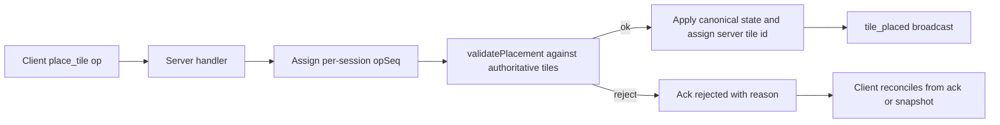

<!-- markdownlint-disable-file -->
# Task Research: Authoritative Backend Domain Port

Research and implementation guidance for moving placement-domain logic from client-side simulation into authoritative server execution for GitHub issue #9.

## Task Implementation Requests

* Port domain modules from apps/client/src/domain into apps/server/src/domain.
* Wire place_tile handling to validatePlacement() and reject invalid requests.
* Enforce tile ID validation for authoritative operations.
* Broadcast tile_placed only after successful validation and state mutation.
* Ensure concurrent operations converge through deterministic server ordering.

## Scope and Success Criteria

* Scope: Server-side domain authority for placement validation, tile ID validation, deterministic operation handling, and reconciliation semantics. Includes contracts and tests in apps/server and domain parity with apps/client domain modules.
* Assumptions:
  * The current server transport and operation envelope are already in place and callable.
  * The server currently contains TODO stubs for domain logic.
  * Client domain modules placementSolver.ts, tileGeometry.ts, and math2d.ts are the current reference implementation for geometry rules.
  * Single-process deterministic ordering is the target for this phase; multi-replica consistency is deferred by architecture decision.
* Success Criteria:
  * place_tile uses validatePlacement() from server domain engine.
  * Invalid placements and invalid tile IDs are rejected with deterministic reasons or removed:false semantics.
  * tile_placed is emitted only on successful authoritative apply.
  * Deterministic first-write-wins conflict handling is defined and tested for concurrent edits.

## Outline

1. Inventory current server stubs, operation flow, and broadcast semantics.
2. Inventory client domain modules and identify porting dependencies.
3. Evaluate deterministic ordering guarantees and test harness feasibility.
4. Identify contract/schema adjustments required for reject/reconcile behavior.
5. Evaluate alternatives for sharing vs copying domain logic.
5. Select recommended approach and provide implementation-ready sequence.

## Potential Next Research

* Confirm tile ID policy (strict UUID vs prefixed ID).
  * Reasoning: remove_tile validation behavior depends on a stable ID contract.
  * Reference: apps/server/src/contracts.ts:45-55, apps/server/src/contracts.ts:219-225.
* Decide whether operation sequence metadata should be internal only or exposed for diagnostics.
  * Reasoning: affects observability and possible future ack schema changes.
  * Reference: apps/server/src/contracts.ts:208-225.
* Validate whether to begin shared package extraction immediately after issue #9 closes.
  * Reasoning: mitigates long-term client/server domain drift.
  * Reference: apps/client/package.json:1-37, apps/server/package.json:1-27.

## Research Executed

### File Analysis

* apps/server/src/index.ts
  * place_tile is placeholder logic with TODO validation and unconditional accept ack.
  * remove_tile is placeholder logic with unconditional removed:true ack.
  * tile_placed and tile_removed broadcasts are TODO comments, not active behavior.
* apps/server/src/contracts.ts
  * Contract defines server-authoritative state ownership and deterministic first-write-wins intent.
  * Ack/event types already include accepted/rejected semantics and server broadcasts.
* apps/client/src/domain/placementSolver.ts
  * validatePlacement() currently contains the core geometric validation logic to port.
* apps/client/src/domain/tileGeometry.ts
  * Canonical shape decomposition and transform logic are already implemented.
* apps/client/src/domain/math2d.ts
  * Vector/math primitives are pure TS and portable to server.
* docs/decisions/2026-07-15-deployment-architecture-v01.md
  * Multi-replica synchronization is deferred; sticky sessions are initial strategy.

### Code Search Results

* Query: place_tile|remove_tile|tile_placed|tile_removed
  * Match summary: handlers currently implemented as stubs in apps/server/src/index.ts; contracts fully define intended authoritative behavior in apps/server/src/contracts.ts.
* Query: validatePlacement
  * Match summary: defined in apps/client/src/domain/placementSolver.ts and currently not used in server.
* Query: Date.now\(\) \+ Math\.random\(\)
  * Match summary: non-authoritative ID generation appears in both client and server placeholders.

### External Research

* None required; repository evidence was sufficient for approach selection.

### Project Conventions

* Standards referenced: TypeScript, Vitest test harness in server app, contract-first event shapes.
* Instructions followed:
  * Task Research mode and .copilot-tracking conventions.
  * No repository-local .github/copilot-instructions.md found; used repository evidence and existing app-level READMEs as convention anchors.

## Key Discoveries

### Project Structure

* apps/client contains mature domain validation engine and tests.
* apps/server contains contract definitions and transport scaffolding, but domain enforcement is not yet implemented.
* apps/server/README.md already expects server domain engine files under apps/server/src/domain, matching requested next phase.

### Implementation Patterns

* Contract-first typing is already in place and should be preserved.
* Mutating operations currently ack via callback; authoritative state mutation should remain in-handler for this phase.
* Deterministic conflict handling target is first-write-wins by server receipt order.

### Complete Examples

```ts
import { randomUUID } from 'node:crypto'
import { validatePlacement, defaultBounds } from './domain/placementSolver'

type SessionState = {
  tiles: TileInstance[]
  createdAt: number
  updatedAt: number
  lastOpSeq: number
}

const sessions = new Map<string, SessionState>()

function getSessionState(sessionId: string): SessionState {
  const now = Date.now()
  const existing = sessions.get(sessionId)
  if (existing) {
    return existing
  }
  const created: SessionState = {
    tiles: [],
    createdAt: now,
    updatedAt: now,
    lastOpSeq: 0,
  }
  sessions.set(sessionId, created)
  return created
}

socket.on('place_tile', (payload, ack) => {
  const session = getSessionState(sessionId)
  const opSeq = ++session.lastOpSeq
  const validation = validatePlacement(payload.shape, payload.transform, session.tiles, defaultBounds)

  if (!validation.valid) {
    ack({ placed: null, rejected: true, reason: validation.reason ?? 'PLACEMENT_REJECTED' })
    return
  }

  const tile: TileInstance = {
    id: randomUUID(),
    shape: payload.shape,
    color: payload.color,
    material: payload.material,
    transform: payload.transform,
    createdAt: Date.now(),
  }

  session.tiles.push(tile)
  session.updatedAt = Date.now()
  void opSeq

  ack({ placed: tile, rejected: false })
  io.to(sessionId).emit('tile_placed', { tile, placedBy: clientId })
})
```

### API and Schema Documentation

* Place ack supports authoritative reject semantics:
  * apps/server/src/contracts.ts:215-217
* Remove ack supports idempotent removed:false semantics:
  * apps/server/src/contracts.ts:223-225
* Server authoritative tile/session ownership:
  * apps/server/src/contracts.ts:45-64
* Deterministic conflict policy (first-write-wins):
  * apps/server/src/contracts.ts:315-320

### Configuration Examples

```json
{
  "apps/server/package.json": {
    "scripts": {
      "test": "vitest run --coverage",
      "test:watch": "vitest"
    },
    "devDependencies": {
      "vitest": "^3.2.4"
    }
  }
}
```

## Technical Scenarios

### Scenario 1: Server-Local Port of Domain Modules (Initial Delivery)

Directly port math2d.ts, tileGeometry.ts, and placementSolver.ts into apps/server/src/domain and invoke validatePlacement() from place_tile handler before mutating session state.

**Requirements:**

* Preserve authoritative validation semantics.
* Preserve current socket contract shapes.
* Enforce deterministic first-write-wins conflict handling.
* Keep implementation incremental to close issue #9 without monorepo restructuring.

**Preferred Approach:**

* Recommended approach: server-local domain port now, with optional shared-package extraction as a follow-up optimization.

```text
apps/server/src/domain/
  math2d.ts
  tileGeometry.ts
  placementSolver.ts
apps/server/src/
  sessionState.ts
  index.ts
  index.concurrency.test.ts
  domain/placementSolver.port.test.ts
```



**Implementation Details:**

1. Port domain files from apps/client/src/domain to apps/server/src/domain with server-compatible imports and types.
2. Introduce authoritative in-memory session state map keyed by sessionId.
3. Update place_tile handler:
  * Increment per-session op sequence.
  * Call validatePlacement(payload.shape, payload.transform, session.tiles, defaultBounds).
  * Reject invalid with rejected:true and reason.
  * On success: assign server tile id, append tile, ack accepted, then emit tile_placed.
4. Update remove_tile handler:
  * Validate tileId format and existence.
  * Return removed:false for unknown IDs.
  * Emit tile_removed only on successful removal.
5. Emit session_snapshot on connect and reconnect from authoritative state.
6. Add deterministic concurrency tests and parity tests for server-ported domain logic.

```ts
// Example tie-break: per-session sequence stamped at dequeue time.
function nextOpSeq(session: SessionState): number {
  session.lastOpSeq += 1
  return session.lastOpSeq
}

// Later operations that conflict with already-applied state reject deterministically.
```

#### Considered Alternatives

Alternative A: Direct server-local port (selected)
* Benefits: fastest to ship issue #9, minimal structural churn, preserves contract shapes.
* Trade-off: temporary code duplication between client and server domain modules.

Alternative B: Immediate shared package extraction (not selected for this phase)
* Benefits: single source of truth for domain logic.
* Trade-off: requires workspace/package restructuring before behavior can ship.

Alternative C: RPC validation fallback service (not selected)
* Benefits: future-friendly for distributed validation services.
* Trade-off: additional latency/failure modes and unnecessary architecture overhead for current scope.

## Technical Scenarios

### Scenario 2: Deterministic Concurrency in Single-Process Server

Current runtime is single-process event-loop based and synchronous in handlers. Determinism can be formalized by assigning per-session monotonic opSeq and applying mutations in dequeue order.

**Requirements:**

* Deterministic ordering for conflicting operations.
* No payload contract change required for current phase.
* Testable convergence behavior for place/place, place/remove, remove/remove races.

**Preferred Approach:**

* Keep sequencing internal to server state for now.

```text
Test matrix:
  server_concurrency_place_tile_conflict_first_write_wins
  server_concurrency_place_tile_non_conflict_both_commit
  server_concurrency_remove_tile_vs_remove_tile_idempotent
  server_concurrency_place_tile_vs_remove_tile_same_tile_seq_ordered
```

**Implementation Details:**

* Use per-session lastOpSeq counter.
* Place/remove mutations read and write the same authoritative session state.
* Broadcasts occur only after successful state mutation.

#### Considered Alternatives

* No explicit sequence tracking (rejected): works incidentally in one process today but is not explicit, testable, or future-proof.
* Exposed sequence in public ack payloads (deferred): useful for diagnostics, but not required to satisfy current acceptance criteria.

## Evidence Log

* apps/server/src/index.ts:73-108
  * session snapshot and mutation handlers are TODO/placeholder paths.
* apps/server/src/index.ts:110-119
  * pointer_update is the only currently active peer broadcast path.
* apps/server/src/contracts.ts:45-64
  * authoritative tile and session structures already defined.
* apps/server/src/contracts.ts:208-225
  * place/remove ack semantics support reject and idempotent remove.
* apps/server/src/contracts.ts:315-320
  * first-write-wins deterministic policy is specified.
* apps/client/src/domain/placementSolver.ts:155-235
  * validatePlacement logic to port.
* apps/client/src/domain/tileGeometry.ts:4-114
  * shape transform and decomposition logic.
* apps/client/src/domain/math2d.ts:1-45
  * reusable vector primitives.
* apps/client/src/domain/placementSolver.test.ts:10-63
  * reference tests for overlap and bounds behavior.
* apps/server/package.json:11-12
  * server test harness scripts in place (Vitest).
* docs/decisions/2026-07-15-deployment-architecture-v01.md:92-95
  * cross-replica synchronization is deferred.

## Selected Approach and Rationale

Selected approach: Alternative A (direct server-local domain port) plus explicit per-session sequencing and server-side convergence tests.

Rationale:
* Resolves current gap where contracts describe authoritative behavior but runtime is still TODO/stubbed.
* Achieves issue #9 acceptance criteria with the least implementation risk and smallest structural change.
* Avoids blocking on workspace-level package restructuring while retaining a clean path to shared-package extraction later.

## Risks and Mitigations

* Risk: client/server domain drift after initial copy.
  * Mitigation: add parity tests in server mirroring critical client placement cases.
* Risk: unclear tile ID policy (UUID vs prefixed) causing inconsistent validation.
  * Mitigation: define explicit policy before implementation and assert with tests.
* Risk: implicit ordering assumptions.
  * Mitigation: formalize opSeq in server state and validate through concurrency tests.

## Actionable Next Steps for Implementation Planning

1. Define tile ID validation policy for remove_tile and place_tile-generated IDs.
2. Create apps/server/src/domain from client domain modules.
3. Implement authoritative session state and sequence handling in apps/server/src/index.ts.
4. Implement place/remove acks and broadcasts to match contract semantics.
5. Add server tests for port parity and concurrency matrix.
