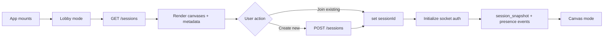

<!-- markdownlint-disable-file -->
# Task Research: Lobby Screen for Canvas Discovery and Join

Research for implementing a first-login lobby screen where users can view available canvases with relevant metadata and join a selected canvas.

## Task Implementation Requests

* Add a lobby screen shown when users first connect/login
* Display available canvases with metadata such as name, connected user count, and canvas size
* Allow users to join a selected canvas from the lobby

## Scope and Success Criteria

* Scope: Client and server architecture needed to support listing canvases and joining a selected canvas, including API/contracts, socket/session interactions, and UI flow. Excludes non-lobby features unrelated to canvas selection.
* Assumptions:
  * "login" corresponds to initial user entry into the app/session flow
  * Existing realtime/session infrastructure can be extended for lobby use cases
  * Canvas metadata (name, size, active users) can be sourced or derived from current server state and persistence
* Success Criteria:
  * Identify current end-to-end flow for session/canvas lifecycle in client and server
  * Define a recommended implementation approach for lobby list and join
  * Provide concrete file-level change plan with examples and pitfalls

## Outline

1. Current baseline behavior and constraints
2. Lobby metadata and API readiness
3. Alternatives analysis
4. Selected approach and implementation impact
5. Test strategy and risks

## Potential Next Research

* Validate runtime DB in deployed environments for existing `canvases.name` drift
  * Reasoning: this affects migration safety and rollout strategy
  * Reference: apps/server/src/db/schema.ts:36, apps/server/src/db/repository.ts:340
* Decide V1 behavior for auto-resume vs explicit join from lobby
  * Reasoning: this changes client initialization and UX expectations
  * Reference: apps/client/src/network/session.ts:3, apps/client/src/App.tsx:64

## Research Executed

### File Analysis

* apps/client/src/App.tsx
  * Auto-session bootstrap is triggered on mount via `ensureSession()` and immediately sets `sessionId` (apps/client/src/App.tsx:64-70)
  * Socket connection is parameterized by `sessionId` through `useSocketConnection`, so null `sessionId` naturally prevents joining (apps/client/src/App.tsx:131-139)
* apps/client/src/network/session.ts
  * Session storage key `zzyix_session_id` is reused if present; otherwise a session is created through `POST /sessions` (apps/client/src/network/session.ts:3-13)
* apps/client/src/network/useSocketConnection.ts
  * Early return when `sessionId` is null prevents socket init, enabling clean lobby gating before join (apps/client/src/network/useSocketConnection.ts:27)
* apps/server/src/index.ts
  * Server currently exposes `GET /health` and `POST /sessions`; lobby list route `GET /sessions` is not present in this file snapshot and must be confirmed/added for lobby list (apps/server/src/index.ts:537-560)
* apps/server/src/db/repository.ts
  * `loadSessionRecord` ensures a canvas row exists with `id` and timestamps only (apps/server/src/db/repository.ts:340)
  * Participant presence lifecycle exists (`markParticipantJoined`, `markParticipantLeft`) for connected count derivation (apps/server/src/db/repository.ts:364-389)
* apps/server/src/db/schema.ts
  * `canvases` table defines `id`, `version`, `createdAt`, `updatedAt` and does not include `name` (apps/server/src/db/schema.ts:36-44)
* apps/server/src/contracts.ts
  * REST section comments still describe `GET /sessions/:sessionId` and tile REST mutation paths, which do not match the visible route implementation snapshot (apps/server/src/contracts.ts:77-89)

### Code Search Results

* `ensureSession\(`
  * Found in apps/client/src/App.tsx:65
* `useSocketConnection\(`
  * Found in apps/client/src/App.tsx:131
* `app.post('/sessions'`
  * Found in apps/server/src/index.ts:547 (from search index), and visible route block near apps/server/src/index.ts:537-560
* `export const canvases = pgTable`
  * Found in apps/server/src/db/schema.ts:36

### External Research

* No external sources required yet; implementation expected to be repository-specific

### Project Conventions

* Standards referenced: markdown and writing style instructions from extension guidance
* The client is a single-page flow that enters canvas editing directly after session bootstrap.
* The server and contracts are designed around websocket-driven collaboration; lobby should integrate with this flow by delaying session join, not replacing transport.
* There is a schema-contract-implementation mismatch around canvas metadata and REST route documentation that should be corrected as part of lobby delivery.

## Key Discoveries

* Existing pattern: session bootstrap and storage are encapsulated in apps/client/src/network/session.ts.
* Existing pattern: socket lifecycle depends solely on `sessionId` in apps/client/src/network/useSocketConnection.ts.
* Existing pattern: server allocates sessions lazily on create/connect paths and persists participant presence for active users.

Pending delegated research.

```ts
// Client lobby gating pattern: only connect once user explicitly joins.
const [sessionId, setSessionId] = useState<string | null>(null)

const socketRef = useSocketConnection(
  serverUrl,
  sessionId,
  clientId,
  onSnapshot,
  onTilePlaced,
  onTileRemoved,
  onResyncRequired,
)

const handleJoin = (selectedSessionId: string): void => {
  sessionStorage.setItem('zzyix_session_id', selectedSessionId)
  setSessionId(selectedSessionId)
}
Pending delegated research.

### Complete Examples

* Contract comments list REST endpoints that are not fully aligned with currently visible handlers and should be reconciled for lobby implementation clarity (apps/server/src/contracts.ts:77-89, apps/server/src/index.ts:537-560).
* Session schema currently lacks a `name` field despite lobby requirement to show canvas names (apps/server/src/db/schema.ts:36-44).
Pending delegated research.
```

```text
Client storage keys currently used by session bootstrap:
- sessionStorage: zzyix_session_id
- localStorage: zzyix_client_id
Pending delegated research.

### Configuration Examples

```text
Pending delegated research.
The user should land on a lobby first, review available canvases with metadata, then explicitly join one. This is best implemented by introducing a client-side lobby stage and delaying socket initialization until session selection.

## Technical Scenarios

### Lobby Experience for Canvas Discovery and Join

Pending alternatives and recommendation.

**Preferred Approach:**

* Add a client mode switch (`lobby` and `canvas`) in apps/client/src/App.tsx, keeping current canvas interaction logic intact.
* Add or verify `GET /sessions` server route returning list payload with session summaries, and ensure schema supports required fields.
* Keep websocket join as the authoritative join path by setting `sessionId` only after explicit user action.

```text
Proposed file changes

apps/client/src/App.tsx
apps/client/src/network/session.ts
apps/client/src/ui/LobbyScreen.tsx (new)
apps/client/src/App.css
apps/server/src/index.ts
apps/server/src/db/schema.ts
apps/server/migrations/<new migration>.sql
apps/server/src/contracts.ts
apps/client/src/**/*.test.tsx (new/updated)
apps/server/src/**/*.test.ts (new/updated)
```
* List active/available canvases with details
**Implementation Details:**

1. Client entry and navigation
* Replace auto-entry behavior by removing direct `ensureSession().then(setSessionId)` on mount and introducing lobby bootstrap to fetch session list.
* Add handlers:
  * `handleRefreshCanvases()` calls `listSessions()`.
  * `handleJoinCanvas(sessionId)` sets storage and sets state.
  * `handleCreateCanvas()` calls create route and joins returned session.

2. Client API and storage helpers
* Expand apps/client/src/network/session.ts with:
  * `listSessions()`
  * `getStoredSessionId()` / `setStoredSessionId()` / `clearStoredSessionId()`
* Keep `ensureClientId()` behavior unchanged.

3. Lobby UI
* Add apps/client/src/ui/LobbyScreen.tsx with list rows containing:
  * name
  * connected users
  * size
  * Join button
* Reuse existing button and shell styles from apps/client/src/App.css and add minimal lobby-specific classes.

4. Server route and data integrity
* Ensure apps/server/src/index.ts exposes `GET /sessions` returning lobby list payload.
* Add `canvases.name` column in apps/server/src/db/schema.ts and migration if lobby must display names from persistence.
* If not introducing named canvases in V1, define a deterministic fallback label (for example short session ID) and document it.

5. Contract alignment
* Update apps/server/src/contracts.ts REST comments and types so route docs match implementation.
* Define or confirm `CanvasSummary` fields for lobby UI consumption.

6. Testing strategy
* Client tests:
  * lobby shown on first load
  * no socket connection before join
  * selecting canvas enters canvas mode
* Server tests:
  * `GET /sessions` shape and metadata accuracy
  * presence count correctness
  * schema/migration consistency for canvas name



**Implementation Details:**

Alternative 1 (not selected): Full page split now (`LobbyPage` and `CanvasPage` refactor)
* Benefits: cleaner long-term separation, easier unit boundaries
* Rejected for now: larger refactor surface and regression risk for immediate work item delivery

Alternative 2 (not selected): Socket-first lobby list updates only
* Benefits: true realtime lobby list freshness
* Rejected for now: higher complexity and unnecessary for first delivery where periodic refresh or initial load is sufficient

Alternative 3 (selected): In-app mode switch with explicit join
* Benefits: smallest safe change, uses existing socket/session primitives, fastest path to user-visible lobby
* Trade-off: App component grows; can be modularized later by extracting `CanvasPage`

## Selected Approach Summary

Use an in-app lobby stage before canvas mode. The lobby loads available canvases from server, displays metadata, and joins only on explicit user action. Keep websocket flow unchanged and gate by `sessionId` assignment. Fix schema/contract gaps required for stable metadata delivery.

Rationale:

* Aligns with existing architecture where socket lifecycle is already session-gated.
* Minimizes refactoring and risk while meeting the work item's UX goals.
* Creates a clean seam for future enhancements (deep links, filters, realtime lobby updates).

## Implementation-Ready Checklist

* Add lobby view state and explicit join/create handlers in apps/client/src/App.tsx.
* Add session list API helper in apps/client/src/network/session.ts.
* Implement new apps/client/src/ui/LobbyScreen.tsx and corresponding CSS styles.
* Ensure `GET /sessions` route exists and returns expected metadata.
* Resolve `canvases.name` schema support (or define fallback naming policy).
* Align contracts and route documentation.
* Add client/server tests for lobby flow and metadata correctness.

```text
Pending snippets
```

#### Considered Alternatives

Pending.
