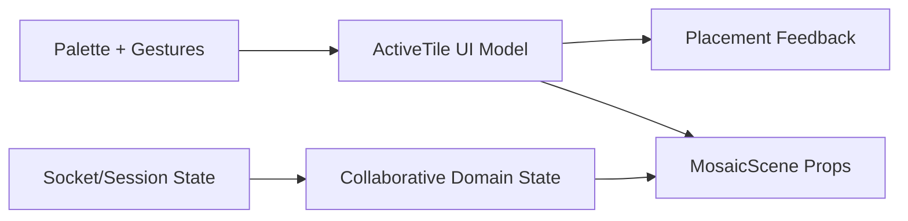

<!-- markdownlint-disable-file -->
# Task Research: Consolidate Active Tile and Palette UI State

Research for GitHub issue #79: consolidate tile configuration into a typed active-tile model while keeping transient palette and gesture state separate from collaborative canvas state.

## Task Implementation Requests

* Define a typed ActiveTile configuration that unifies shape, color, material, rotation, and mirror.
* Separate palette open/collapsed and pointer gesture state from domain/network state.
* Preserve existing keyboard shortcuts and MosaicScene prop behavior.
* Add focused tests for state transitions without introducing any casts or duplicate sources of truth.

## Scope and Success Criteria

* Scope: Client-side state architecture in React app, especially App-level state, handlers, MosaicScene integration, and related tests. Out of scope: socket contract changes, authoritative sequenced tile state replacement, and global editor framework adoption.
* Assumptions:
  * Existing behavior in keyboard shortcuts and scene interactions is expected to remain stable.
  * Issue #75 dependency may already shape model boundaries and names.
  * Migration should be isolated to reduce behavioral regression risk.
* Success Criteria:
  * One typed model represents shape, color, material, rotation, and mirror.
  * Palette and gesture transient state are separated from domain/network state.
  * Existing keyboard shortcuts and MosaicScene props remain consistent.
  * Focused unit/component tests cover transitions.
  * No any casts or duplicate tile-configuration sources of truth.

## Outline

1. Baseline current client state structure and ownership in App and related modules.
2. Locate keyboard shortcut and MosaicScene contract dependencies.
3. Identify candidate state model boundaries (active tile vs palette/gesture vs domain/network).
4. Evaluate implementation alternatives and migration sequence.
5. Recommend one approach with implementation impacts and test strategy.

## Potential Next Research

* Validate issue #75 traceability with a concrete branch/PR/commit artifact.
  * Reasoning: Dependency is stated in issue metadata but not definitively evidenced in local artifacts.
  * Reference: .copilot-tracking/changes/2026-07-26/tile-palette-active-selection-summary-changes.md:37
* Confirm product intent for palette open/collapsed state delivery inside #79.
  * Reasoning: Current code has no open/collapsed state to consolidate.
  * Reference: apps/client/src/App.tsx:1
* Decide whether MosaicScene prop contract remains split in #79.
  * Reasoning: Current contract passes activeShape separately from ghost color/material/visible/transform.
  * Reference: apps/client/src/App.tsx:1020

## Research Executed

### File Analysis

* apps/client/src/App.tsx
  * Mixed ownership of domain/network state and UI-interaction state in one component.
  * Active tile fields are currently primitive state variables, then derived into a typed object with useMemo.
* apps/client/src/interaction/controller.ts
  * Defines typed ActiveTile and placement helpers that already consume ActiveTile.
* apps/client/src/render/MosaicScene.tsx
  * Uses split prop contract: activeShape separate from ghost payload.
  * Implements right-button rotate drag and middle-button pan gesture handling.
* apps/client/src/ui/TilePalette.tsx
  * Controlled/stateless palette control; no open/collapsed state owned here.
* apps/client/src/App.test.tsx and apps/client/src/ui/TilePalette.test.tsx
  * Strong integration coverage in placement and palette fallback flows, but specific gaps in keyboard regression and gesture button-path tests.

### Code Search Results

* active tile and UI state declarations
  * apps/client/src/App.tsx:199
  * apps/client/src/App.tsx:202
  * apps/client/src/App.tsx:203
  * apps/client/src/App.tsx:204
  * apps/client/src/App.tsx:205
  * apps/client/src/App.tsx:207
  * apps/client/src/App.tsx:208
  * apps/client/src/App.tsx:209
  * apps/client/src/App.tsx:210
  * apps/client/src/App.tsx:211
  * apps/client/src/App.tsx:212
* activeTile derivation and placement usage
  * apps/client/src/App.tsx:261
  * apps/client/src/App.tsx:896
  * apps/client/src/App.tsx:912
* keyboard mutation paths
  * apps/client/src/App.tsx:829
  * apps/client/src/App.tsx:834
  * apps/client/src/App.tsx:838
  * apps/client/src/App.tsx:842
  * apps/client/src/App.tsx:846
* scene prop handoff and callbacks
  * apps/client/src/App.tsx:1020
  * apps/client/src/App.tsx:1021
  * apps/client/src/App.tsx:1028
  * apps/client/src/App.tsx:1031
  * apps/client/src/App.tsx:1039
* pointer button gesture logic in scene interaction plane
  * apps/client/src/render/MosaicScene.tsx:223
  * apps/client/src/render/MosaicScene.tsx:232
  * apps/client/src/render/MosaicScene.tsx:252
  * apps/client/src/render/MosaicScene.tsx:269

### External Research

* N/A so far; prioritize repository-first evidence.

### Project Conventions

* Standards referenced: TypeScript strict typing, single source-of-truth state ownership, focused unit/component tests.
* Instructions followed: Task Researcher mode requirements and task-research prompt requirements.

## Key Discoveries

### Project Structure

* App currently co-locates collaborative/session/network state and UI/transient interaction state.
* Existing placement pipeline already expects a typed ActiveTile, but source-of-truth fields remain split across primitives.
* Scene rendering contract is intentionally split today:
  * activeShape is one prop.
  * ghost carries transform, confidence, color, material, and visibility.
* No explicit palette open/collapsed state currently exists in App or TilePalette.

### Implementation Patterns

* Active tile primitive fields in App:
  * shape, material, paletteName, color, rotation, mirrored.
* Placement feedback/transient fields in App:
  * ghost, ghostVisible, invalidPulse, cameraPan, zoomTier.
* Keyboard behavior:
  * R and Shift+R perform quarter-step rotation.
  * [ and ] perform fine rotation deltas.
  * F toggles mirror.
  * Z triggers undo remove_tile path.
* Pointer behavior:
  * updatePointer recomputes ghost target/validity and emits hover selection.
  * attemptPlace performs optimistic placement and ack/reject handling.
* Existing tests strongly cover palette fallback and placement ack flows, but not keyboard and pointer-button gesture regressions.

### Complete Examples

```ts
// Existing typed model in interaction controller already matches issue target direction.
export type ActiveTile = {
  shape: TileShape;
  color: string;
  material: TileMaterial;
  rotation: number;
  mirrored: boolean;
};
```

### API and Schema Documentation

* ActiveTile definition and usage:
  * apps/client/src/interaction/controller.ts:39
  * apps/client/src/interaction/controller.ts:176
  * apps/client/src/interaction/controller.ts:232
* Scene prop split:
  * apps/client/src/render/MosaicScene.tsx:24
  * apps/client/src/render/MosaicScene.tsx:44
* App handoff to scene:
  * apps/client/src/App.tsx:1020
  * apps/client/src/App.tsx:1021

### Configuration Examples

```ts
type ActiveTileUiState = {
  activeTile: ActiveTile;
  palette: {
    paletteName: PaletteName;
    fallbackAnnouncement: string;
  };
};

type ActiveTileUiAction =
  | { type: 'set-shape'; shape: TileShape }
  | { type: 'set-material'; material: ActiveTile['material'] }
  | { type: 'set-color'; color: string }
  | { type: 'rotate-quarter'; direction: 1 | -1 }
  | { type: 'rotate-fine'; delta: number }
  | { type: 'toggle-mirror' }
  | {
      type: 'set-palette';
      paletteName: PaletteName;
      color: string;
      fallbackAnnouncement: string;
    };
```

## Technical Scenarios

### Scenario: Consolidate Active Tile Configuration While Preserving Existing Behavior

The current code already uses a typed ActiveTile in placement logic, but App keeps tile configuration as primitive state variables and derives ActiveTile with useMemo. Consolidation should move source-of-truth to one typed model while preserving split ownership boundaries:

* Active tile and palette transition state in one dedicated UI slice.
* Gesture and placement feedback state as separate transient slices.
* Domain/network collaborative state untouched.

**Requirements:**

* Keep collaborative canvas/domain-network state boundaries intact.
* Keep transient palette and gesture state independent.
* Keep keyboard shortcuts and MosaicScene integration unchanged in behavior.

**Preferred Approach:**

* Adopt an App-level reducer for ActiveTile and palette transient state now.
* Keep gesture and placement feedback outside the reducer.
* Preserve existing MosaicScene prop contract in this migration.

```text
apps/client/src/App.tsx
apps/client/src/interaction/controller.ts
apps/client/src/render/MosaicScene.tsx
apps/client/src/ui/TilePalette.tsx
apps/client/src/App.test.tsx
apps/client/src/ui/TilePalette.test.tsx
```



**Implementation Details:**

Recommended migration sequence:

1. Introduce reducer-backed ActiveTileUiState with typed actions and initialize from current defaults.
2. Replace TilePalette mutation callbacks with reducer action dispatches.
3. Route keyboard and drag-mutation handlers through reducer actions.
4. Remove primitive shape/material/color/rotation/mirrored states and use reducer activeTile as single source.
5. Keep scene contract split in this issue to reduce blast radius; consider unification in a follow-up if needed.

Coverage additions recommended:

* Keyboard regression tests for R/Shift+R, [ ], F, Z in App.
* Invalid pulse timing/class toggle test.
* Pointer button gesture path tests for right drag rotate and middle drag pan in MosaicScene.
* Preserve existing placement ack/reject and palette fallback tests, re-anchored to new single source state.

```ts
// Boundary separation preserved while consolidating tile + palette transitions.
type PlacementUiState = {
  ghost: GhostState;
  ghostVisible: boolean;
  invalidPulse: boolean;
};

type GestureUiState = {
  cameraPan: { x: number; y: number };
  zoomTier: 'fine' | 'aggregate';
};
```

#### Considered Alternatives

1. Minimal useState ActiveTile object migration.
  * Pros: small mechanical change, easy incremental adoption.
  * Cons: no centralized transition semantics; scattered update logic risk remains.
2. App-level reducer for ActiveTile + palette transients. (Selected)
  * Pros: explicit actions, deterministic tests, low-to-medium migration risk, aligns with existing typed ActiveTile usage.
  * Cons: modest upfront refactor breadth in App.
3. useActiveTileController hook abstraction around reducer/selectors.
  * Pros: best encapsulation and future reuse.
  * Cons: higher abstraction and migration complexity for this issue scope.
4. Global UI context.
  * Pros: may reduce prop threading in broader future architecture.
  * Cons: over-scoped and high risk for #79; increases coupling risk.

## Selected Approach and Rationale

Selected approach: App-level reducer for active tile + palette transients, with gesture and placement transient state kept separate and domain/network state untouched.

Rationale:

* Delivers acceptance criteria directly with one typed source of truth for shape/color/material/rotation/mirror.
* Preserves current architecture boundaries and avoids socket/domain contract changes.
* Improves testability of transitions through action-level unit tests.
* Minimizes behavioral risk by preserving current MosaicScene contract in this issue.

## Open Questions

* Should palette open/collapsed state be introduced in #79 or tracked as a separate follow-up issue?
* Should MosaicScene prop contract stay split in #79 by design, with unification deferred?
* Can maintainers provide canonical issue #75 traceability artifact (PR or commit) for dependency verification?

## Subagent Evidence Source

Primary subagent findings document:

* .copilot-tracking/research/subagents/2026-07-26/active-tile-palette-state-repo-analysis.md
