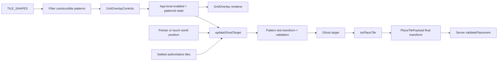

<!-- markdownlint-disable-file -->
# Task Research: Grid Overlay (Issue #85)

Research and recommend an implementation approach for issue #85: an optional grid overlay with selectable, constructible tile patterns and pattern-aligned placement.

## Task Implementation Requests

* Let users enable and disable a grid overlay.
* Offer multiple predefined grid-like patterns only when the current tile library can construct them.
* Show the active pattern, compatible tile shapes, and valid placement positions without obscuring placed work.
* Align placement to the selected pattern while the overlay is active.
* Preserve all placed tiles when the overlay is hidden or its pattern changes.
* Support the application's responsive layouts and currently supported keyboard, pointer, and touch input paths.

## Scope and Success Criteria

* Scope: Client-side pattern definitions, availability filtering, overlay controls, Three.js rendering, ghost-target resolution, accessibility behavior, and tests. The server remains authoritative for overlap, bounds, adjacency, revision, and concurrency validation.
* Assumptions:
  * A pattern is a repeating world-space arrangement of typed tile slots, not a free-form grid editor or a one-time operation that rearranges tiles.
  * Overlay choice is a per-user editing aid, not shared canvas state.
  * Pattern alignment includes slot position, rotation, and mirroring where the pattern requires them.
  * The initial catalog can use exact tile-shape requirements. Square lattice, rectangle running bond, and triangle tessellation are sufficient to satisfy "multiple predefined patterns."
* Success criteria:
  * Identify exact state, rendering, geometry, placement, and server-authority integration points.
  * Define a pattern schema whose compatibility can be derived rather than manually duplicated.
  * Evaluate at least two viable implementation alternatives.
  * Select an approach that keeps existing placements immutable and preserves server validation.
  * Provide file-level implementation and test guidance.

## Outline

1. Map current tile-library, placement, rendering, and responsive-input behavior.
2. Resolve product ambiguities implied by the `needs-design` label.
3. Model constructible repeating patterns and slot availability.
4. Compare renderer and placement-integration alternatives.
5. Recommend a client-side architecture, rollout sequence, and test plan.

## Potential Next Research

* Validate the initial pattern spacing and visual language with a small interactive prototype.
  * Reasoning: Tile dimensions differ, and triangle/L-shape orientations need visual confirmation beyond domain tests.
  * Reference: `apps/client/src/domain/tileGeometry.ts:23-84`
* Test touch gesture arbitration on real devices after issue #80 lands.
  * Reasoning: The current canvas has pointer events but does not yet implement the second-pointer cancellation and two-finger gesture contract required by #80.
  * Reference: `apps/client/src/render/MosaicScene.tsx:209-305`, issue #80
* Decide whether pattern selection should persist across sessions.
  * Reasoning: Issue #85 requires placement preservation, not preference persistence; local storage or server persistence would add a separate product contract.
* Centralize the duplicated client/server tile registry if runtime tile-library changes are planned.
  * Reasoning: Client `TILE_SHAPES`, server contract unions, server payload guards, and server geometry are separate definitions today.
  * Reference: `apps/client/src/domain/tileGeometry.ts:4-8`, `apps/server/src/contracts.ts:35`, `apps/server/src/index.ts:80`

## Research Executed

### Issue and Dependency Analysis

* Issue #85 is open with `enhancement`, `type:feature`, `area:frontend`, and `needs-design`.
* Issue #80 defines the intended touch contract: tap placement, one-finger drag preview, second-pointer cancellation, and two-finger pan/zoom.
* Issue #83 defines the future mobile palette bottom sheet but is not implemented on this branch.
* Issue #77 defines a canvas-local action-bar direction. Its CSS remains, but the current branch no longer renders `CanvasActionBar`.
* Epic #72 prioritizes a canvas-first UI, persistent visual tile selection, contextual feedback, 44x44px targets, and keyboard/pointer/touch support.

### File Analysis

* `apps/client/src/domain/tileGeometry.ts`
  * `TILE_SHAPES` is the current client tile-library list.
  * Canonical outlines and convex decompositions provide the geometry needed for slot previews and overlay outlines.
* `apps/client/src/domain/placementSolver.ts`
  * `validatePlacement` enforces bounds, overlap, and the maximum grout gap.
  * `solveGuidedPlacement` currently passes through the raw pointer; snapping and magnetization are disabled.
* `apps/client/src/interaction/controller.ts`
  * `updateGhostTarget` is the narrow integration seam for selecting either raw-pointer or pattern-slot placement.
  * `tryPlaceTile` already persists `ghost.target`, so a slot transform can flow to placement without a second transform path.
* `apps/client/src/App.tsx`
  * App owns active tile, ghost, camera, world bounds, optimistic placement, and scene composition.
  * Pointer updates resolve the ghost; pointer release sends the selected ghost transform to the server.
* `apps/client/src/render/MosaicScene.tsx`
  * The scene already has canonical tile extrusion, a world-space interaction plane, viewport reporting, canvas bounds, and layered ghost/settled rendering.
  * The orthographic camera and viewport data support visible-slot generation and culling.
* `apps/client/src/ui/TilePalette.tsx`
  * Shape choices are derived from `TILE_SHAPES` and use existing visual tile previews.
  * Existing ToggleGroup primitives provide tested single-select radio semantics.
* `apps/server/src/index.ts` and `apps/server/src/domain/placementSolver.ts`
  * The server accepts a final transform and independently validates it against current authoritative state.
  * No grid state is needed in the transport for a local editing guide.
* `apps/client/src/App.css` and `apps/client/src/styles/tokens/primitives.css`
  * The responsive workspace becomes one column below 960px.
  * The repository already defines a 44px minimum touch target.

### Code Search Results

* `grid|overlay|pattern`
  * No current grid renderer, grid state, or pattern catalog exists.
  * `.canvas-action-bar` styling exists without a current JSX consumer.
* `TILE_SHAPES|TileShape`
  * The client exports a canonical list for its picker, while server shape definitions remain duplicated.
* `solveGuidedPlacement|updateGhostTarget`
  * Raw-pointer placement is localized enough to add an optional guide without changing the authoritative validator.
* `MosaicScene|onViewportChanged`
  * Scene viewport reporting is already available for chunk subscription and can be reused conceptually for overlay culling.
* `GridHelper|InstancedMesh|LineSegments`
  * No existing helper or custom overlay rendering utility is available in client source.

### External Research

* WAI-ARIA Authoring Practices: Button Pattern
  * A two-state button should use a stable label and `aria-pressed` to expose its state.
  * Source: <https://www.w3.org/WAI/ARIA/apg/patterns/button/>
* WCAG 2.2 Understanding Success Criterion 1.4.11
  * Control and state indicators need 3:1 non-text contrast, and state should not depend on hue alone.
  * Source: <https://www.w3.org/WAI/WCAG22/Understanding/non-text-contrast.html>

### Documentation Drift

* `apps/client/README.md:17-21,31,103` and `apps/client/IMPLEMENTATION_NOTES.md:22-35` describe hidden guidance anchors and soft magnetization.
* Current client and server solvers explicitly disable snapping and use raw pointer positions at `apps/client/src/domain/placementSolver.ts:259-286` and `apps/server/src/domain/placementSolver.ts:258-285`.
* Grid-overlay implementation should update both documents rather than preserving the stale hidden-guidance description.

## Key Discoveries

### Placement Authority and State Boundaries

* The grid can remain entirely client-side because the server already validates the final `Transform2D`.
* Existing optimistic and concurrent placement handling remains correct:
  * Client places `ghost.target` optimistically.
  * Server revalidates against current tiles and canvas bounds.
  * A stale, overlapping, out-of-bounds, or disconnected slot is rejected and reconciled through the existing acknowledgement path.
* Pattern visibility and selection should not enter `PlaceTilePayload`; doing so would turn a personal guide into shared authoritative state without an acceptance-criteria requirement.

### Tile-Library Availability

* The current tile library is compile-time and global, represented by `TILE_SHAPES`.
* "Patterns become available or unavailable as the tile library changes" can be implemented now as a pure filter that accepts an available-shape set.
* Pattern requirements should be derived from slot definitions. A separate manually maintained `requiredShapes` array would introduce drift.
* If future sessions have runtime shape policies, the same filter can accept that session-provided set without changing the pattern schema.

### Existing Tile Preservation

* Existing tiles are stored independently of all proposed grid state.
* Toggling or changing a pattern must only change:
  * rendered overlay slots,
  * compatible-shape guidance,
  * subsequent ghost-target resolution.
* It must not normalize, migrate, move, rotate, hide, or delete settled tiles.
* Existing off-pattern tiles may block a slot through normal overlap validation; they are otherwise left unchanged.

### Responsive and Input Constraints

* Overlay controls can be keyboard accessible immediately with native buttons and the existing ToggleGroup.
* Pointer and basic touch placement both reach the same R3F pointer handlers, so one slot resolver can serve both.
* Full touch parity depends on issue #80 because the current interaction plane does not classify one- versus two-pointer gestures.
* The future mobile bottom sheet in #83 should not own the overlay toggle. A compact canvas-local control keeps the guide available while the palette is closed.

## Product Decisions Recommended for Planning

1. Treat patterns as repeating world-space slot templates anchored to world origin `(0, 0)`.
   * This is deterministic across users, viewport sizes, camera movement, and canvas sizes.
2. Keep overlay state local to each client.
   * Collaboration continues to share placed tiles, not editing preferences.
3. Use strict slot placement while enabled.
   * Never fall back to the raw pointer when the guide is active; otherwise a tile could appear aligned in preview but settle off-pattern.
4. Let slots define orientation as well as position.
   * Pattern transform wins for the ghost and placed tile, while the user's stored active-tile rotation/mirror state remains unchanged for use after the overlay is disabled.
5. Do not automatically change the selected tile shape when a pattern changes.
   * Preserve active selection and instead show compatible shapes plus an actionable status when the current shape has no slots.
6. Show only selectable, fully constructible patterns.
   * Unconstructible patterns are filtered out rather than offered as disabled choices.
7. Preserve the selected pattern when the overlay is hidden.
   * Re-enabling restores the previous guide without touching tiles.

## Recommended Pattern Model

Use a pure domain catalog in a new `gridPatterns.ts` module.

```ts
export type GridPatternId = 'square-lattice' | 'running-bond' | 'triangle-tessellation'

export type GridPatternSlot = {
  id: string
  shape: TileShape
  offset: Vec2
  rotation: number
  mirrored?: boolean
}

export type GridPattern = {
  id: GridPatternId
  label: string
  description: string
  basisX: Vec2
  basisY: Vec2
  slots: readonly GridPatternSlot[]
}

export const getPatternShapes = (pattern: GridPattern): ReadonlySet<TileShape> =>
  new Set(pattern.slots.map((slot) => slot.shape))

export const isPatternConstructible = (
  pattern: GridPattern,
  availableShapes: ReadonlySet<TileShape>,
): boolean =>
  pattern.slots.every((slot) => availableShapes.has(slot.shape))
```

Initial catalog:

* Square lattice
  * Repeating orthogonal cells with one square slot.
  * Compatible shape: Square.
* Running bond
  * Repeating two-row cell with offset rectangle slots.
  * Compatible shape: Rectangle.
* Triangle tessellation
  * Repeating cell with alternating triangle orientation.
  * Compatible shape: Triangle.

Pattern constants should use dimensions derived from canonical tile outlines plus a documented grout value. Domain tests must prove each pattern can be filled in a valid sequence under the existing `validatePlacement` rules.

## Pattern-Aware Placement Algorithm

Add a client-only resolver rather than changing the server solver.

```text
resolvePatternPlacement(pointer, activeTile, pattern, settledTiles, bounds)
  1. Convert pointer into approximate pattern-cell coordinates.
  2. Enumerate slots from the nearest cell and its immediate neighbors.
  3. Keep slots whose required shape matches activeTile.shape.
  4. Compose each slot's world position, rotation, and mirror transform.
  5. Validate candidates with the existing validatePlacement function.
  6. Choose the closest valid candidate.
  7. If no candidate is valid, return the closest exact slot as invalid.
  8. Never return the raw pointer while the overlay is enabled.
```

`updateGhostTarget` should accept an optional active grid guide:

```ts
type PlacementGuide =
  | { enabled: false }
  | { enabled: true; pattern: GridPattern }
```

When disabled, it calls the current `solveGuidedPlacement`. When enabled, it calls the new pattern resolver. `tryPlaceTile` does not need to change because it already persists `ghost.target`.

Important behavior:

* Slot transforms determine position/orientation, but tile color and material remain user-selected.
* A slot blocked by an existing tile remains visible as occupied or unavailable.
* The adjacency rule still applies. A distant slot can be geometrically aligned but not currently placeable.
* Concurrency remains first-write-wins at the server. Another collaborator can occupy a slot after local preview and before acknowledgement.

## Overlay Rendering Strategy

Add a `GridOverlay` scene component rendered above `CanvasBounds` and below tiles/ghost.

* Generate only slots intersecting the camera viewport plus one-cell overscan.
  * Avoid generating a full `vast` or future unbounded-world overlay.
* Build slot outlines from `getTileDefinition(slot.shape).outline`.
  * The overlay then uses the same geometry source as placement, scene extrusion, and tile previews.
* Render batched line segments or merged buffer geometry rather than one React component per line.
  * Rebuild with `useMemo` when pattern, viewport cell range, active shape, or settled tiles change.
* Keep the overlay non-interactive.
  * It must not intercept the interaction plane's pointer events.
* Place overlay geometry between the canvas plane and tiles.
  * Use depth ordering and low-opacity strokes so existing tile content remains dominant.
* Encode state with more than hue:
  * placeable: solid outline,
  * active/nearest: thicker outline or center marker,
  * occupied/blocked: reduced opacity plus dash/marker,
  * incompatible shape: omitted or very faint.
* Avoid Three.js `GridHelper` as the primary renderer.
  * A uniform rectangular line grid cannot express typed slots, alternating rotations, running-bond offsets, occupancy, or compatible-shape states.

## Control and Accessibility Strategy

Create a focused `GridOverlayControls` component near the canvas.

* Toggle:
  * Native `<button type="button">`.
  * Stable accessible label such as "Grid overlay".
  * `aria-pressed={enabled}` per the WAI-ARIA toggle-button pattern.
* Pattern selection:
  * Existing single-select `ToggleGroup` for a small catalog.
  * Each option includes pattern label and required shape names/previews.
  * A native `<select>` remains a viable compact mobile adaptation if the catalog grows.
* Compatible-shape guidance:
  * Render text such as "Compatible tile: Rectangle" adjacent to the selector.
  * Reuse `TileShapePreview` for visual reinforcement, not as the only label.
* Status behavior:
  * If the active shape is incompatible, show "Choose Rectangle to place on Running bond."
  * Announce compatibility or automatic availability fallback changes in a polite status region.
  * Do not announce every pointer movement or slot-validity change.
* Sizing and contrast:
  * Reuse `--touch-target-min: 44px`.
  * Ensure selected/focus/toggle state indicators meet 3:1 non-text contrast and do not rely on color alone.
* Responsive placement:
  * Put the compact toggle and current pattern in a canvas-local toolbar.
  * Let the pattern chooser wrap or collapse at narrow widths without covering the central canvas.
  * Coordinate final mobile placement with issue #83 rather than embedding the control inside the future palette sheet.

## State and Data Flow



Recommended App state:

```ts
type GridOverlayState = {
  enabled: boolean
  patternId: GridPatternId
}
```

Keep it separate from `ActiveTileUiState`; grid visibility is a canvas editing preference, not tile appearance.

## Technical Scenarios

### Scenario A: Data-Driven Slot Catalog With Strict Client-Side Snapping

**Approach**

* Add a pure repeating-pattern catalog and compatibility filter.
* Resolve the nearest compatible slot before the existing ghost pipeline.
* Render canonical tile outlines for visible slots.
* Send only the final transform to the unchanged server.

**Benefits**

* Directly satisfies constructibility, compatible-tile visibility, predefined positions, and strict alignment.
* Keeps pattern definitions testable without React or WebGL.
* Preserves server authority and current protocol compatibility.
* Supports bounded, vast, and future unbounded canvases through viewport-local generation.

**Trade-offs**

* Requires careful basis math, pattern fixtures, occupancy classification, and rendering batching.
* Rotation/mirror behavior must be clearly explained while a pattern is active.

### Scenario B: Uniform Grid Quantization Plus Decorative Pattern Texture

**Approach**

* Quantize pointer X/Y to one global cell size.
* Draw a repeated texture or `GridHelper`.
* Treat pattern names as visual variants.

**Benefits**

* Small implementation surface.
* Fast rendering and simple nearest-cell math.

**Trade-offs**

* Cannot accurately represent rectangle running bond, alternating triangle orientation, mixed slot requirements, or exact occupied positions.
* Pattern visuals and placement math can drift.
* "Every pattern can be fully constructed" becomes a naming convention rather than a provable property.

**Decision**

* Reject. It addresses a generic grid, not the issue's typed predefined layouts.

### Scenario C: Persist Pattern and Slot Occupancy on the Server

**Approach**

* Add pattern ID to session configuration and slot ID to placement payloads.
* Have the server enforce exact pattern alignment.

**Benefits**

* Every collaborator shares one pattern.
* The server can guarantee pattern membership, not only collision/bounds validity.

**Trade-offs**

* Changes REST/socket contracts, schema, migration, snapshots, and collaboration semantics.
* Pattern changes would become shared edits and need authorization/concurrency rules.
* Conflicts with the requirement that changing or hiding a guide leave existing tiles untouched.

**Decision**

* Reject for issue #85. Revisit only if product requirements explicitly make patterns shared canvas rules.

## Selected Approach and Rationale

Select Scenario A: a data-driven, client-side slot catalog with strict pattern placement and viewport-cullable canonical-outline rendering.

Rationale:

* It is the only approach that makes pattern constructibility mechanically testable.
* It reuses the current geometry and validation sources instead of duplicating shapes or collision rules.
* It isolates guide behavior from authoritative server state and preserves all collaboration/concurrency protections.
* It gives the renderer enough semantic information to show exact compatible, placeable, occupied, and blocked slots.
* It scales to larger canvases by generating visible cells rather than an entire world grid.

## File-Level Implementation Guidance

### Add

* `apps/client/src/domain/gridPatterns.ts`
  * Pattern types, catalog, required-shape derivation, constructibility filtering, visible-cell/nearest-slot math.
* `apps/client/src/domain/gridPatterns.test.ts`
  * Catalog completeness, availability filtering, deterministic slot generation, and fill-sequence validity.
* `apps/client/src/domain/gridPlacement.ts`
  * Pattern candidate selection and existing-validator integration.
* `apps/client/src/domain/gridPlacement.test.ts`
  * Strict snapping, orientation, incompatible shape, occupied slot, bounds, adjacency, and no raw-pointer fallback.
* `apps/client/src/render/GridOverlay.tsx`
  * Viewport-local canonical-outline rendering and visual slot states.
* `apps/client/src/ui/GridOverlayControls.tsx`
  * Toggle, pattern selection, compatible-shape summary, and status messaging.
* `apps/client/src/ui/GridOverlayControls.test.tsx`
  * Toggle semantics, selection, filtering, labels, keyboard behavior, and announcements.

### Modify

* `apps/client/src/interaction/controller.ts`
  * Add optional placement-guide input to `updateGhostTarget`.
* `apps/client/src/interaction/controller.test.ts`
  * Assert guide-disabled parity and guide-enabled slot targeting.
* `apps/client/src/App.tsx`
  * Own local grid state, derive available patterns, pass guide to ghost updates, compose controls and scene overlay.
  * Recompute the ghost from the last pointer when pattern or active shape changes.
* `apps/client/src/render/MosaicScene.tsx`
  * Accept overlay state/pattern and compose `GridOverlay` between canvas bounds and tiles.
* `apps/client/src/App.test.tsx`
  * Assert pattern state wiring, unchanged placed tiles after toggle/pattern changes, and slot transform in `place_tile`.
* `apps/client/src/App.css`
  * Add canvas-local responsive grid controls with 44px targets and non-color-only states.
* `apps/client/README.md`
  * Document optional visible patterns and current controls.
* `apps/client/IMPLEMENTATION_NOTES.md`
  * Replace stale hidden-guidance claims with raw-pointer default plus optional pattern-guide architecture.

### Do Not Modify for the Initial Feature

* `apps/server/src/contracts.ts`
* `apps/server/src/index.ts`
* `apps/server/src/domain/placementSolver.ts`
* Database schema and migrations

The server should continue receiving and validating ordinary tile transforms.

## Test Strategy

### Domain Tests

* Every catalog pattern has unique IDs, a non-empty slot template, finite non-zero basis vectors, and only canonical `TileShape` values.
* `getAvailableGridPatterns` removes a pattern when any required shape is absent.
* Initial catalog returns at least two patterns for current `TILE_SHAPES`.
* Visible-slot generation is stable across viewport sizes and includes only the requested cell range plus overscan.
* Nearest-slot resolution is deterministic at cell boundaries.
* Every initial pattern can be filled in a documented adjacent order using `validatePlacement`.
* Active pattern placement never returns the raw pointer transform.
* Existing off-pattern tiles are unchanged and can block slots through existing validation.

### Component and App Tests

* Toggle button exposes a stable name and correct `aria-pressed`.
* Pattern choices use single-select semantics and omit unconstructible patterns.
* Required compatible shapes have text labels.
* Incompatible active shape produces actionable text/status.
* Hiding/re-enabling restores the selected pattern.
* Changing pattern does not mutate `sequencedState.tiles`.
* A placement payload uses the resolved slot position/orientation.
* Rejected server acknowledgement removes the optimistic tile without changing overlay selection.
* Existing active tile color/material and palette persistence tests remain valid.
* Narrow-width test confirms no horizontal overflow and 44px minimum controls.

### Render and Interaction Checks

* Overlay remains behind placed tiles and does not intercept pointer events.
* Pan/zoom updates the visible slot range without rebuilding off-screen cells.
* Pointer and touch world coordinates resolve through the same slot function.
* Reduced-motion mode does not add overlay animation.
* Manual contrast review covers toggle, selected pattern, active slot, blocked slot, and focus states.

## Risks and Mitigations

* Risk: Pattern fixtures appear constructible but violate overlap or grout-gap rules.
  * Mitigation: Generate dimensions from canonical outlines and validate complete fill sequences in domain tests.
* Risk: Current shape is incompatible with the selected pattern.
  * Mitigation: Preserve selection, show compatible shapes, suppress valid ghost placement, and provide actionable status text.
* Risk: Grid switching unexpectedly changes rotation or mirror controls.
  * Mitigation: Keep active-tile orientation state unchanged; slot orientation affects only guided ghost/placement while enabled.
* Risk: Overlay obscures tile art or collaborator indicators.
  * Mitigation: Render below tiles, use restrained opacity, and emphasize only the nearest/placeable slot.
* Risk: Large canvases create too many overlay objects.
  * Mitigation: Generate viewport-local cells and batch line geometry.
* Risk: Remote placement wins a slot after local preview.
  * Mitigation: Preserve current server rejection/reconciliation behavior and immediately reclassify the slot from authoritative tile state.
* Risk: Client/server tile registries drift as tile types change.
  * Mitigation: Filter from client `TILE_SHAPES` now; plan shared registry centralization before runtime-configurable libraries.
* Risk: Touch interactions place accidentally while panning.
  * Mitigation: Reuse the slot resolver but coordinate gesture arbitration with issue #80; validate on real touch hardware.
* Risk: Documentation directs maintainers toward nonexistent hidden anchors.
  * Mitigation: Update README and implementation notes in the same implementation change.

## Actionable Implementation Sequence

1. Add and test the pure pattern catalog, compatibility filter, and visible/nearest-slot generation.
2. Add and test strict pattern placement using existing `validatePlacement`.
3. Add `GridOverlayControls` with accessible toggle, pattern selection, and compatible-shape guidance.
4. Add viewport-cullable `GridOverlay` rendering from canonical tile outlines.
5. Wire local grid state through App, controller, and MosaicScene without changing transport contracts.
6. Add App regression coverage for tile preservation, exact payload transforms, and server rejection reconciliation.
7. Update stale placement documentation and run targeted client domain/component/App tests, then client lint/build.

## Evidence Index

* Issue #85: <https://github.com/dkirby-ms/zzyix/issues/85>
* Issue #80: <https://github.com/dkirby-ms/zzyix/issues/80>
* Issue #83: <https://github.com/dkirby-ms/zzyix/issues/83>
* Issue #77: <https://github.com/dkirby-ms/zzyix/issues/77>
* Epic #72: <https://github.com/dkirby-ms/zzyix/issues/72>
* `apps/client/src/domain/tileGeometry.ts:4-8`
* `apps/client/src/domain/tileGeometry.ts:18-105`
* `apps/client/src/domain/placementSolver.ts:174-286`
* `apps/client/src/domain/placementSolver.test.ts:11-94`
* `apps/client/src/interaction/controller.ts:39-65`
* `apps/client/src/interaction/controller.ts:176-258`
* `apps/client/src/interaction/controller.test.ts:30-118`
* `apps/client/src/App.tsx:140-244`
* `apps/client/src/App.tsx:304-365`
* `apps/client/src/App.tsx:905-1024`
* `apps/client/src/App.tsx:1068-1175`
* `apps/client/src/render/MosaicScene.tsx:42-84`
* `apps/client/src/render/MosaicScene.tsx:209-320`
* `apps/client/src/render/MosaicScene.tsx:323-475`
* `apps/client/src/render/MosaicScene.tsx:479-586`
* `apps/client/src/ui/TilePalette.tsx:20-100`
* `apps/client/src/ui/primitives/ToggleGroup.tsx:7-23`
* `apps/client/src/ui/primitives/ToggleGroup.test.tsx:5-22`
* `apps/client/src/styles/tokens/primitives.css:52-64`
* `apps/client/src/App.css:218-278`
* `apps/client/src/App.css:481-624`
* `apps/server/src/contracts.ts:35-79`
* `apps/server/src/contracts.ts:254-284`
* `apps/server/src/domain/placementSolver.ts:173-285`
* `apps/server/src/index.ts:1408-1505`
* `apps/client/README.md:17-37`
* `apps/client/README.md:82-107`
* `apps/client/IMPLEMENTATION_NOTES.md:22-35`
