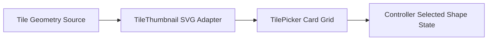

<!-- markdownlint-disable-file -->
# Task Research: Visual Tile Picker for Tile Selection

Research and recommend an implementation approach for issue #78: replacing text-only shape buttons with an accessible visual tile picker that previews each available tile shape using shared geometry data.

## Task Implementation Requests

* Replace text-only shape controls with visual preview cards for Square, Triangle, Rectangle, and L-shape
* Ensure previews are derived from existing geometry source of truth to avoid drift
* Preserve single active selection behavior after placement
* Deliver full keyboard, touch, pointer, and screen-reader operability with distinct interaction states
* Maintain minimum target sizing requirements (72x72 visual target, 44x44 interactive hit area)

## Scope and Success Criteria

* Scope: Client-side UI research and implementation path for tile selection controls in existing React app; includes component architecture, state wiring, accessibility semantics, and tests. Excludes new tile types and placement geometry changes.
* Assumptions:
  * Existing tile geometry definitions are available in client source and can be transformed for thumbnail rendering.
  * Existing selection state is already managed by the controller and can be reused.
  * Styling system in app supports adding a card-based picker without introducing a new framework.
* Success Criteria:
  * Identify exact current files/functions that implement tile selection and geometry definitions.
  * Propose a reusable thumbnail strategy that is coupled to geometry source data.
  * Evaluate alternatives and select one preferred implementation approach with evidence.
  * Provide actionable implementation guidance, including tests and risks.

## Outline

1. Current state mapping: tile selection UI, state flow, geometry source.
2. Accessibility and interaction requirements mapped to concrete controls.
3. Visual preview generation options from existing geometry definitions.
4. Alternative evaluation and recommended approach.
5. Implementation plan with file-level impacts and test strategy.

## Potential Next Research

* Evaluate whether shape options should be derived from the geometry registry instead of a local constant.
  * Reasoning: Prevents option drift when future shapes are added.
  * Reference: apps/client/src/ui/TilePalette.tsx:17, apps/client/src/domain/tileGeometry.ts:4-82
* Validate optional automated a11y engine checks (axe) in the existing Vitest setup.
  * Reasoning: Current tests are semantic but not rules-engine based.
  * Reference: apps/client/src/test/setup.ts:1, apps/client/package.json:11-12
* Confirm final visual language for card labels versus icon-dominant cards.
  * Reasoning: Impacts readability and screen reader naming.
  * Reference: apps/client/src/ui/TilePalette.tsx:46-50

## Research Executed

### File Analysis

* apps/client/src/ui/TilePalette.tsx
  * Tile shape selection is a single-select ToggleGroup and shape options are currently hardcoded.
  * Shape updates are emitted through onShape in onValueChange.
* apps/client/src/App.tsx
  * App owns shape state and composes activeTile with shape/material/color/rotation/mirroring.
  * activeTile.shape is consumed by ghost solving and placement, then persisted on placed tiles.
* apps/client/src/domain/tileGeometry.ts
  * Canonical shape outlines and convex parts are centralized here.
  * getTileDefinition(shape) provides a stable geometry entry point.
* apps/client/src/render/MosaicScene.tsx
  * Three.js extrusion already derives from tile outlines but is scene-oriented.
* apps/client/src/ui/TilePalette.test.tsx and apps/client/src/ui/primitives/ToggleGroup.test.tsx
  * Existing tests assert radiogroup/radio semantics and checked state.

### Code Search Results

* Search term: `TilePalette`
  * apps/client/src/App.tsx:1100-1108 mounts the picker and wires state callbacks.
* Search term: `getTileDefinition`
  * apps/client/src/domain/tileGeometry.ts:92 defines access helper.
  * apps/client/src/render/MosaicScene.tsx:95 and apps/client/src/App.tsx:172 consume shared geometry.
* Search term: `ToggleGroup`
  * apps/client/src/ui/TilePalette.tsx:35-118 uses single-select groups.
  * apps/client/src/ui/primitives/ToggleGroup.tsx wraps Radix toggle-group primitives.
* Search term: `aria-checked|radiogroup|radio` in client tests
  * apps/client/src/ui/TilePalette.test.tsx:24-29 and 66-70 validate accessible role model.

### External Research

* None required for this phase.
  * Findings are sufficiently supported by codebase evidence for architecture and implementation choice.

### Project Conventions

* Standards referenced: Markdown and writing style instructions loaded from hve-core.
* Instructions followed: Task Research mode constraints and document template conventions.

## Key Discoveries

### Project Structure

* Current picker implementation is localized in apps/client/src/ui/TilePalette.tsx:6-127.
* Parent integration and selection state ownership live in apps/client/src/App.tsx:203 and 1100-1108.
* Geometry source-of-truth is centralized in apps/client/src/domain/tileGeometry.ts:23-103.
* Placement pipeline consumes activeTile.shape through controller functions in apps/client/src/interaction/controller.ts:176-246.
* Rendering path also shares geometry via getTileDefinition in apps/client/src/render/MosaicScene.tsx:92-109.

### Implementation Patterns

* UI controls use single-select Radix groups wrapped by local primitives for consistent semantics and styling.
* Accessibility assertions are role and state based in test suites, without an axe-style engine.
* Shape list in UI is currently duplicated as a constant rather than derived from geometry registry.
* Collaboration selection updates are pointer-event-driven and throttled, so picker interactions should remain local and lightweight.

### Complete Examples

```tsx
// Existing shape selection pattern in TilePalette
const shapes: TileShape[] = ['square', 'triangle', 'rectangle', 'l-shape']

<ToggleGroup
  type="single"
  className="shape-grid"
  value={shape}
  onValueChange={(value) => {
    if (value) {
      onShape(value as TileShape)
    }
  }}
  aria-label="Shape"
>
  {shapes.map((entry) => (
    <ToggleGroupItem key={entry} value={entry} aria-label={entry}>
      {entry}
    </ToggleGroupItem>
  ))}
</ToggleGroup>
```

### API and Schema Documentation

* Tile shape schema and geometry entry points
  * apps/client/src/domain/tileGeometry.ts:4 defines TileShape union.
  * apps/client/src/domain/tileGeometry.ts:52-82 defines canonical shape map.
  * apps/client/src/domain/tileGeometry.ts:92 exposes getTileDefinition(shape).
* Placement path alignment
  * apps/client/src/interaction/controller.ts:176-189 forwards activeTile.shape into solver.
  * apps/client/src/interaction/controller.ts:241-246 writes placed tile shape.

### Configuration Examples

```text
apps/client package test stack:
- vitest + jsdom
- @testing-library/react
- @testing-library/jest-dom

References:
apps/client/package.json:11-12
apps/client/package.json:32-34
apps/client/vite.config.ts:35-38
apps/client/src/test/setup.ts:1
```

## Technical Scenarios

### Scenario A: Inline SVG Thumbnail from Domain Geometry (Preferred Candidate)

Use a small pure utility to convert tileGeometry outline points into normalized SVG paths and render those in shape cards inside the existing single-select ToggleGroup.

**Requirements:**

* Preview generated from shared geometry source
* Accessible selectable card behavior
* Stable selected state after placement

**Preferred Approach:**

* Derive previews from getTileDefinition(shape).outline to keep one geometry source-of-truth.
* Keep shape selection semantics unchanged by preserving ToggleGroupItem controls.
* Add a reusable presentational component, then update TilePalette shape items to render icon + label.

```text
Primary files impacted:
- apps/client/src/ui/TilePalette.tsx
- apps/client/src/ui/TilePalette.test.tsx
- apps/client/src/ui/TileShapePreview.tsx (new)
- apps/client/src/ui/TileShapePreview.test.tsx (new)
- apps/client/src/App.css (shape card visual states and sizing)
```



**Implementation Details:**

* Build path data from normalized polygon coordinates.
  * Read points from getTileDefinition(shape).outline.
  * Compute bounds minX/maxX/minY/maxY.
  * Fit shape into square viewBox with padding.
* Render preview inside ToggleGroupItem with aria-hidden graphics.
  * Keep readable text labels for each shape.
  * Maintain one selected option via existing value/onValueChange.
* Style states for selected, hover, focus-visible, pressed, and disabled.
  * Ensure each visual card is at least 72x72 px.
  * Ensure interactive hit area meets at least 44x44 px.
* Testing strategy.
  * Preserve existing radiogroup/radio role tests.
  * Add tests asserting SVG preview renders for each shape.
  * Add unit tests for path normalization utility.

```tsx
// Sketch: preview component contract
import { getTileDefinition, type TileShape } from '../domain/tileGeometry'

export function TileShapePreview({ shape, size = 56 }: { shape: TileShape; size?: number }) {
  const outline = getTileDefinition(shape).outline
  const d = polygonToPathData(outline, { size, padding: 6 })
  return (
    <svg
      aria-hidden="true"
      focusable="false"
      width={size}
      height={size}
      viewBox={`0 0 ${size} ${size}`}
    >
      <path d={d} />
    </svg>
  )
}
```

#### Considered Alternatives

1. Shared render utility with canvas or Three.js snapshot
  * Rejected because it couples palette UI to scene rendering internals in apps/client/src/render/MosaicScene.tsx:92-109.
  * Increased complexity for lifecycle, testing, and potential performance overhead in sidebar controls.
2. Static preauthored shape assets mapped to tile names
  * Rejected because assets can drift from canonical geometry in apps/client/src/domain/tileGeometry.ts:52-82.
  * Creates an additional manual maintenance workflow.

## Selected Approach and Rationale

Selected approach is inline SVG previews generated from tileGeometry outlines.

Rationale:

* Strongest source-of-truth compliance because the preview path uses the same outline data consumed by placement and rendering.
* Lowest architectural coupling because it does not import scene renderer concerns into UI controls.
* Best compatibility with existing accessibility and test architecture that already models shape controls as radios.
* Low runtime cost for a fixed set of four small vector previews.

## Risks and Mitigations

* Risk: shape clipping or inverted orientation in SVG projection.
  * Mitigation: centralize normalization utility and test each shape fixture.
* Risk: future shape additions update geometry but not picker options.
  * Mitigation: derive options from geometry registry or add drift-guard tests.
* Risk: visual state regressions under selected or focus conditions.
  * Mitigation: reuse existing data-state and focus-visible hooks, add interaction-state tests.

## Actionable Implementation Guidance

1. Add `TileShapePreview` component and geometry-to-SVG utility.
2. Update shape items in `TilePalette` to render card layout with preview + label.
3. Adjust CSS for minimum visual and hit-area sizing, plus all required states.
4. Extend `TilePalette` tests and add preview utility tests.
5. Optionally add axe-based checks later as incremental quality improvement.

## Evidence Index

* apps/client/src/ui/TilePalette.tsx:6-127
* apps/client/src/ui/TilePalette.test.tsx:24-29
* apps/client/src/ui/TilePalette.test.tsx:66-70
* apps/client/src/ui/primitives/ToggleGroup.tsx:7-23
* apps/client/src/ui/primitives/ToggleGroup.test.tsx:8-21
* apps/client/src/App.tsx:203
* apps/client/src/App.tsx:262-270
* apps/client/src/App.tsx:895-899
* apps/client/src/App.tsx:912-947
* apps/client/src/App.tsx:1100-1108
* apps/client/src/domain/tileGeometry.ts:4-103
* apps/client/src/interaction/controller.ts:176-246
* apps/client/src/render/MosaicScene.tsx:92-109
* apps/client/package.json:11-12
* apps/client/package.json:32-34
* apps/client/vite.config.ts:35-38
* apps/client/src/test/setup.ts:1
