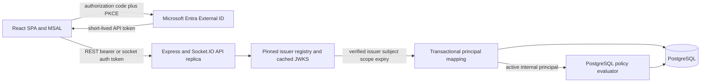

<!-- markdownlint-disable-file -->
# Task Research: Infinite-Canvas Authentication and Authorization

Evaluate the authentication and authorization work that should follow the finite toroidal quilt foundation, with emphasis on stable user identity, server authorization, client principal context, patch ownership, and protocol-v2 mutation enablement.

## Task Implementation Requests

* Evaluate authentication and authorization as the next critical-path work for infinite canvas
* Determine the minimum production identity integration needed by the server and client
* Separate identity integration from the broader patch policy in GitHub issues 14 and 94
* Identify missing protocol-v2 mutation work and recommend an implementation sequence
* Ask the user for decisions that materially affect architecture or scope

## Scope and Success Criteria

* Scope: Current branch architecture, relevant GitHub backlog, identity-provider options, HTTP and Socket.IO authentication, internal principal mapping, patch authorization policy, client identity exposure, testing, deployment, and rollout implications
* Assumptions:
  * The current branch is `infinite-canvas` and includes the accepted finite toroidal quilt architecture
  * Azure Container Apps remains the intended deployment platform
  * PostgreSQL remains authoritative for principals, mappings, patch policy, and mutations
  * Protocol-v2 mutation remains disabled until stable authenticated principal integration passes its rollout gate
* Success Criteria:
  * Verify the current authentication and authorization implementation boundaries with exact references
  * Identify backlog dependencies and overlaps
  * Evaluate viable identity-provider and authentication-transport approaches
  * Select one recommended architecture with explicit rationale
  * Define implementation slices, data and API contracts, tests, rollout gates, and pitfalls
  * Record unresolved product decisions and ask the user only when evidence cannot resolve them

## Outline

1. Verify current identity, policy, transport, persistence, and deployment boundaries
2. Analyze GitHub issue dependencies and required backlog decomposition
3. Research external identity and token-validation options suitable for the application
4. Evaluate authentication session transport and client principal-context alternatives
5. Evaluate minimum ownership policy versus complete issue 94 policy
6. Select an architecture and define an implementation-ready sequence
7. Record user decisions, implementation risks, and planning handoff

## Potential Next Research

* Delegated mutation and moderator policy
  * Reasoning: Issue 94 requires delegated capability and moderator cases before protocol-v2 mutation can be enabled broadly
  * Reference: GitHub issues 94 and 98
* Provider outage and principal deletion behavior
  * Reasoning: The accepted quilt ADR makes both release-gate decisions
  * Reference: docs/decisions/2026-07-27-finite-toroidal-quilt-v01.md
* Entra External ID subscription validation
  * Reasoning: Pricing, tenant availability, custom domains, and desired social providers must be confirmed before implementation
  * Reference: Microsoft Entra External ID documentation

## Confirmed Product Decisions

* Identity audience: Public and self-service community users
* Identity provider direction: Microsoft Entra External ID, subject to target-subscription validation
* Anonymous access: No quilt catalog or content beyond the sign-in experience
* External identities: One external identity per internal principal for the initial release; design for audited linking later
* Initial ownership: Eligible authenticated users atomically claim unowned patches
* Delegated mutation: No member mutation delegation in the initial release; owners alone may mutate
* Moderation: No moderator commands in the initial release; preserve an audit-ready extension path
* Ownership lifecycle: Recipient-accepted transfer with a seven-day expiry plus owner abandonment to unclaimed
* Account deletion: Immediate disable followed by a 30-day recoverable period, ownership resolution, mapping/profile removal, and retained pseudonymous attribution and audit
* Provider outage: Clear all protected content and drafts when authentication expires
* Claim limits: One active patch per principal per quilt, three attempts per 10 minutes, and one successful claim per 24 hours across quilts

## Research Executed

### File Analysis

* apps/server/src/contracts.ts
  * The Socket.IO handshake has session and client identifiers but no production credential; `SocketData` has an optional server principal
* apps/server/src/index.ts
  * HTTP routes are anonymous, Socket.IO trusts transport identifiers, and only E2E mode can inject a test principal
  * Protocol v2 exposes scoped reads and explicitly reports `mutationEnabled: false`
  * Visibility is derived from lifecycle and membership in code rather than persisted policy
* apps/server/src/db/schema.ts
  * Principals, external mappings, patch owners, patch memberships, operation actors, and lifecycle state exist
  * Delegated capabilities, moderators, claims, transfers, visibility policy, and general authorization audit do not exist
* apps/server/src/db/repository.ts
  * Existing placement persistence atomically locks and authorizes every intersected patch for an owner principal
  * No protocol-v2 removal transaction or production identity caller exists
* apps/client/src/network/session.ts and apps/client/src/network/useSocketConnection.ts
  * Session and client IDs are anonymous transport identity; REST and Socket.IO send no access token
* docs/decisions/2026-07-27-finite-toroidal-quilt-v01.md
  * The accepted contract requires stable principals, persisted visibility, delegated grants, audited moderation, claims, transfers, lifecycle behavior, and atomic footprint authorization

### Code Search Results

* `principal`, `authorization`, `visibility`, `moderator`, `delegated`, and `mutationEnabled`
  * Principal-aware persistence exists, but production token verification and broad policy persistence are absent
* `persistQuiltTilePlacement`
  * Used by database tests, not by a protocol-v2 server handler
* Protocol-v2 mutation event names
  * No dedicated placement or removal contracts, handlers, acknowledgements, or complete client reconciliation exist

### External Research

* OAuth 2.0 Security Best Current Practice and PKCE specifications
  * Browser SPAs should use authorization code with PKCE and must not hold a client secret
* Microsoft Entra External ID documentation
  * External tenants support public customer sign-up and are the Microsoft-native fit for the selected audience
* Microsoft identity-platform token-validation documentation
  * The API must validate signature, trusted issuer, audience, lifetime, accepted algorithms, and delegated scope
* Socket.IO middleware and client-auth documentation
  * Browser clients can send current bearer credentials in the Socket.IO `auth` object; arbitrary WebSocket authorization headers are not reliable
* `jose`, MSAL Browser, and MSAL React documentation
  * `jose` provides provider-neutral JWT and remote-JWKS validation; MSAL supports SPA authorization code with PKCE and React 19

### Project Conventions

* Standards referenced: Task Researcher mode, Markdown instructions, writing-style instructions, accepted architecture decisions
* Instructions followed: Research is delegated to Researcher Subagents; this primary artifact is restricted to `.copilot-tracking/research/`

## Key Discoveries

### Project Structure

The static React/Vite client and Express/Socket.IO API run as separate Azure Container Apps. PostgreSQL is authoritative and the Socket.IO PostgreSQL adapter supports room fanout across replicas. Authentication must therefore validate statelessly per request or connection and resolve identity through durable database mappings.

### Implementation Patterns

Keep ephemeral `clientId` for tab, device, and presence identity. Derive durable authorization and attribution only from a server-validated access token mapped from exact `(issuer, subject)` to an immutable internal principal UUID. OAuth scope protects the API boundary; PostgreSQL policy decides patch access for every read, subscription, and mutation.

### Complete Examples

```text
Browser SPA -- authorization code plus PKCE --> Entra External ID
Browser SPA <-- zzyix API access token -------- Entra External ID
Browser SPA -- REST Authorization header ----> API replica
Browser SPA -- Socket.IO auth.token ----------> API replica
API replica -- trusted discovery and JWKS ----> Entra External ID
API replica -- verified issuer and subject ---> external_principal_mappings
API replica -- internal principal ID ---------> patch policy and audit
```

### API and Schema Documentation

The existing composite external mapping is the correct identity seam when `provider_namespace` is defined as a canonical trusted issuer identifier. The initial release should enforce one active mapping per principal even though the composite primary key permits multiple mappings. A later audited linking workflow can relax that invariant deliberately.

### Configuration Examples

```text
Client public configuration:
  Entra authority and tenant
  SPA client ID
  zzyix API scope
  redirect and logout URIs
  API origin

Server configuration:
  exact trusted issuer
  zzyix API audience
  accepted asymmetric algorithm
  required delegated scope
  client-origin allow list
  JWKS cache and timeout policy
```

## Technical Scenarios

### Stable Production Identity Integration

**Requirements:**

* Public self-service sign-up without workforce invitations
* Authorization code with PKCE and no browser client secret
* Exact issuer, audience, signature, lifetime, algorithm, and scope validation
* Durable unambiguous mapping to the existing internal principal UUID
* Stateless verification across API replicas
* Immediate local disable even while a provider token remains valid

**Preferred Approach:**

Use Microsoft Entra External ID with `@azure/msal-browser` and `@azure/msal-react` in the SPA. Send the zzyix API access token through the REST `Authorization` header and Socket.IO `auth.token`. Validate it with `jose` and a pinned trusted-issuer registry on every HTTP request and socket connection. Resolve exact `(issuer, subject)` to one internal principal in a transaction.

Add `active`, `disabled`, `deletion_pending`, and `deleted` principal states. Only `active` principals may connect or access protected resources. Add reverse uniqueness on `external_principal_mappings.principal_id` for the initial one-to-one rule. A future audited linking migration can remove that constraint without changing durable principal foreign keys.



Disconnect each socket no later than token expiry. The client may attempt one silent renewal and reconnect. Interaction-required or repeated failures stop retries and return the app to sign-in. Cached signing keys may validate unexpired tokens during a provider outage; an unknown key or expired token fails closed.

### Client Principal Context

**Requirements:**

* Keep principal identity separate from `clientId`, session selection, and presence
* Protect the quilt catalog, content, subscriptions, presence, search, and events
* Expose only safe profile fields and server-derived capabilities
* Remove all protected client state at token expiry under the approved outage policy

**Preferred Approach:**

Add top-level client auth state hydrated from a protected `GET /me` response. Keep `clientId` as ephemeral tab/device identity and never submit an internal `principalId` as authority. A shared auth client should acquire current access tokens for protected fetches and socket connections. `LobbyScreen` owns sign-in and account-state flows; `AppHeader` projects the active profile; `StatusIndicator` remains transport health.

Protect and principal-filter all session/quilt listings. Return the same `404 resource_not_found` for nonexistent and nonvisible resources. `GET /health` may remain anonymous if it exposes no content or identity. At access-token expiry during an External ID outage, disconnect, clear protected snapshots, caches, presence, and drafts, and show a reauthentication-required state.

### Patch Ownership and Delegated Authorization

**Requirements:**

* Atomic self-service claim for eligible unowned patches
* Owner-only mutation in the first release
* Accepted ownership transfer, abandonment, and recoverable deletion
* No inferred authority from attribution, participation, or transport identity
* Complete audit for identity, claims, ownership, policy decisions, and lifecycle transitions

**Preferred Approach:**

Implement claim as a database command that locks or conditionally updates an eligible `unclaimed` patch and writes ownership, owner membership, and one audit event atomically. Exactly one concurrent claimant wins. Require an `active` human principal, quilt admission, current terms acceptance, no moderation hold, the approved claim quotas, and a claim-enabled patch.

Keep mutation owner-only initially. A `member` may receive authorized read surfaces but cannot mutate. Do not reinterpret `member` as editor. Preserve schema extension points for scoped delegated capabilities and moderators, but do not expose those commands in the initial release.

Ownership transfer creates a pending transfer that expires after seven days. The recipient must accept before ownership changes. The owner may abandon a patch to `unclaimed` through an audited command. Recovery or disputes cannot rely on moderator commands in this release, so support/admin intervention must remain an explicitly gated operational procedure until the moderator policy is approved.

Account deletion immediately changes the principal to `deletion_pending` and blocks all access. During 30 days, the user may recover the account and must transfer or abandon owned patches. At expiry, remove the external mapping and personal profile, mark the principal deleted, and retain only pseudonymous content attribution and audit approved by the retention policy.

### Authenticated Protocol-v2 Mutations

**Requirements:**

* Dedicated placement and removal contracts rather than reuse of legacy events
* Stable operation IDs and expected revision for every intersected patch
* Verified principal context supplied only by the server
* Atomic authorization, geometry, collision, persistence, and audit
* Post-commit viewer-scoped fanout and deterministic reconnect reconciliation

**Preferred Approach:**

Create a separate protocol-v2 mutation child under issues 93 and 94. Define placement and removal payloads with quilt ID, operation ID, canonical input, and expected per-patch revisions. Add typed acknowledgements for authentication, authorization, conflict, collision, and idempotent replay without exposing hidden policy details.

Reuse the existing principal-aware placement transaction after adapting it to the central policy evaluator. Add the missing removal transaction. Both must derive and lock the complete canonical footprint, recheck principal status and owner authority inside the transaction, and publish no event before commit. Update client optimistic placement, removal, undo, alias traversal, and reconnect handling for per-patch revisions and scoped events.

Issue 98 currently requires delegated-capability cases. Because delegation is explicitly deferred, either keep issue 98 blocked until delegation ships or revise its initial acceptance criteria to owner, denied member, cross-patch mixed authority, aliases, expiry reconnect, and two-replica convergence. Do not mark the current issue complete while omitting its delegated case.

### Rollout and Failure Handling

**Requirements:**

* Repair migration history before adding identity-policy schema
* Keep production identity free of test bypasses
* Handle key rotation and provider outage without accepting unverifiable tokens
* Preserve all existing quilt rollout and legacy-retirement gates

**Preferred Approach:**

Complete issue 96 and establish issue 97's one-shot release migration job before generating auth migrations. Replace `testPrincipalId` with a standards-conforming local test OIDC issuer enabled only when both `NODE_ENV=test` and `E2E_TEST_MODE=true`. Production startup must fail when test issuer or key configuration is present.

Use cached trusted signing keys for unexpired tokens during a short provider outage. Unknown keys, invalid signatures, disabled principals, and expired tokens fail closed. Emit stable safe error codes and structured metrics without tokens, external subjects, emails, or hidden resource identifiers.

Authentication does not waive quilt rollout gates. Issue 100 remains blocked until identity, owner policy, authenticated mutation, replica recovery, performance thresholds, migration rehearsal, and rollback approval all pass.

#### Considered Alternatives

| Alternative | Decision | Rationale |
|---|---|---|
| Entra workforce tenant | Rejected | Organization-controlled membership and invitations do not fit public self-service access |
| Auth0 | Retained fallback | Technically suitable, but adds another vendor and operating plane; use if External ID subscription validation fails |
| BFF cookie session | Rejected initially | Requires one-site proxying, CSRF defenses, a distributed session store, and additional Socket.IO operations |
| Azure Container Apps built-in authentication | Rejected | Separate Container Apps do not share one automatic session boundary and domain authorization remains necessary |
| Anonymous aggregate reads | Rejected | Conflicts with the approved authenticated-only visibility baseline and can reveal hidden activity |
| Immediate multi-provider linking | Deferred | Adds takeover, recovery, conflict, and unlink semantics without initial product need |
| Moderator-only patch assignment | Rejected | Conflicts with approved atomic self-service claim and creates a centralized operations queue |
| Automatic patch allocation | Rejected | Removes user intent and still requires fairness, release, and retry policy |

## Backlog and Implementation Sequence

1. Complete issue 96 and define issue 97's release-owned migration path.
2. Validate Entra External ID availability, pricing, domains, branding, and sign-in methods in the target subscription.
3. Decompose issue 94 into identity verification, principal lifecycle/mapping, client auth, protected visibility, claims/ownership, transfer/deletion, audit, and protocol-v2 mutation children.
4. Narrow issue 14 to runtime authentication transport: token verification, protected HTTP and Socket.IO, `GET /me`, safe failures, CORS, renewal, and logout. Remove generic owner/editor/viewer policy from it or close it after those criteria move to issue 94 children.
5. Add principal status, one-to-one mapping, and audit schema after the migration prerequisites pass.
6. Implement External ID authentication, transactional principal provisioning, protected principal-filtered listings, client auth lifecycle, and test OIDC verification.
7. Centralize read policy for every catalog, snapshot, aggregate, presence, search, and durable event surface.
8. Implement atomic claim, accepted transfer, abandonment, and 30-day account deletion commands with focused concurrency and audit tests.
9. Create and implement the missing owner-only protocol-v2 placement/removal child.
10. Decide whether issue 98 remains blocked for delegation or is formally split into owner-only and later delegated-capability E2E gates.
11. Complete authenticated two-replica E2E, production budgets, telemetry, migration rehearsal, and rollback approval before issue 100.

## Safe Contracts and Audit Defaults

Use a typed error envelope containing `code`, safe `message`, `requestId`, and optional `retryAfterSeconds`. REST uses `401` with `WWW-Authenticate: Bearer` for missing or invalid credentials, `403` for insufficient global scope or blocked principal status, `404` for nonexistent or nonvisible domain resources, `409` for safe claim/revision conflicts, and `429` for throttling. Socket errors use equivalent stable codes.

Every identity, claim, ownership, authorization, and lifecycle audit event should include an immutable event ID, UTC time, event type, attempted action, outcome, reason code, internal actor, internal subject, quilt/patch IDs where applicable, request/socket/operation correlation IDs, source channel, replica identifier, policy version, and redacted before/after state. Do not persist raw tokens or external subjects in the general audit record.

## Test Matrix

| Layer | Required evidence |
|---|---|
| Token verifier | Valid, expired, not-before, wrong issuer/audience/algorithm, missing scope, malformed, unknown key, and same subject under another issuer |
| JWKS and outage | Cached-key validation, unknown-key failure, rotation overlap, timeouts, and no expiry extension |
| Principal mapping | First and concurrent provisioning, tuple and reverse conflicts, disable, deletion pending, and no email-based merge |
| REST and CORS | Protected profile/listing, safe 401/403/404, exact origins, authorization preflight, and no identity leakage |
| Socket authentication | Valid connect, expiry disconnect, one renewal, interaction-required stop, invalid origin, polling, WebSocket, and replica reconnect |
| Claims | Eligibility, quota, cooldown, concurrent winner, idempotency, audit, and no partial state |
| Ownership lifecycle | Accepted transfer, expiry, abandonment, deletion recovery, deletion completion, and ownership resolution |
| Visibility | Hidden versus unknown catalog, count, aggregate, snapshot, presence, search, and event behavior |
| Owner-only mutation | Owner success, member denial, mixed cross-patch denial, stale revisions, canonical aliases, post-commit fanout, and reconnect convergence |
| Browser security | PKCE callback, state/nonce, CSP, token storage inspection, logout, open redirects, and protected-state clearing at expiry |
| Test isolation | Test issuer double gate, production startup rejection, no `testPrincipalId`, and no test key in deployment artifacts |

## Evidence Register

### Repository Research

* `.copilot-tracking/research/subagents/2026-07-28/infinite-canvas-auth-repository-research.md`
* `.copilot-tracking/research/subagents/2026-07-28/infinite-canvas-auth-external-research.md`
* `.copilot-tracking/research/subagents/2026-07-28/infinite-canvas-auth-selected-architecture-research.md`
* `docs/decisions/2026-07-27-finite-toroidal-quilt-v01.md:137-242`
* `apps/server/src/contracts.ts:237-305`
* `apps/server/src/contracts.ts:459-616`
* `apps/server/src/index.ts:1317-1426`
* `apps/server/src/index.ts:1691-2052`
* `apps/server/src/index.ts:2350-2571`
* `apps/server/src/db/schema.ts:61-279`
* `apps/server/src/db/repository.ts:703-920`
* `apps/server/src/db/repository.ts:1452-1685`
* `apps/client/src/network/session.ts:4-119`
* `apps/client/src/network/useSocketConnection.ts:27-188`

### External Sources

* [OAuth 2.0 Security Best Current Practice](https://www.rfc-editor.org/rfc/rfc9700)
* [Proof Key for Code Exchange](https://www.rfc-editor.org/rfc/rfc7636)
* [JWT Best Current Practices](https://www.rfc-editor.org/rfc/rfc8725)
* [Microsoft identity platform authorization code flow](https://learn.microsoft.com/en-us/entra/identity-platform/v2-oauth2-auth-code-flow)
* [Microsoft identity platform claims validation](https://learn.microsoft.com/en-us/entra/identity-platform/claims-validation)
* [Microsoft Entra External ID customer overview](https://learn.microsoft.com/en-us/entra/external-id/customers/overview-customers-ciam)
* [Azure Container Apps authentication](https://learn.microsoft.com/en-us/azure/container-apps/authentication)
* [Socket.IO middleware](https://socket.io/docs/v4/middlewares/)
* [Socket.IO client options](https://socket.io/docs/v4/client-options/)
* [`@azure/msal-browser`](https://github.com/AzureAD/microsoft-authentication-library-for-js/tree/dev/lib/msal-browser)
* [`@azure/msal-react`](https://github.com/AzureAD/microsoft-authentication-library-for-js/tree/dev/lib/msal-react)
* [`jose`](https://github.com/panva/jose)

## Remaining Validation and Follow-Up

* Validate External ID availability, pricing, custom-domain, branding, and sign-in-provider support in the target Azure subscription
* Prototype MSAL renewal and protected-state clearing in the supported browser matrix
* Define the operational support path for transfer disputes and account recovery while moderator commands are deferred
* Confirm audit and pseudonymous attribution retention periods with product, privacy, and legal stakeholders
* Benchmark mapping, protected listing, claim, transfer, and policy queries at production-like cardinality
* Decide whether issue 98 is split or remains blocked until delegated mutation is later approved
