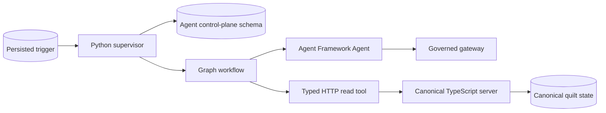

<!-- markdownlint-disable-file -->
# Task Research: Fantome Resident Agent Implementation

Research for implementing the accepted read-only Fantome resident-agent
architecture in zzyix. The architecture requires a durable Python worker using
Microsoft Agent Framework, while preserving the existing TypeScript server as
the sole authority for canonical quilt behavior.

## Task Implementation Requests

* Convert the accepted resident-agent architecture into an implementation-ready
  plan for the Mosaic Agents MVP.
* Identify the existing repository boundaries that can support the worker.
* Evaluate runtime, state-access, and workflow alternatives and select one
  approach for planning.

## Scope and Success Criteria

* Scope: Authentication and principals, canonical server contracts, PostgreSQL
  state, worker runtime, deployment, telemetry, and test coverage needed for a
  read-only resident-agent proof of concept.
* Exclusions: Model-authorized canvas mutation, user memory, user-authored
  prompt content, client-to-provider access, and a hosting-boundary redesign.
* Assumptions:
  * `docs/fantome-resident-agent-architecture.md` is the accepted v1 decision.
  * PostgreSQL remains the shared durable store.
  * Agent operations are limited to approved server reads and structured output.
* Success criteria:
  * The implementation preserves server authority and prevents direct canonical
    state mutation by the worker.
  * An implementer has a phased path with verified code anchors and tests.
  * The selected design supports a one-active-workflow-per-quilt guarantee,
    recovery, app-only identity, and bounded model interaction.

## Outline

1. Use existing server authorization-aware repositories behind new worker-only
   HTTP read contracts.
2. Add a separate Python worker and a restricted PostgreSQL agent-control-plane
   schema.
3. Establish app-only agent authentication and pre-provisioned principals.
4. Implement leases, triggers, checkpoints, read-only tools, and a governed
   model gateway.
5. Deploy the worker independently in the existing Azure Container Apps
   environment and activate it through evidence-backed feature gates.

## Potential Next Research

* Resolve the current Entra application-registration and tenant configuration.
  * Reasoning: The existing delegated-user verifier must gain a distinct,
    correctly scoped app-only token path.
  * Reference: apps/server/src/auth/tokenVerifier.ts lines 14-60
* Define the initial trigger producers and coalescing semantics.
  * Reasoning: Queue bounds and idempotency depend on what counts as meaningful
    work for a quilt.
  * Reference: docs/fantome-resident-agent-architecture.md lines 92-103
* Specify production operating limits.
  * Reasoning: Retention, backoff, queue size, model budget, and ingress policy
    are required before activation but have no verified repository value yet.

## Research Executed

### File Analysis

* docs/fantome-resident-agent-architecture.md
  * Establishes Python Agent Framework inside an explicit Workflow, a durable
    PostgreSQL control plane, a governed model gateway, read-only tools, and
    app-only managed-identity authentication.
* apps/server/src/auth/tokenVerifier.ts lines 14-60
  * Only validates delegated scopes (`scp` or `scope`); it has no application
    role or caller-kind branch.
* apps/server/src/auth/principalContext.ts lines 36-82
  * Auto-provisions absent principals as `human`, which cannot be reused for
    agents because unknown agent identities must be rejected.
* apps/server/src/auth/httpAuth.ts lines 38-62
  * Attaches immutable, server-derived principal context and is the extension
    point for an app-token authentication path.
* apps/server/src/db/schema.ts lines 68-97 and apps/server/src/db/types.ts
  lines 12-18
  * Limit principal kinds to `human` and `system`; an `agent` kind requires a
    migration and type update.
* apps/server/src/db/repository.ts lines 3360-3668
  * Implements principal-aware delivery context, authorized quilt snapshots,
    and ordered event replay. These are the correct canonical read primitives.
* apps/server/src/index.ts lines 1025-1185 and 2113-2210
  * Provides some public discovery HTTP reads, while fine-grained snapshots and
    event replay are Socket.IO subscription-only. Worker HTTP routes do not yet
    exist.
* apps/server/src/db/schema.ts lines 205-229 and apps/server/src/db/repository.ts
  lines 1581-1736
  * Demonstrate expiring leases, advisory locks, and transactions that can guide
    the agent-control-plane persistence design.
* apps/server/src/telemetry.ts lines 1-26 and infra/bicep/main.bicep lines 32-90
  * Establish Azure Monitor telemetry, an ACA environment, and private
    PostgreSQL, but no worker Container App or managed identity.

### Code Search Results

* `principal kind`, `scp`, `scope`, and `roles`
  * Server authentication is human delegated-token oriented; agent app-role
    verification and pre-provisioned mapping are absent.
* `snapshot`, `event replay`, and `subscribe_quilt_area`
  * Authorization-aware read implementation already exists in repositories, but
    it has no typed HTTP surface suitable for a worker.
* `agent-framework`, `pyproject.toml`, `Dockerfile`, and Foundry dependencies
  * No Python agent project, Agent Framework package, Foundry client, worker
    container, or worker deployment currently exists.

### External Research

* Microsoft Learn: Microsoft Agent Framework overview
  * Confirms the Python `agent-framework` package and distinguishes agent model
    behavior from explicit workflow coordination.
  * Source: [Microsoft Agent Framework overview](https://learn.microsoft.com/en-us/agent-framework/overview)
* Microsoft Learn: Microsoft Agent Framework workflows overview
  * Documents graph workflows, typed routing, executors, events, and
    checkpoints. The functional workflow API is experimental.
  * Source: [Microsoft Agent Framework workflows](https://learn.microsoft.com/en-us/agent-framework/workflows/overview)
* Microsoft Learn: access-token claims reference
  * Confirms that delegated permissions use `scp` while app-only permissions
    appear in `roles`.
  * Source: [Access token claims reference](https://learn.microsoft.com/en-us/entra/identity-platform/access-token-claims-reference)
* Microsoft Learn: protected web API app registration
  * Requires protected API token validation, including audience, issuer,
    signature, and expiration.
  * Source: [Configure protected web API apps](https://learn.microsoft.com/en-us/entra/identity-platform/scenario-protected-web-api-app-registration)

### Project Conventions

* Standards referenced: Existing Drizzle SQL migrations, PostgreSQL integration
  tests, immutable principal context, Azure Monitor OpenTelemetry, and Bicep
  deployment modules.
* Instructions followed: Task Researcher mode, repository Markdown standards,
  and the architecture decision supplied in the task context.

## Key Discoveries

### Project Structure

The repository is ready to host the required boundaries but not the worker
itself. The TypeScript server owns canonical quilt logic and durable
authorization audit. PostgreSQL already supports multi-replica coordination,
and the infrastructure already provisions an ACA environment, private database,
and Azure Monitor. A Python worker, agent-specific database schema, internal
server read contracts, managed identity, and app-role authentication are all
new work.

### Implementation Patterns

The existing canonical mutation path is deliberately repository-centered:
apps/server/src/db/repository.ts lines 1784-2150 performs transaction,
revision, authorization, collision, idempotency, and audit work. The Python
worker must not access these canonical tables directly. It should instead call
narrow server HTTP routes that reuse the repository's delivery context,
snapshot, and event replay methods.

For its own control plane, the worker may write only a new restricted schema:
agent assignment and lifecycle, per-quilt lease, run and checkpoint, trigger,
tool-call outcome, model-call metadata, and lifecycle audit history. The
database role must be denied writes to canonical quilt, patch, tile, ownership,
and authorization tables. This makes the architecture enforceable rather than
conventional.

### Complete Examples

The intended v1 call flow is:

```text
Trigger -> Python supervisor -> transactional lease claim
        -> Agent Framework graph workflow
        -> typed HTTP read tool -> TypeScript server authorization
        -> validated/redacted tool result -> governed model gateway
        -> structured response or proposal -> checkpoint commit
```

The Python worker should model workflow state explicitly rather than persist a
framework session dump:

```python
@dataclass(frozen=True)
class ResidentCheckpoint:
    agent_id: str
    quilt_id: str
    run_id: str
    workflow_state: str
    observed_revision: int | None
    pending_trigger_ids: tuple[str, ...]
    policy_version: str
    framework_version: str
    checkpoint_version: int
```

Tool clients must have fixed typed contracts. For example, a patch snapshot
request should accept only the agent's assigned patch identifier and a bounded
detail mode. It must not accept raw URLs, SQL, socket event names, or arbitrary
query fragments.

### API and Schema Documentation

The app-only authentication branch should validate issuer, audience, signature
algorithm, expiry, subject/application identity, and the `agent.runtime`
application role. It must map only an active, pre-provisioned identity to an
`agent` principal. It must not auto-provision, accept delegated `scp` as a
substitute for `roles`, or expose a Socket.IO path in V1.

Each control-plane mutation requires transactional semantics:

* Claim work only when no unexpired lease exists for the quilt.
* Renew only when the lease owner and run ID match the stored row.
* Stop workflow execution immediately after a failed renewal.
* Commit versioned checkpoints after canonical reads, completed tools, waits,
  and before lease release.
* Deduplicate persisted trigger IDs and bound the pending queue.
* Persist tool completion and idempotency keys before effects can be repeated.

### Configuration Examples

The new worker must receive configuration through managed identity and deployed
settings, not prompt content:

```text
AGENT_SERVER_BASE_URL=<internal server origin>
AGENT_DATABASE_DSN=<restricted control-plane role>
AZURE_AI_FOUNDRY_ENDPOINT=<approved endpoint>
APPLICATIONINSIGHTS_CONNECTION_STRING=<existing monitored path>
AGENT_LEASE_DURATION_SECONDS=<bounded policy value>
AGENT_MAX_PENDING_TRIGGERS=<bounded policy value>
```

## Technical Scenarios

### Durable Read-Only Resident Runtime

The runtime must process at most one workflow per quilt, survive replica loss,
and preserve server authority. A supervisor owns trigger dequeue, lease claim
and renewal, lifecycle transitions, retries, and checkpoint commits. It invokes
an Agent Framework Agent embedded in a graph Workflow for bounded model work.

**Requirements:**

* Use Python Microsoft Agent Framework with an explicit Workflow.
* Persist a per-quilt lease, trigger identity, run state, and versioned
  checkpoint in PostgreSQL.
* Stop on lease loss and recover from the latest committed checkpoint.
* Use only approved read tools and structured output in V1.

**Preferred Approach:**

* Deploy a separate Python worker inside the existing ACA environment. Let it
  access only a dedicated PostgreSQL agent-control-plane schema and call
  server-owned authenticated HTTP endpoints for all canonical reads.

```text
apps/
  agent-worker/
    pyproject.toml
    Dockerfile
    src/
      supervisor.py
      workflow.py
      gateway.py
      tools.py
      control_plane.py
      checkpoints.py
apps/server/
  src/auth/
  src/routes/agentReads.ts
  migrations/<agent-control-plane>.sql
infra/bicep/
  modules/agent-worker.bicep
```



**Implementation Details:**

1. Extend principal types and authored SQL migration to add `agent`. Add an
   explicit, auditable agent-provisioning operation, never automatic fallback.
2. Add a separate app-token verifier and agent resolver alongside the existing
   human path. Reuse `PrincipalContext` only after validation and mapping.
3. Add versioned server HTTP read contracts. Each route must use the existing
   repository authorization-aware reads, fixed limits, and audit logging.
4. Add control-plane tables and a role restricted to those tables. Implement
   compare-and-set lease renewals and checkpoint transactions.
5. Build graph workflow execution around a fake gateway first. Validate and
   redact every tool response before including it in the prompt. Keep memory
   disabled and exclude user-authored content.
6. Add Foundry integration behind a gateway with timeouts, retry budget, model
   routing, token limits, rate and concurrency limits, redacted telemetry, and
   deterministic malformed or unsafe-output fallback.
7. Deploy the worker independently with a managed identity, private database
   access, required API application role, and existing Azure Monitor telemetry.

#### Considered Alternatives

| Alternative | Reason not selected |
| --- | --- |
| Put the resident loop in the TypeScript server | Conflicts with the accepted Python Agent Framework decision and couples public serving to long-running lease work, model dependencies, and workflow failure modes. |
| Use Agent Framework Harness | The accepted architecture defers its planning, memory, compaction, approval, and broad tool features because they exceed the V1 threat model. |
| Use an agent-only loop | Leaves serialization, retries, checkpoints, and lease-loss behavior implicit rather than controlled by a supervisor and typed workflow. |
| Give the worker broad canonical database access | Bypasses server authorization and delivery policy and violates the authority boundary. |
| Put all worker state behind server APIs | Preserves one service boundary but makes the transactional lease/checkpoint control plane needlessly remote. |

### Validation and Activation

The implementation must begin with local and integration evidence before it is
enabled. The existing test suites contain focused anchors:

* apps/server/src/auth/tokenVerifier.test.ts lines 18-118 for app-role success,
  wrong-role, issuer, audience, algorithm, and expiry failures.
* apps/server/src/auth/principalContext.postgres.integration.test.ts lines
  25-116 for pre-provisioned agent acceptance, unknown-agent rejection, and
  inactive-agent rejection.
* apps/server/src/db/ownership.postgres.integration.test.ts lines 94-369 for
  PostgreSQL transactional race and audit test patterns that should be reused
  for lease takeover, renewal failure, trigger deduplication, and recovery.
* e2e/quilt-reconnect.spec.ts lines 68-259 for multi-replica contract testing
  after a worker process and agent token fixture exist.

Activation sequence:

1. Verify the fake-model read-only flow, lease loss, checkpoint migration, and
   recovery in integration tests.
2. Enable model-free read-only runtime under a feature flag.
3. Enable Foundry calls behind gateway budget, safety, and fallback tests.
4. Enable structured proposals behind a distinct feature flag.
5. Keep all mutation capability disabled pending a separate architecture and
   security decision.

## Selected Approach

Implement a separate Python Microsoft Agent Framework worker with a small
supervisor and graph Workflow. It has direct PostgreSQL access only to a newly
created, role-restricted agent-control-plane schema. Every canonical quilt read
uses a typed, app-only authenticated server HTTP endpoint backed by existing
authorization-aware repositories. The worker uses a governed model gateway and
is deployed as an independently scalable Container App in the existing ACA
environment.

This approach is selected because it satisfies all accepted architecture
boundaries: Python runtime, durable one-workflow-per-quilt behavior, server-only
canonical authority, no Socket.IO or broad database access, memory-disabled
prompt policy, and a distinct managed-identity application role. It also
reuses the repository's existing PostgreSQL, telemetry, authorization, audit,
and deployment foundations without treating observation as authority.

## Follow-Up Items

* Confirm same-tenant Entra role assignment versus a separate agent API
  registration before auth implementation begins.
* Decide whether a dedicated managed identity and pre-provisioned principal are
  required per logical agent, then define rotation and deprovisioning.
* Define trigger sources, coalescing criteria, capacity values, retention,
  retry, cost, latency, and redaction policies.
* Verify worker-to-server internal ingress and the least-privilege PostgreSQL
  role design in the target ACA topology.
