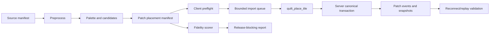

<!-- markdownlint-disable-file -->
# Task Research: Issue 155 Alexander Mosaic Remaining Work

Research remaining work for GitHub issue 155: "[Epic] Recreate famous historical mosaics in the app autonomously." The epic asks for a system in this repository that can faithfully recreate famous ancient mosaics inside the app, with the Alexander the Great House of the Faun mosaic as the first reference target.

## Task Implementation Requests

* Determine what work is already present in the repository for Alexander mosaic preprocessing, data generation, rendering, agent automation, and app integration.
* Identify remaining implementation gaps needed to satisfy the epic.
* Evaluate possible implementation approaches and select one recommended path for planning.
* Produce a consolidated research handoff for implementation planning.

## Scope and Success Criteria

* Scope: Research issue 155 against repository artifacts, tests, docs, current branch context, generated outputs, and local backlog artifacts relevant to autonomous historical mosaic recreation.
* Assumptions:
  * The current branch `agent-alex` contains partial Alexander mosaic work.
  * Generated files under `offline/output/` are local reproducible evidence because `/offline/output/` is ignored by Git.
  * The first implementation path should preserve the canonical quilt authority model and avoid direct SQL writes or a parallel mutation protocol.
  * "Autonomous" is ambiguous in the issue text. Current evidence supports deterministic generation/import now, while agent-owned mutation requires an explicit server authorization and product decision.
* Success Criteria:
  * Clear inventory of completed work with source references.
  * Clear list of remaining work grouped by implementation area.
  * Alternatives evaluated with one selected approach and rationale.
  * Actionable next steps for implementation planning.

## Outline

1. Existing Alexander source provenance, preprocessing, and mosaic-input generation are implemented and locally validated.
2. Existing app/server runtime already supports canonical tile placement, persistence, replay, patch revisions, and collaborative rendering.
3. Existing agent-worker is durable but read-only and cannot place tiles today.
4. Missing epic work is the bridge from generated image-space candidates to versioned app-ready placements, fidelity evidence, client import orchestration, canonical persistence/replay validation, and an explicit autonomy boundary.
5. Recommended path: generate a deterministic placement manifest, import it through the existing `quilt_place_tile` protocol with client preflight and bounded revision-safe queues, verify fidelity and replay, then decide whether agent-owned mutation is required as a later policy-backed slice.

## Potential Next Research

* Query live GitHub state for issues #155 through #167.
  * Reasoning: Local artifacts record child issue creation, but this research did not fetch live GitHub state.
  * Reference: .copilot-tracking/research/subagents/2026-08-09/issue-155-backlog-intent-research.md
* Compare `agent-alex` against `main`.
  * Reasoning: This would isolate which Alexander work is branch-only before implementation planning or PR preparation.
  * Reference: .copilot-tracking/research/subagents/2026-08-09/issue-155-backlog-intent-research.md
* Decide the autonomy product boundary.
  * Reasoning: Current server placement requires human ownership, and current worker output is observe-only.
  * Reference: .copilot-tracking/research/subagents/2026-08-09/alexander-mosaic-app-integration-research.md

## Research Executed

### File Analysis

* .copilot-tracking/research/subagents/2026-08-09/alexander-mosaic-pipeline-research.md
  * Verified existing provenance, preprocessing, generated-artifact, and script-test evidence.
  * Recorded that generated outputs currently include 1077 x 1616 preprocessing space, 24 palette colors, and 760 ranked tile candidates.
  * Recorded missing patch manifest, supported tile payload, tessera geometry, fidelity report, generated-artifact verifier, and candidate-level post-truncation feature coverage.
* .copilot-tracking/research/subagents/2026-08-09/alexander-mosaic-app-integration-research.md
  * Verified that the client already has `TileInstance`, tile geometry, Three.js rendering, ghost placement, quilt cache, canonical discovery, patch subscriptions, optimistic placement, ACK reconciliation, and undo.
  * Verified that the server already owns canonical quilt persistence, patch revisions, spatial refs, patch operations, snapshots, authorization, idempotency, Socket.IO placement, removal, and replay delivery.
  * Verified that the Python worker can claim triggers, lease quilts, checkpoint, read authorized server context/events/snapshots, and produce observe-only proposals, but cannot mutate tiles.
  * Recorded that Alexander data is not wired into the app runtime, server, or worker.
* .copilot-tracking/research/subagents/2026-08-09/issue-155-backlog-intent-research.md
  * Verified local backlog artifacts for child issues #156 through #167 under `.copilot-tracking/github-issues/discovery/alexander-mosaic-patch/`.
  * Verified architecture constraints from canonical quilt storage, finite toroidal quilt decisions, client/server placement path, and resident-agent architecture.
  * Inferred acceptance criteria for source reproducibility, placement payloads, canonical import, fidelity scoring, replay, tests, and autonomy constraints.

### Code Search Results

* Alexander runtime wiring
  * No `apps/client/src/**/mosaicImport*` file found.
  * No `e2e/*mosaic*` test found.
  * No tracked patch manifest or app-ready placement payload found.
  * No server route, worker tool, or trigger type found for Alexander generation/import.
* Existing pipeline references
  * Alexander references are concentrated in `scripts/`, `offline/reference/`, ignored `offline/output/`, `package.json`, and `.copilot-tracking/` planning/review artifacts.

### External Research

No external research executed. This task was scoped to repository state and the attached GitHub issue context.

### Project Conventions

* Standards referenced: Task Research mode instructions and local repository architecture evidence.
* Instructions followed: Research documents stayed under `.copilot-tracking/research/`; codebase investigation was delegated to Researcher Subagent; implementation files were not modified.
* Architecture constraints:
  * `docs/canonical-quilt-data-storage.md` defines canonical quilt persistence as PostgreSQL tile records with patch/chunk indexing and patch operation history, not a single large image or JSON blob.
  * `docs/decisions/2026-07-27-finite-toroidal-quilt-v01.md` defines the finite wrapped protocol-V2 quilt, patch topology, canonical coordinates, and non-duplicated periodic rendering.
  * `docs/decisions/2026-08-07-resident-agent-architecture.md` requires resident agents to act through ordinary authenticated API contracts and preserve server authority.
  * `apps/agent-worker/README.md` documents the current worker as read-only.

## Key Discoveries

### Project Structure

Completed or substantially complete areas:

* Source provenance contract: `offline/reference/alexander-source-license-records.json` and `offline/reference/README.md`.
* Preprocessing pipeline: `scripts/preprocess-alexander-source.mjs`, `scripts/preprocess-alexander-source.test.mjs`, and generated `offline/output/alexander-preprocessed/` artifacts.
* Mosaic-input generation: `scripts/generate-alexander-mosaic-inputs.mjs`, `scripts/generate-alexander-mosaic-inputs.test.mjs`, and generated `offline/output/alexander-mosaic-inputs/` artifacts.
* Runtime substrate: client placement/rendering/cache code in `apps/client/src/`, server canonical quilt authority in `apps/server/src/`, and E2E collaboration/reconnect tests in `e2e/`.
* Read-only autonomy substrate: `apps/agent-worker/src/` plus `apps/server/src/routes/agentReads.ts`.

Missing or incomplete areas:

* Patch-compatible placement manifest generation.
* Supported tessera assignment to app tile shapes/materials/transforms.
* Fidelity scoring and visual acceptance report.
* Client import parser/preflight and bounded revision-safe placement queue.
* Server/replay/E2E tests proving imported placements persist and converge.
* Agent-owned write authority or a product decision that v1 autonomy is deterministic generation plus user-approved import.

### Implementation Patterns

* Existing placement should be reused. `apps/client/src/App.tsx` already emits `quilt_place_tile` with expected patch revisions and reconciles ACKs into `quiltCache`.
* Existing server authority should remain the source of truth. `apps/server/src/index.ts` validates socket payloads and delegates to `persistQuiltTilePlacement`; `apps/server/src/db/repository.ts` performs authorization, patch locking, collision checks, tile insertion, spatial refs, patch operations, patch revision increments, and idempotency binding.
* Existing tile contract constrains generated output. `apps/client/src/domain/tileGeometry.ts` and `apps/server/src/contracts.ts` support square, triangle, rectangle, l-shape, large-square, circle, right-triangle, and large-right-triangle with ceramic, glass, and stone materials.
* Existing worker cannot be treated as a mutation actor without new design. `apps/agent-worker/src/gateway.py` only allows observe actions, and current server placement requires an active human patch owner.

### Complete Examples

Existing validation commands:

```bash
npm run verify:alexander-source
npm run test:preprocess-alexander-source
npm run test:alexander-mosaic-inputs
```

Existing generation commands:

```bash
npm run preprocess:alexander-source -- --live
npm run generate:alexander-mosaic-inputs
```

Recommended future planning target for generated placement manifest:

```json
{
  "schemaVersion": "alexander.patch-manifest.v1",
  "sourceImageId": "alexander-mosaic-primary",
  "sourceSha256": "6c3731140a79698818db392e7a0a1985a56dad1fbf034552bd214dd14fd4397b",
  "preprocessingConfigSha256": "f261deac833975efdefe4b818adc65689ced42b8c39e725a6ff35ee617c95712",
  "mosaicInputsConfigSha256": "95df0852dd9beb4c0d49becad9b57b0a01f315839bf0f436c441688bbe891cc6",
  "coordinateSpace": {
    "source": "preprocessed-source-pixel",
    "width": 1077,
    "height": 1616,
    "target": "canonical-quilt-patch"
  },
  "supportedTileContract": {
    "shapes": ["square", "triangle", "rectangle", "l-shape", "large-square", "circle", "right-triangle", "large-right-triangle"],
    "materials": ["ceramic", "glass", "stone"]
  },
  "placements": [],
  "fidelity": {
    "reportPath": "offline/output/alexander-mosaic-inputs/alexander-fidelity-report.json"
  }
}
```

Recommended future client import flow:

```text
offline candidate JSON
  -> deterministic placement manifest
  -> client parse/preflight
  -> bounded queue using quilt_place_tile
  -> server authorization/collision/revision transaction
  -> patch events/snapshots
  -> reconnect/replay validation
```

### API and Schema Documentation

* Source provenance manifest: `offline/reference/alexander-source-license-records.json`.
* Generated preprocessing config: `offline/output/alexander-preprocessed/alexander-preprocessing-config.json`.
* Generated mosaic-input config: `offline/output/alexander-mosaic-inputs/alexander-mosaic-inputs-config.json`.
* Runtime tile and protocol contracts: `apps/server/src/contracts.ts` and `apps/client/src/domain/placementSolver.ts`.
* Canonical storage schema: `apps/server/src/db/schema.ts` and migrations under `apps/server/migrations/`.
* Agent control-plane schema: `apps/server/migrations/0012_agent_control_plane.sql` and `apps/server/migrations/0015_patch_scoped_agent_assignments.sql`.

### Configuration Examples

Current generated output shape from subagent research:

```text
preprocessed width: 1077
preprocessed height: 1616
palette size: 24
ranked candidates: 760
preprocessing config sha256: f261deac833975efdefe4b818adc65689ced42b8c39e725a6ff35ee617c95712
mosaic inputs config sha256: 95df0852dd9beb4c0d49becad9b57b0a01f315839bf0f436c441688bbe891cc6
palette sha256: 2962b77cf2ab13a211169febc19bb1ba78fc3c4db803e000c5bc48190519f4b1
candidates sha256: f1213ac07cee54db735ab0f4f7a641ce3a68e0dc96733a02dcf652b4d8142f5a
```

## Technical Scenarios

### Selected Scenario: Deterministic Manifest Plus Canonical Client Import

Complete issue 155 through a deterministic, reproducible generation pipeline that produces app-supported tile placements, then imports those placements through the existing client/server `quilt_place_tile` path with bounded queues, expected patch revisions, ACK reconciliation, server authority, replay validation, and fidelity evidence.

**Requirements:**

* Generate a versioned patch placement manifest from existing palette/candidate outputs.
* Use only supported tile shapes, materials, colors, transforms, and canonical coordinates.
* Validate source provenance, generated artifact hashes, payload schema, payload budgets, and topology bounds before import.
* Submit placements through existing `quilt_place_tile`; do not direct-write SQL and do not add a parallel mutation protocol.
* Bound concurrent/in-flight placements and define deterministic stale-revision retry and collision-skip behavior.
* Verify persistence, patch operation history, snapshots, replay, reconnect convergence, and fidelity thresholds.
* Defer agent-owned write authority until a server/product policy explicitly allows it.

**Preferred Approach:**

* Use the existing canonical quilt protocol as the import boundary because it already owns validation, authorization, collision checks, idempotency, patch revisions, persistence, and replay.
* Build a new deterministic generation stage after `scripts/generate-alexander-mosaic-inputs.mjs` instead of expanding client runtime to interpret raw image-space candidates.
* Add client preflight and queue code as a narrow product surface rather than a server bulk import endpoint, preserving the same semantics as manual placement.
* Treat v1 autonomy as deterministic generation plus operator/user-triggered import unless the product explicitly requires agent-owned writes.

```text
scripts/
  generate-alexander-mosaic-inputs.mjs            existing
  generate-alexander-patch-manifest.mjs          new
  score-alexander-patch-fidelity.mjs             new
apps/client/src/domain/
  mosaicImport.ts                                new
  mosaicImport.test.ts                           new
apps/client/src/
  import queue integration near App mutation path
apps/server/src/
  focused tests for existing placement/replay path with import-shaped payloads
e2e/
  alexander-mosaic-import.spec.ts                new
offline/output/
  alexander-mosaic-inputs/
    alexander-patch-manifest.json                generated
    alexander-fidelity-report.json               generated
```



**Implementation Details:**

* The manifest generator should map preprocessed pixel coordinates to a chosen target patch/world rectangle, derive tile positions, select supported shapes/materials, assign palette colors, and output stable operation order.
* The generator should record source image hash, preprocessing config hash, mosaic-input config hash, generator seed, coordinate transform, tile count, conflict policy, feature coverage after truncation, and payload budget metadata.
* Client preflight should reject unsupported shapes/materials, invalid transforms, out-of-bounds coordinates, duplicate IDs, excessive payloads, missing expected patch revisions, and manifest/source hash mismatches.
* Import execution should reuse the same expected-patch-revision and ACK reconciliation concepts used by manual placement in `apps/client/src/App.tsx`.
* Server validation should remain unchanged unless import provenance needs to be attached to operation metadata. If metadata is needed, it should extend existing operation payload/audit paths rather than bypassing repository placement logic.
* Fidelity scoring should produce machine-readable metrics and thresholds. Backlog artifacts already point to a weighted score using luminance MS-SSIM, edge F1, directional divergence, and silhouette IoU.

#### Considered Alternatives

* Server-side bulk import endpoint.
  * Rejected for v1 because it risks duplicating or bypassing existing Socket.IO placement semantics, expected patch revisions, optimistic/reconnect behavior, and client-visible ACK outcomes. It may be useful later for administrative imports if it delegates internally to the same repository path and preserves authorization/audit semantics.
* Agent-worker commits placements directly.
  * Rejected for v1 because current worker tools and gateway are observe-only, and current server placement requires active human patch ownership. Agent-owned mutation should be a separate policy-backed implementation aligned with resident-agent architecture.
* Static rendered Alexander image or texture overlay.
  * Rejected because issue 155 asks to recreate mosaics inside the app, and the app's domain is durable tile placement. An image overlay would not exercise tile persistence, patch history, collaboration, replay, or autonomous construction.
* Commit ignored `offline/output/` artifacts as runtime assets.
  * Rejected as the default because the current repository intentionally ignores generated outputs. A compact committed run manifest or fixture may be appropriate, but generated binary/source-derived artifacts should remain reproducible unless planning decides otherwise.

### Scenario: Full Agent-Owned Autonomous Recreation

This scenario treats "autonomously" as the Python resident agent initiating and committing tile placement without human approval.

**Requirements:**

* Add an agent principal write authority model.
* Add safe mutation tools or server-managed import triggers.
* Preserve server ownership, validation, revision, idempotency, ordering, transaction, and audit guarantees.
* Prove model output cannot bypass deterministic validation or collision checks.

**Preferred Approach:**

* Not selected for the first implementation slice. Plan it only after the deterministic manifest/import path exists and product owners confirm that agent-owned writes are required.

#### Considered Alternatives

* Grant the existing worker direct database write access.
  * Rejected because it violates documented resident-agent architecture and bypasses server authority.
* Let model output decide placement mutations directly.
  * Rejected because current gateway only permits observe actions and architecture documents defer mutation decisions to deterministic/server-validated paths.

## Planning-Ready Remaining Work

1. Close source-pack and manifest contract.
   * Confirm current child issue state for #157 through #159.
   * Decide whether the close-up remains v1 target or whether full-scene horse retention is required.
   * Resolve or document the normalized working-source path mismatch between the source manifest and generated preprocessing output directory.
   * Add generated-artifact verifier or committed run manifest policy.
2. Generate patch-compatible tessera placements.
   * Add deterministic placement manifest generation from palette/candidate JSON.
   * Enforce supported shape/material/color/transform/topology contracts.
   * Add post-truncation feature coverage reporting for face, weapon, armour, and contour.
3. Add fidelity scoring and visual acceptance.
   * Rasterize or render generated payloads for comparison.
   * Compute machine-readable metrics and thresholds.
   * Record generated report path and failure reasons.
4. Build client import preflight and revision-safe queue.
   * Add a client domain parser/validator.
   * Execute import via existing `quilt_place_tile` semantics with bounded windows.
   * Handle ACKs, stale revisions, collisions, disconnects, cancellation, and deterministic resume/stop behavior.
5. Verify server persistence, replay, and reconnect.
   * Add focused server tests with import-shaped payloads.
   * Add E2E coverage for import, reconnect convergence, and no duplicate/unauthorized writes.
6. Resolve autonomy boundary.
   * Decide whether v1 is user-triggered deterministic import, agent-triggered proposal, or actual agent-owned placement.
   * If agent-owned placement is required, plan it as a separate server-authorized mutation feature.
7. Run final validation and handoff.
   * Run focused script checks, client/server tests, Playwright import test, fidelity check, and process cleanup checks.
   * Capture generated artifact hashes, validation results, and residual risks.

## Evidence Log

Subagent research documents:

* .copilot-tracking/research/subagents/2026-08-09/alexander-mosaic-pipeline-research.md
* .copilot-tracking/research/subagents/2026-08-09/alexander-mosaic-app-integration-research.md
* .copilot-tracking/research/subagents/2026-08-09/issue-155-backlog-intent-research.md

Key repository artifacts cited by subagents:

* `package.json:48-52`, `package.json:68`
* `.gitignore:7`
* `offline/reference/README.md:8-66`
* `offline/reference/alexander-source-license-records.json:1-180`
* `scripts/verify-alexander-source-provenance.mjs:1-135`
* `scripts/preprocess-alexander-source.mjs:1-424`
* `scripts/generate-alexander-mosaic-inputs.mjs:1-459`
* `scripts/preprocess-alexander-source.test.mjs:1-190`
* `scripts/generate-alexander-mosaic-inputs.test.mjs:1-151`
* `offline/output/alexander-preprocessed/alexander-preprocessing-config.json:1-140`
* `offline/output/alexander-mosaic-inputs/alexander-mosaic-inputs-config.json:1-45`
* `offline/output/alexander-mosaic-inputs/alexander-mosaic-palette.json:1-439`
* `offline/output/alexander-mosaic-inputs/alexander-tile-candidates.json:1-16731`
* `apps/client/src/App.tsx`
* `apps/client/src/domain/tileGeometry.ts`
* `apps/client/src/domain/placementSolver.ts`
* `apps/client/src/domain/quiltCache.ts`
* `apps/client/src/render/MosaicScene.tsx`
* `apps/server/src/contracts.ts`
* `apps/server/src/index.ts`
* `apps/server/src/db/repository.ts`
* `apps/server/src/db/schema.ts`
* `apps/server/src/routes/agentReads.ts`
* `apps/agent-worker/README.md`
* `apps/agent-worker/src/gateway.py`
* `apps/agent-worker/src/workflow.py`
* `docs/canonical-quilt-data-storage.md`
* `docs/decisions/2026-07-27-finite-toroidal-quilt-v01.md`
* `docs/decisions/2026-08-07-resident-agent-architecture.md`
* `docs/fantome-resident-agent-architecture.md`
* `.copilot-tracking/github-issues/discovery/alexander-mosaic-patch/issue-analysis.md`
* `.copilot-tracking/github-issues/discovery/alexander-mosaic-patch/issues-plan.md`
* `.copilot-tracking/github-issues/discovery/alexander-mosaic-patch/handoff.md`
* `.copilot-tracking/github-issues/discovery/alexander-mosaic-patch/handoff-logs.md`
* `.copilot-tracking/reviews/2026-08-07/alexander-mosaic-patch-plan-review.md`
* `.copilot-tracking/reviews/rpi/2026-08-07/alexander-mosaic-patch-plan-001-validation.md`

Validation evidence from subagent research:

```text
npm run verify:alexander-source                         passed
npm run test:preprocess-alexander-source                passed, 2 tests
npm run test:alexander-mosaic-inputs                    passed, 1 test
git status --short --ignored offline/output             reported !! offline/output/
```
