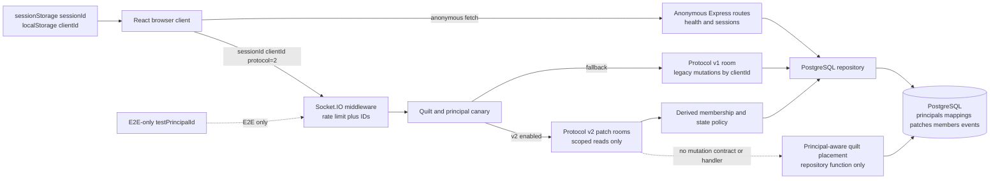

## Research scope

* Current HTTP and Socket.IO authentication boundary
* Current client identity and connection lifecycle
* Implemented persistence compared with ADR-only identity and authorization requirements
* Protocol-v2 read and mutation paths
* Authentication and authorization tests and rollout gates
* GitHub backlog dependencies, overlap, gaps, and recommended priority
* Repository conventions and deployment constraints

## Status

Complete as of 2026-07-28. Repository evidence reflects the checked-out workspace;
backlog evidence reflects GitHub issue state retrieved from `dkirby-ms/zzyix` on the
same date.

## Executive findings

* Production authentication is not implemented. HTTP routes are anonymous, and the
	Socket.IO middleware validates only caller-supplied `sessionId` and `clientId`.
	A UUID principal can enter socket state only through the E2E-only, undeclared
	`testPrincipalId` handshake property.
* Protocol v2 has an implemented, tested, patch-scoped read path and an implemented
	repository transaction for authorized placement. It has no v2 mutation transport
	contract, server handler, removal transaction, acknowledgement model, or usable
	client wiring. The handshake intentionally reports `mutationEnabled: false`.
* The database implements principals, external subject mappings, owner/member records,
	patch lifecycle states, actor attribution, and atomic owner-only cross-patch placement.
	Persisted visibility policies, delegated capabilities, moderator assignments, claims,
	transfers, lifecycle transition records, and general audit records remain ADR-only.
* [Issue #94](https://github.com/dkirby-ms/zzyix/issues/94) is the correct next feature
	under [epic #93](https://github.com/dkirby-ms/zzyix/issues/93). The older
	[issue #14](https://github.com/dkirby-ms/zzyix/issues/14) overlaps as a generic
	canvas-level auth umbrella and should be linked, narrowed, or superseded to avoid two
	sources of scope.
* Identity-provider selection, account lifecycle, and visibility/delegation semantics
	require product and security decisions before broad authorization implementation.

## Server authentication boundary

### HTTP

The Express stack parses JSON, applies origin-based CORS, logs requests, and exposes
`GET /health`, `GET /sessions`, and rate-limited `POST /sessions` without authentication
or authorization. CORS echoes an allowed request origin, allows credentials, accepts
`GET`, `POST`, and `OPTIONS`, and permits only `Content-Type`; it does not yet permit an
`Authorization` header. A missing or disallowed origin receives no CORS allow header,
but same-origin and non-browser callers can still access the routes. See
`apps/server/src/index.ts:1317-1369` and `apps/server/src/index.ts:1376-1426`.

The only guarded REST routes are E2E controls compiled into runtime behavior when
`NODE_ENV=test` and `E2E_TEST_MODE=true`. They compare a static
`x-zzyix-test-token` header and return JSON `{ error: 'Forbidden' }` with HTTP 403.
These controls seed a principal and patch owner directly; they are not a production
identity path. See `apps/server/src/index.ts:1319-1320`,
`apps/server/src/index.ts:1458-1547`, and `apps/server/src/index.ts:1566-1648`.

HTTP failures are ad hoc `{ error: string }` bodies with status 400, 403, 429, or 500.
The shared contracts define an `ApiError`, but the current routes do not use a common
authenticated error envelope. Session creation rate limiting returns HTTP 429 and a
safe generic message. See `apps/server/src/index.ts:143-149` and
`apps/server/src/contracts.ts:134-149`.

### Socket.IO

`ConnectionAuth` contains `sessionId`, `clientId`, protocol version, and the v1
compatibility flag. `SocketData` can hold an optional `principalId`, but the public
handshake contract has no token, credential, or identity claims. See
`apps/server/src/contracts.ts:237-255`.

The connection middleware rate-limits attempts by forwarded or remote address, then
requires only truthy `sessionId` and `clientId`. It does not validate identifier format,
session existence, issuer, audience, signature, expiry, nonce, or revocation. On success
it trusts those values as socket metadata. See `apps/server/src/index.ts:1691-1756`.

When `E2E_TEST_MODE=true`, middleware also reads an extra `testPrincipalId` field through
a record cast and accepts it if it matches the UUID pattern. This field is intentionally
absent from `ConnectionAuth`, but E2E tests use it to exercise principal-scoped reads.
See `apps/server/src/index.ts:1743-1748` and `e2e/quilt-reconnect.spec.ts:25-39`.

Middleware failures call `next(new Error(message))`: missing IDs and rate limits become
Socket.IO `connect_error` messages. Initialization failures after connection are logged
and force-disconnect the socket without a typed reason. Subscription authorization is
represented inside acknowledgements as `forbidden`, commonly `NOT_VISIBLE` or
`QUILT_NOT_VISIBLE`; unexpected subscription failures are reported as `invalid` with
`SUBSCRIPTION_FAILED`. See `apps/server/src/index.ts:1712-1740`,
`apps/server/src/index.ts:1845-1852`, and `apps/server/src/index.ts:2350-2571`.

### Protocol selection

On a requested v2 connection, the server loads the quilt and optional principal,
evaluates the quilt/principal canary, and emits a v2 handshake only when rollout permits.
Otherwise it silently falls back to v1. V2 advertises `mutationEnabled: false`; v1
advertises the legacy mutation feature flag. See `apps/server/src/index.ts:1782-1827`.

This design correctly prevents current v2 mutation, but fallback is not suitable for an
authentication boundary: an absent or unmapped production principal currently changes
rollout/read capability rather than producing a deliberate authentication result.

## Client identity and connection lifecycle

The client stores the selected session under `zzyix_session_id` in `sessionStorage`, so
it survives reloads in one tab, and stores a random `zzyix_client_id` in `localStorage`,
so it survives tabs and browser restarts. Neither identifier is an authenticated
principal. See `apps/client/src/network/session.ts:4-6`,
`apps/client/src/network/session.ts:47-55`, and
`apps/client/src/network/session.ts:111-119`.

`createSession` and `listSessions` use anonymous `fetch` requests. They send no cookies
option, bearer token, CSRF token, or authenticated request wrapper. Errors preserve only
the HTTP status in a new `Error`. See `apps/client/src/network/session.ts:57-97`.

`App` owns session selection, lobby/canvas mode, collaborators, protocol-v2 handshake,
bounded quilt cache, and connection status. Joining stores the session and causes the
socket hook to run. Returning to the lobby clears connection-derived canvas state but
not the persisted `clientId`. See `apps/client/src/App.tsx:375-427` and
`apps/client/src/App.tsx:500-534`.

`useSocketConnection` creates a new Socket.IO client whenever its dependency set changes.
It sends the untrusted session/client IDs, requests v2 without v1 compatibility, enables
WebSocket with polling fallback, and retries five times with 1-5 second delay. Cleanup
disconnects the old socket. Protocol selection gates legacy event handlers; v2 snapshots,
events, and resync events have separate subscriptions. See
`apps/client/src/network/useSocketConnection.ts:27-100` and
`apps/client/src/network/useSocketConnection.ts:101-188`.

Connection status is reduced to `connecting`, `connected`, `disconnecting`,
`disconnected`, or `error`, with only a message string for `connect_error`. The hook
polls the mutable socket ref every 200 ms. The status strip can display the error, but
there is no distinction among expired authentication, forbidden quilt access, transient
network failure, and protocol mismatch. See
`apps/client/src/network/useConnectionStatus.ts:1-82` and
`apps/client/src/ui/StatusIndicator.tsx:1-38`.

For v2, the client computes canonical patch requests from visible chunks, submits
`subscribe_quilt_area`, merges accepted cursors, and caches scoped snapshots/events.
Reconnect naturally creates a new socket and resubscribes from cache cursors because
the socket lifecycle and subscription effects rerun. See `apps/client/src/App.tsx:905-949`
and `apps/client/src/App.tsx:1000-1040`.

### Recommended profile location

A server-derived `PrincipalProfile` should be top-level `App` state alongside
`quiltProtocol` and connection state, not embedded in the random client/session storage
module. A small auth/session client should hydrate it through a protected `GET /me` or
verified bootstrap response before protected REST calls and make the same credential
available to Socket.IO.

The existing UI ownership boundaries support two projections:

* `LobbyScreen` should own sign-in, sign-out, account recovery/error prompts, and which
	quilts or canvases the principal may join. See `apps/client/src/ui/LobbyScreen.tsx:4-24`
	and `apps/client/src/App.tsx:1538-1554`.
* `AppHeader` should show active principal identity and context-sensitive role/capability
	status, while `StatusIndicator` remains transport health. See
	`apps/client/src/ui/AppHeader.tsx:1-38` and `apps/client/src/App.tsx:1556-1570`.

Do not replace `clientId` with `principalId`: one principal may have multiple tabs,
devices, or sockets. Keep connection identity for ephemeral presence and derive durable
authorization and attribution exclusively from the verified server principal.

## Persistence and policy model

### Implemented

The additive quilt migration and Drizzle schema implement:

* `principals`: UUID, `human|system` kind, optional display name, creation time
* `external_principal_mappings`: unique `(provider_namespace, external_subject)` to one
	principal, with cascade deletion and an index by principal
* `patches`: nullable owner principal, state, revision, canonical quilt address
* `patch_memberships`: one principal per patch with `member|owner` role
* `patch_operations`: actor principal, operation/event IDs, type, payload, and timestamp
* `patch_snapshots` and canonical tile spatial references

See `apps/server/src/db/schema.ts:61-166`, `apps/server/src/db/schema.ts:179-279`,
`apps/server/src/db/types.ts:7-27`, and
`apps/server/migrations/0005_finite_toroidal_quilt.sql:1-155`.

`loadQuiltDeliveryContext` can resolve an existing external mapping if code supplies
provider namespace and subject, but no production caller supplies that identity. It
marks a principal as a patch member when the owner column or any membership row matches.
See `apps/server/src/db/repository.ts:1452-1514`.

`buildPatchRoomAccess` derives an in-memory visibility approximation solely from
lifecycle state and membership. Public fine data is always false; active, unclaimed,
and suspended patches expose public aggregates; members receive fine/aggregate/events
for most nondeleted states and presence only while active. This policy is code, not
persisted configuration, and has no moderator or purpose context. See
`apps/server/src/index.ts:203-216` and `apps/server/src/realtime/quiltRooms.ts:39-60`.

`persistQuiltTilePlacement` implements canonical placement, deterministic patch locks,
owner-only authorization over every footprint-intersected active patch, expected
revision checks, collision validation, tile/spatial-reference writes, actor-attributed
operations, and all-or-nothing commit. Despite the `member` name, only membership role
`owner` grants mutation. See `apps/server/src/db/repository.ts:703-910`.

### Accepted ADR requirements not implemented

The accepted finite-quilt ADR requires stable authenticated external principals;
unambiguous mapping; account linking, recovery, deletion, and provider outage behavior;
scoped delegated mutation grants; separately assigned and audited moderators; atomic
claims; pending ownership transfers; suspension/deletion workflows; recoverable
retention; and one persisted visibility matrix across snapshots, aggregates, presence,
search, and events. See
`docs/decisions/2026-07-27-finite-toroidal-quilt-v01.md:137-242`.

No current tables or handlers implement:

* Provider issuer/audience metadata, mapping status, account links, revocation, or
	principal lifecycle timestamps
* Quilt-level membership distinct from patch membership
* Per-capability member delegation or deny grants
* Patch/quilt visibility policy fields
* Moderator assignments, scope, purpose, or reason
* Claim eligibility, claim attempt/event, pending transfer, acceptance, or recovery
* Lifecycle transition requests and approvals
* A general authorization/moderation audit record with actor, subject, reason, outcome,
	and before/after state
* Search or quilt-roster authorization surfaces

`patch_operations` is durable content history, not a complete authorization audit log.
The schema's lifecycle enum is implemented, but transition rules are not. Ownership can
currently be assigned by seed/backfill/test code, not by a claim or transfer workflow.

## Protocol-v2 read and mutation paths

### Implemented read path

1. Client requests protocol v2 in socket auth.
2. Server resolves quilt topology and optional mapped/test principal.
3. Canary/global flags select v2 and negotiate immutable topology plus budgets.
4. Client maps viewport chunks to canonical patch room requests and sends cursors.
5. Server canonicalizes toroidal aliases, checks derived access and room/chunk/churn
	 budgets, and joins chunk-qualified adapter rooms.
6. Server reconstructs patch state and emits a scoped fine snapshot, aggregate snapshot,
	 or contiguous replay; cursor/budget failures remain explicit.
7. Client merges patch snapshots/events into a bounded cache and resubscribes with
	 cursors after reconnect.

Contracts are in `apps/server/src/contracts.ts:459-547` and
`apps/server/src/contracts.ts:559-616`. Resolution and delivery are in
`apps/server/src/realtime/quiltRooms.ts:62-151`,
`apps/server/src/index.ts:2350-2571`, and
`apps/server/src/db/repository.ts:1517-1685`. Client wiring is in
`apps/client/src/network/useSocketConnection.ts:77-100` and
`apps/client/src/App.tsx:580-653`.

### Precise mutation gaps

The repository has `persistQuiltTilePlacement`, but it is used only by database and
recovery integration tests. There is no corresponding v2 removal repository function.
See `apps/server/src/db/repository.ts:703-920` and
`apps/server/src/db/repository.postgres.integration.test.ts:21-239`.

The event contract exposes only legacy `place_tile` and `remove_tile` payloads. They
lack `quiltId`, stable `operationId`, complete `expectedPatchRevisions`, canonical
footprint/cursor response data, `UNAUTHORIZED`, and safe identity/auth failure reasons.
No `place_quilt_tile` or `remove_quilt_tile` events exist. See
`apps/server/src/contracts.ts:257-305` and `apps/server/src/contracts.ts:559-581`.

Server legacy mutation handlers reject every selected-v2 socket before persistence.
They call `persistTilePlacement`/`persistTileRemoval` with `clientId` attribution, not
the principal-aware quilt transaction. See `apps/server/src/index.ts:1856-1974` and
`apps/server/src/index.ts:1978-2052`.

Client placement and undo contain dormant v2 branches, but when enabled they still emit
legacy events with one canvas revision and one cached patch ID. They cannot authorize a
cross-patch footprint or reconcile per-patch revisions. See
`apps/client/src/App.tsx:1148-1188` and `apps/client/src/App.tsx:1278-1342`.

The missing implementation is therefore a full vertical slice: authenticated principal
bootstrap, explicit v2 mutation contracts and typed failures, principal-aware handlers,
authorized placement and removal transactions, post-commit scoped event fanout, client
multi-patch preconditions/optimistic reconciliation, and alias/reconnect E2E tests.

## Tests and rollout gates

Implemented coverage includes:

* Socket middleware/CORS helper and legacy handler semantics in
	`apps/server/src/index.test.ts:25-391`
* Atomic quilt placement idempotency, stale writes, owner authorization, and member
	denial against PostgreSQL in
	`apps/server/src/db/repository.postgres.integration.test.ts:118-239`
* Explicit room invalid/forbidden/budget outcomes and lifecycle visibility in
	`apps/server/src/realtime/quiltRooms.test.ts:24-110`
* Principal-and-quilt canary selection and the authenticated-principal legacy retirement
	gate in `apps/server/src/migration/quiltRollout.test.ts:10-90`
* E2E anonymous denial, test-principal access, cross-replica cursor replay, and no event
	leakage from rejected room scope in `e2e/quilt-reconnect.spec.ts:42-155`
* Alias deduplication and an explicit assertion that v2 mutation remains disabled in
	`e2e/quilt-seams.spec.ts:57-104`
* Client v2 subscription/cache behavior and mutation-disabled behavior in
	`apps/client/src/App.test.tsx:728-838`

Missing gates include real token verification and expiry; external mapping creation,
collision, linking, and deletion; authenticated REST and Socket.IO parity; owner,
delegated member, moderator, and deny matrices; persisted visibility/redaction across
all surfaces; claim/transfer/lifecycle concurrency; authorization audit records; and
authenticated alias mutation through two replicas.

Legacy retirement is environment-gated on parity, recovery, multi-replica behavior,
authenticated principal integration, client budgets, measured-window approval, and
rollback-policy approval. The decision is logged, but current startup reporting always
states legacy protocol/storage are available; no destructive retirement occurs. See
`apps/server/src/migration/quiltRollout.ts:22-113` and
`apps/server/src/index.ts:2619-2630`.

## GitHub backlog analysis

| Issue | State and role | Dependency and overlap assessment |
|---|---|---|
| [#53 Infinite scrolling canvas](https://github.com/dkirby-ms/zzyix/issues/53) | Open UX feature | Original wraparound request. Most architecture is delivered; use #93 as delivery epic and close #53 only when product-visible wraparound is accepted or explicitly track UX-only residue. |
| [#93 Infinite canvas rollout and legacy retirement](https://github.com/dkirby-ms/zzyix/issues/93) | Open P0 epic | Correct parent for #94-#100 and remaining rollout outcomes. |
| [#94 Identity, authorization, and visibility policy](https://github.com/dkirby-ms/zzyix/issues/94) | Open P0 feature | Critical path and next work. Blocks mutation enablement and #98; supplies an entry criterion for #100. |
| [#14 Authz and authn](https://github.com/dkirby-ms/zzyix/issues/14) | Open P2 feature | Older generic canvas owner/editor/viewer scope overlaps #94. Convert to the provider/runtime-auth child of #94, or close as superseded after its acceptance criteria move into decomposed work. |
| [#95 Production budgets and canary thresholds](https://github.com/dkirby-ms/zzyix/issues/95) | Open P0 task | Can benchmark anonymous reads in parallel, but final cohort dashboards and mutation thresholds depend on stable principals and v2 writes. |
| [#96 Repair Drizzle migration metadata](https://github.com/dkirby-ms/zzyix/issues/96) | Open P1 task | Should precede new auth-policy schema migration generation to avoid compounding an acknowledged metadata gap. |
| [#97 One-shot production migration job](https://github.com/dkirby-ms/zzyix/issues/97) | Open P1 task | Should be ready before deploying auth-policy migrations; coordinates with open rollback issue #19. |
| [#98 Authenticated protocol-v2 alias mutation E2E](https://github.com/dkirby-ms/zzyix/issues/98) | Open blocked P0 test | Correctly blocked by stable principal integration and delegated policy. It also depends on v2 mutation contracts/handlers and should coordinate with #20 for two-replica execution. |
| [#99 Production adapter attachment telemetry](https://github.com/dkirby-ms/zzyix/issues/99) | Open P1 task | Parallel observability work; coordinates with #20 and feeds #95/#100 confidence. |
| [#100 Retire protocol v1 and legacy storage](https://github.com/dkirby-ms/zzyix/issues/100) | Open blocked P1 feature | Last step after #94, #95, #98, migration rehearsal, canary window, and rollback approval. |
| [#20 Multi-instance Postgres adapter validation](https://github.com/dkirby-ms/zzyix/issues/20) | Open supporting task | Required for #98's two-replica acceptance and #99 telemetry confidence. |
| [#19 Executable migration rollback](https://github.com/dkirby-ms/zzyix/issues/19) | Open supporting task | Required by #97 and destructive retirement confidence. |
| [#44 Cache and horizontal scale](https://github.com/dkirby-ms/zzyix/issues/44) | Open supporting work | Overlaps multi-replica presence correctness and may affect authenticated reconnect/session semantics. |

### Missing work-item decomposition

#94 is too broad for one implementation unit. Recommended child work items are:

1. Select the identity provider and approve issuer/audience, browser flow, account
	 linking/recovery/deletion, outage behavior, and security threat model.
2. Implement server credential verification and principal mapping for HTTP and
	 Socket.IO, a typed `GET /me` profile, safe auth errors, CORS headers, and rate limits.
3. Implement client auth bootstrap, callback/session lifecycle, authenticated fetch and
	 socket creation, profile UI, logout, expiry refresh, and recovery behavior.
4. Repair migration metadata (#96), then add persisted visibility, delegated grants,
	 moderator assignments, lifecycle transitions, and authorization audit schema.
5. Centralize policy evaluation and enforce it for room reads, event publication,
	 presence, future search, and all affected-patch mutation checks.
6. Add v2 placement/removal contracts, transactions, handlers, scoped post-commit fanout,
	 and client reconciliation.
7. Add focused policy/database/API tests, then complete #98's two-replica alias E2E gate.

## Repository and deployment constraints

* The npm workspace separates React/Vite client and TypeScript/Express server, with
	shared contracts imported directly from the server source. Builds, lint, unit tests,
	Playwright, database migration, backfill, and parity commands are root scripts. See
	`package.json:1-45`.
* PostgreSQL is authoritative. Socket.IO uses the PostgreSQL adapter for room fanout,
	while presence last-socket gating remains process-local. Sticky ACA affinity remains
	required for current correctness. See
	`docs/decisions/2026-07-15-deployment-architecture-v01.md:69-101`.
* ACA hosts separate static client and server containers. The CD workflow injects
	`DATABASE_URL` as a secret reference and `CORS_ORIGIN` as configuration; it has no
	identity-provider settings. See `.github/workflows/cd.yml:120-128` and
	`.github/workflows/cd.yml:147-250`.
* Startup validation currently checks only `DATABASE_URL`. Auth implementation must add
	fail-fast validation for provider mode, issuer, audience, discovery/JWKS configuration,
	callback/origin policy, and any cookie/session secrets. See
	`apps/server/src/startup/validateEnv.ts:14-31`.
* The static client has no server-side session rendering. Choose an auth flow compatible
	with a Vite SPA and cross-origin ACA containers. Cookie-based auth requires exact
	origin, credentials, SameSite/Secure, CSRF, proxy, and Socket.IO cookie handling;
	bearer auth requires safe in-memory token handling and refresh strategy.
* Migrations are currently checked/applied during startup, while #97 requires one
	release-owned migration job and verification-only replicas. New auth tables should not
	deepen this race. See `apps/server/src/index.ts:2632-2645` and
	[issue #97](https://github.com/dkirby-ms/zzyix/issues/97).
* Test-control principal injection must remain impossible outside explicit E2E mode and
	should be isolated behind a typed test helper when production auth is introduced.

## Current-state data and control flow

## Implementation risks

* Treating `clientId`, tile `placedBy`, or presence as identity would create account
	takeover and cross-device inconsistency. The ADR explicitly forbids this.
* Enabling the dormant client v2 branch without new contracts would authorize only one
	cached patch and one global revision, violating atomic cross-patch policy.
* A hard-coded visibility policy can leak hidden existence through aggregate counts,
	event timing, room outcomes, presence, or public session listing.
* External mapping races or ambiguous account linking can attach one external identity
	to the wrong durable principal. Mapping creation/linking needs uniqueness, transaction
	boundaries, and audit.
* Membership role `member` currently grants reads but never writes. Reusing it as an
	implicit editor would bypass the ADR's scoped capability delegation.
* Moderator access without purpose/reason and immutable audit creates broad standing
	privilege contrary to the accepted contract.
* Account deletion conflicts with `restrict` actor/owner foreign keys and audit retention;
	product and legal retention semantics must be decided before schema behavior.
* Authentication on one replica and reconnect on another requires shared verification
	inputs and durable mapping, not process-local sessions unless a shared session store is
	added. Presence gating remains separately process-local.
* Cookie and CORS changes can break Socket.IO polling fallback even when WebSocket works.
	Both transports, REST, preflight, and credential refresh need integration tests.
* Adding schema before #96/#97 risks untruthful Drizzle history and migration races
	across rolling replicas.
* Returning distinct unknown-user, hidden-quilt, or unmapped-subject errors can enable
	enumeration. Public errors should be safe while audit logs retain diagnostic detail.

## Product and user decisions

1. Which external identity provider and browser flow are approved for dev, staging, and
	 production? Is guest/anonymous read access required?
2. Should the server use secure cookies, bearer access tokens, or a backend-for-frontend
	 session, and what are refresh, revocation, and provider-outage semantics?
3. Can one internal principal link multiple provider identities? Who can recover or merge
	 accounts, and how are linking conflicts resolved?
4. What profile fields may be stored and shown? Is display name provider-controlled,
	 user-editable, moderated, or private?
5. What is the persisted visibility vocabulary for patch existence, fine content,
	 aggregates, presence, search, roster, and events? Are unclaimed patches public?
6. Which mutation capabilities can owners delegate, at what scope and expiry, and can a
	 deny override a grant?
7. How are moderators assigned, scoped, time-bounded, approved, and required to record a
	 purpose or reason?
8. Who may claim a patch, what prevents squatting, and what are transfer acceptance,
	 timeout, cancellation, dispute, and lost-account recovery rules?
9. What do suspension, deletion request, restoration, and final erasure expose to public
	 viewers, members, owners, and moderators?
10. What audit retention and privacy rules apply after principal deletion, including
		actor pseudonymization and the existing restrictive foreign keys?
11. Should session/quilt listing remain public, become authenticated, or return a
		principal-filtered catalog?

## Recommended implementation sequence

1. Resolve the product/security decisions and record the provider plus policy contract.
	 Reframe #14 as a child of #94 or close it as superseded.
2. Complete #96 and define #97's release-owned migration path before generating new auth
	 schema migrations.
3. Add a small server auth boundary: credential verifier, durable mapping service,
	 request/socket principal context, `GET /me`, typed safe failures, CORS/config/startup
	 validation, and isolated E2E principal injection.
4. Add client identity bootstrap and lifecycle: authenticated fetch, socket credentials,
	 refresh/logout/recovery, top-level principal state, lobby account surface, and header
	 profile projection.
5. Add persisted policy/audit schema and one central evaluator. Migrate current room
	 derivation to it before implementing mutation so reads and writes cannot diverge.
6. Implement claims, membership/delegation, moderator assignment, transfer, suspension,
	 and deletion as explicit audited commands with focused transaction tests.
7. Define and implement protocol-v2 place/remove contracts and handlers using verified
	 `principalId`, complete canonical footprints, per-patch revisions, atomic repository
	 transactions, and scoped post-commit event fanout.
8. Update client optimistic placement, undo, and reconnect reconciliation for v2, then
	 complete #98 with owner, delegated member, moderator, denial, alias, and two-replica
	 cases.
9. Run #95 and #99/#20 production-like measurement with real principal dimensions,
	 approve canary thresholds and rollback, and only then execute #100.

## Follow-on research

* Compare identity providers against the approved account, cost, tenant, recovery, and
	local-development requirements after product supplies those constraints.
* Threat-model token theft, account linking, confused deputy behavior, hidden-activity
	side channels, moderator abuse, CSRF, replay, and provider outage for the selected
	flow.
* Prototype the authorization data model and query plans against representative patch
	memberships before finalizing delegation and visibility schema.
* Define typed protocol-v2 mutation payloads and failure semantics in a contract review
	before implementing server or client handlers.
* Research legal/product retention requirements for principal deletion and audit history.
