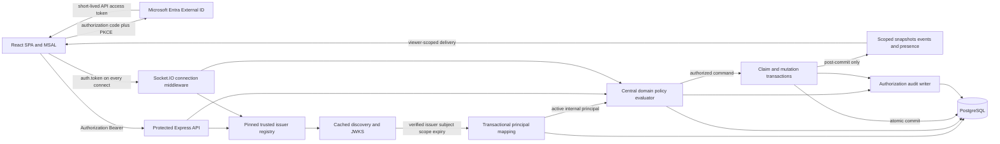

## Research status

Status: Complete as of 2026-07-28

## Confirmed decisions

* Public, self-service community users
* Microsoft Entra External ID direction, subject to subscription validation
* No anonymous quilt catalog or content beyond sign-in
* One external identity per internal principal initially, with audited linking permitted by future schema
* Eligible authenticated users atomically claim unowned patches

## Research questions

1. Stress-test the selected bearer-token, trusted-issuer, immutable-principal, and PostgreSQL authorization design against the required threat and failure scenarios.
2. Evaluate the principal identity, transport, platform-authentication, visibility, account-linking, and allocation alternatives.
3. Define concrete initial defaults for token and socket lifetime, principal status, mapping uniqueness, claims, safe errors, audit records, and protected listings.
4. Separate planning-ready defaults from choices that require product or user approval.
5. Define issue-aware sequencing around #96, #97, #94, #14, #98, and #100, including the missing protocol-v2 mutation child.
6. Provide the end-state control flow, test matrix, configuration checklist, rollout gates, and exact evidence register.

## Executive assessment

Proceed with the selected architecture, conditional on confirming Microsoft Entra
External ID availability, licensing, and required customer identity features in the
target subscription. Authorization code with PKCE through `@azure/msal-browser` and
`@azure/msal-react`, short-lived zzyix API bearer tokens, stateless `jose` validation,
exact trusted `(issuer, subject)` mapping, and PostgreSQL domain authorization fit the
public community audience and the existing separate SPA/API, multi-replica topology.

The direction survives the required threat and failure scenarios if implementation
adds five controls that are not optional:

* Tokens remain SDK-managed and outside URLs, logs, and durable application storage.
* Every socket is disconnected no later than token expiry and reconnects only after
  obtaining and validating a current token.
* Trusted issuer metadata and signing keys are cached, but unknown keys and expired
  tokens fail closed during an identity-provider outage.
* Local principal status and resource authorization are rechecked for every mutation,
  claim, membership change, and privileged command.
* Principal mapping and patch claiming are database transactions protected by explicit
  uniqueness constraints and row-level conflict handling.

Authentication does not make protocol-v2 mutation planning-ready by itself. Delegated
mutation grants, moderator scope, ownership transfer, deletion and retention, and outage
user experience still need product or user approval. Protocol-v2 mutation also lacks a
dedicated contract, removal transaction, handler, acknowledgement model, client
reconciliation path, and child work item.

## Selected architecture and trust boundaries

### Identity and token boundary

The browser is an OAuth public client. It uses authorization code with PKCE/S256 through
MSAL and requests an access token for the zzyix API. It never sends an ID token to the
API and contains no client secret. REST sends `Authorization: Bearer <token>`; Socket.IO
sends the same class of access token as `auth.token` because browser WebSocket clients
cannot reliably attach an arbitrary authorization header.

Each API replica uses one pinned trusted-issuer registry. A registry entry fixes the
exact issuer, discovery source, expected API audience, accepted asymmetric algorithms,
and required delegated scope. The verifier must not select an issuer, discovery URL, or
JWKS URL from an unverified token claim. `jose` verifies signature, issuer, audience,
expiry, not-before, algorithm, and scope before the server resolves identity.

The verified exact `(issuer, sub)` tuple maps to one immutable internal principal UUID.
Email, username, display name, tenant display data, `clientId`, socket ID, participation,
and content attribution never grant authority. PostgreSQL remains authoritative for
principal status, claims, ownership, membership, delegated capability, moderation,
lifecycle, visibility, and audit.

### End-state auth and control flow

## Threat and failure stress test

| Scenario | Failure mode | Required control and expected behavior | Residual risk and gate |
|---|---|---|---|
| Token theft or replay | A bearer token grants the thief the same API authority until expiry | Keep tokens in MSAL-managed memory or session storage, never application `localStorage`; enforce HTTPS, strict CSP, dependency review, no token logging, exact audience and scope, and short provider lifetimes. Replayed mutations remain subject to local status, policy, revision, and idempotency checks. | XSS can act as the user even without extracting a token. CSP, output encoding, Trusted Types evaluation, dependency hygiene, and browser security tests are release gates. Proof-of-possession tokens are not an initial dependency. |
| Expired token on a long-lived socket | Connection-time validation leaves a socket authorized indefinitely | Record token `exp`; schedule server disconnect at `exp` with at most 60 seconds clock-skew tolerance for validation, never for extending the socket. Client silently acquires once and reconnects with a new token. Interaction-required stops retries and returns to sign-in. | A stolen live socket remains usable until disconnect. Mutation-time principal and policy checks limit local disable and resource-change exposure. |
| JWKS or provider outage | New sign-in, renewal, metadata refresh, or an unknown `kid` fails | Cache trusted discovery and multiple JWKS keys with bounded freshness. Continue validating unexpired tokens only with already cached trusted keys. Unknown `kid`, stale-unusable metadata, invalid signature, and expired token fail closed and alert. Never extend token expiry. | Existing users work only until token and cache limits. Product must approve the outage message, read-only draft behavior, and retry window. |
| Reconnect across replicas | A new replica lacks process-local auth or room state | Validate the token independently on every connection, resolve the durable mapping in PostgreSQL, rebuild subscriptions from cursors, and use the PostgreSQL Socket.IO adapter. Keep auth stateless. Test both WebSocket and polling topology; polling requires ingress affinity. | Current presence last-socket logic is process-local. Multi-replica presence correctness remains coordinated with #20 and #44. |
| Principal disable or deletion | A still-valid provider token reactivates a locally blocked user | Check local principal status after token validation on every request and connection, and again inside every mutation or privileged transaction. Disconnect all known sockets after disable as an optimization, not the enforcement mechanism. Remove mappings only according to approved deletion policy. | Read subscriptions admitted before disable need forced disconnect or periodic status checks. Final deletion and audit pseudonymization require retention approval. |
| Account mapping race | Concurrent first requests create two principals or attach one identity ambiguously | Insert mapping and principal in one transaction. Use unique `(provider_namespace, external_subject)` plus an initial unique `principal_id` constraint. On conflict, reread the winner. Never merge by email. Audit create, conflict, disable, unlink, and future link operations. | The current schema has only tuple uniqueness. The reverse unique invariant must be added after #96/#97. |
| Claim race or squatting | Concurrent users claim one patch, or one user exhausts desirable patches | Lock or conditionally update the unowned eligible patch and insert owner membership plus audit event in one transaction. Exactly one transaction wins. Apply per-principal success limits, attempt rate limits, eligibility checks, and moderator-visible abuse signals. | Product may revise quotas and eligibility. Defaults below are conservative and configuration-backed. |
| Hidden-resource enumeration | Different errors, lists, counts, timing, presence, or events reveal a hidden quilt or patch | Protect and principal-filter all session/quilt listing. Return the same `404 resource_not_found` for nonexistent and nonvisible resources. Exclude hidden resources from counts, search, presence, aggregates, and durable event fanout. Keep detailed denial reasons only in audit and metrics. | Timing and aggregate side channels require negative E2E tests and policy review across every delivery surface. |
| CSRF, CORS, and XSS | Cross-origin requests abuse ambient credentials; permissive origins expose data; script injection uses bearer authority | Bearer headers are not ambient browser credentials, reducing classic CSRF. Allow only exact client origins and `Authorization, Content-Type`; reject credentialed wildcard origins. Validate Socket.IO origin separately. Use CSP, output encoding, safe URL policy, and no raw HTML. | XSS remains the primary browser-token risk. Switching to cookies would not prevent XSS-driven actions and would add CSRF obligations. |
| Test bypass leakage | A production deployment accepts `testPrincipalId`, static reset tokens, or test signing keys | Exercise the normal verifier with a distinct local test issuer. Compile or register test controls only when both `NODE_ENV=test` and `E2E_TEST_MODE=true`; fail startup if test issuer configuration appears elsewhere. Remove `testPrincipalId` from the runtime path. Scan deployment config and bundles for test issuer and key material. | The current socket code gates `testPrincipalId` only on `E2E_TEST_MODE`; production hardening must use the same double gate as HTTP test controls and then remove the bypass. |

## Alternatives analysis

| Alternative | Decision | Evidence-based rationale | Revisit trigger |
|---|---|---|---|
| Microsoft Entra workforce | Reject for the selected audience | Workforce tenants fit employees, contractors, and invited partners. Guest invitation and organization-controlled lifecycle conflict with public self-service community access. | Product changes to organization-only access. |
| Auth0 | Reject as the initial provider; retain as fallback | Auth0 is a technically credible CIAM provider with a maintained React SDK and broad federation. It adds another vendor, tenant, billing model, and operational plane without improving the selected Azure consolidation goal enough to justify the switch. Exact issuer-subject mapping preserves future portability. | External ID subscription validation fails, required federation is unavailable, or provider-neutral operations become a product requirement. |
| BFF cookie session | Reject for the initial topology | A BFF keeps provider tokens server-side, but zzyix currently has separate SPA and API origins. A defensible design requires one-site proxying, secure `HttpOnly` cookies, CSRF defenses, a distributed session store, coherent Socket.IO cookie handling, and additional replica operations. XSS can still issue authenticated actions. | Security explicitly prioritizes browser token non-exposure and funds the topology plus session-store change. |
| Azure Container Apps built-in authentication | Reject as primary authentication | ACA authentication can inject identity headers or issue platform cookies/tokens, but separate Container Apps do not automatically share one session boundary. It does not remove zzyix principal mapping or domain authorization and complicates the current Socket.IO bearer contract. | The SPA and API become one simple app boundary with no independent realtime credential lifecycle. |
| Anonymous or public aggregate reads | Reject | The confirmed product decision allows no catalog or content before sign-in. Even coarse aggregates can reveal hidden patch existence or activity and conflict with the accepted visibility contract. Health endpoints may remain unauthenticated but must expose no content identity. | Product explicitly approves a public discovery surface with a separate privacy review. |
| Immediate multi-provider linking | Reject for initial release | Linking introduces account takeover, recovery, merge-conflict, unlink, and audit semantics. Email equality is not proof of identity. One mapping per principal reduces ambiguity while the schema and event model preserve a later audited linking path. | Product approves recent-authentication-to-both-identities or administrator recovery workflows. |
| Moderator-only assignment | Reject as the normal allocation model | It creates an operational queue, centralizes power, and conflicts with the confirmed atomic self-service claim decision. Moderators should handle abuse, disputes, recovery, and exceptional transfers under scoped audited authority. | Abuse or scarcity data shows automated eligibility and quotas are insufficient. |
| Automatic allocation | Reject | Automatic allocation removes user choice, can allocate unwanted resources, and still needs fairness, release, and retry rules. Explicit atomic claims provide clear intent and audit while preserving deterministic conflict handling. | Product chooses guided onboarding and defines allocation, refusal, expiration, and reallocation policy. |

## Recommended initial defaults

These defaults are conservative planning assumptions. They can be configuration-backed
without changing the core identity model.

### Token and socket lifecycle

* Accept the provider-issued access-token lifetime, expected to be approximately 60
  minutes for Entra, rather than minting a second zzyix token in the first release.
* Validate with at most 60 seconds of clock skew. Do not use skew to extend connection
  authorization beyond the token's `exp` value.
* Acquire silently before each protected REST operation when the SDK indicates renewal
  is needed and before every Socket.IO connect or reconnect.
* Schedule server disconnect at token expiry. Emit a stable `AUTH_TOKEN_EXPIRED` socket
  reason immediately before disconnect when transport state permits.
* Allow one silent renewal and reconnect attempt. On `interaction_required`, disabled
  principal, or repeated authentication failure, stop automatic retries and return to a
  sign-in or account-status state.
* Preserve unsent local edits as nonauthoritative drafts during an outage. Never queue
  them as guaranteed server mutations or replay them without fresh revisions and policy.

### Local principal status

Use `active`, `disabled`, `deletion_pending`, and `deleted` as the initial local status
vocabulary. Only `active` may connect, read protected content, claim, or mutate.
`disabled` is reversible and blocks immediately. `deletion_pending` blocks all access
while retention and ownership obligations are resolved. `deleted` is terminal for the
mapping and profile, with only approved pseudonymous attribution retained. Do not reuse
patch lifecycle `suspended` as a principal status; scoped suspension belongs to domain
policy.

### One-mapping database invariant

Keep the existing primary key on `(provider_namespace, external_subject)` and add a
unique constraint on `principal_id` for the initial one-to-one policy. Canonicalize
`provider_namespace` to the exact trusted issuer registry identifier. Provision through
one transaction and resolve insert conflicts by reading the committed mapping. Add
mapping status, created/disabled timestamps, and audit events. Future linking can replace
the reverse unique constraint through a separately reviewed migration without changing
principal foreign keys.

### Claim eligibility, rate, and limit

An initial claimant must be an authenticated `active` human principal, be admitted to
the selected quilt, have accepted current community terms, and target an `unclaimed`,
claim-enabled patch. System principals, disabled or deletion-pending principals, and
principals with an unresolved moderation hold are ineligible.

Use these initial anti-squatting defaults:

* One owned active patch per principal per quilt
* Three claim attempts per 10 minutes per principal and per source-address risk bucket
* One successful claim per principal per 24 hours across quilts
* No automatic release of an owned patch until transfer, abandonment, and retention
  semantics are approved
* A database conflict returns `CLAIM_UNAVAILABLE` without identifying the winning user

The ownership cap and cooldown are product-tunable. The atomicity, eligibility status
check, audit, and nonenumerating conflict response are architectural requirements.

### Safe public error semantics

Use one typed envelope containing `code`, safe `message`, `requestId`, and optional
`retryAfterSeconds`. REST uses `401` with `WWW-Authenticate: Bearer` for absent or invalid
credentials, `403` for a known authenticated caller lacking a global API scope or whose
local principal is blocked, `404 resource_not_found` for nonexistent or nonvisible
domain resources, `409 claim_unavailable` or `revision_conflict` for safe concurrency
outcomes, and `429 rate_limited` for throttling. Do not reveal issuer subjects, mapping
existence, owner identity, hidden resource existence, internal policy clauses, or raw
provider errors. Socket errors use equivalent stable machine codes.

### Audit event minimum fields

Every identity, authorization, claim, ownership, moderation, lifecycle, and privileged
configuration event should include:

* Immutable event ID and UTC occurrence time
* Event type, attempted action, outcome, and stable reason code
* Actor internal principal ID or explicit system actor, with no raw token or subject
* Subject type and internal subject ID
* Quilt and patch IDs when applicable
* Request, socket, correlation, and operation IDs when applicable
* Source channel (`rest`, `socket`, `job`, or `admin`) and API replica identifier
* Policy/version identifier and authorization decision category
* Redacted before and after state sufficient to explain the transition
* Optional user-supplied moderation reason stored under length and content limits

IP address, user agent, email, issuer subject, and token claims are not minimum durable
audit fields. If security operations require them, define purpose, access, hashing or
redaction, and retention separately.

### Session and quilt listing

Protect all session, quilt, roster, search, and catalog routes. Return only resources
visible to the authenticated principal and only fields permitted by the central policy.
Do not return global totals that include hidden resources. `GET /health` may remain
anonymous if it exposes only service health and a nonsensitive version.

## Decisions requiring product or user approval

The following choices cannot be safely inferred and must be approved before their
respective planning slices are accepted:

1. Delegated mutation grants: capability vocabulary, patch or quilt scope, expiration,
   revocation, deny precedence, delegation depth, and whether undo or paste are distinct.
2. Moderator authority: assignment approver, quilt and patch scope, duration, purpose
   requirement, emergency access, review, and which actions may bypass owner policy.
3. Ownership transfer and abandonment: initiation, acceptance, timeout, cancellation,
   disputes, lost-account recovery, owner death or inactivity, and quota interaction.
4. Principal and content deletion: retention periods, restoration, ownership disposition,
   external mapping removal, profile anonymization, audit pseudonymization, legal holds,
   and final erasure.
5. Provider and JWKS outage experience: how long cached-token access is acceptable,
   whether read-only cached UI remains visible after expiry, draft preservation, support
   messaging, and operator override policy.
6. External ID subscription validation: tenant availability, pricing, custom domain,
   branding, supported sign-in methods, required social providers, and production support.
7. Claim product policy beyond the proposed defaults: ownership cap, cooldown, terms,
   geographic or community eligibility, abandoned-patch release, and abuse appeals.

Initial authentication, one-to-one mapping, protected principal-filtered listing, local
disable, safe errors, and atomic claim mechanics can be planned using the defaults above.
Delegated mutation, moderator commands, transfer, and deletion cannot.

## Implementation and issue sequence

1. Complete [#96](https://github.com/dkirby-ms/zzyix/issues/96) so Drizzle metadata and
   applied quilt schema history are truthful. Complete [#97](https://github.com/dkirby-ms/zzyix/issues/97)
   so exactly one release-owned job applies migrations and replicas become
   verification-only. Do not generate auth-policy migrations before both controls exist.
2. Record External ID subscription validation and the approved issuer, audience, scope,
   redirect, logout, account recovery, and outage contract. This is the decision gate
   for the first child of [#94](https://github.com/dkirby-ms/zzyix/issues/94).
3. Decompose #94 into independently testable children:
   authentication verifier and trusted issuer registry; transactional principal mapping
   and local lifecycle; client MSAL bootstrap and protected REST/socket transport;
   persisted visibility and central evaluator; atomic claims; delegated grants;
   moderator and lifecycle commands; and audit plus observability.
4. Narrow [#14](https://github.com/dkirby-ms/zzyix/issues/14) to the generic runtime
   authentication transport child of #94, with provider token validation, protected HTTP
   and Socket.IO, `/me`, safe failures, CORS, and client renewal. Remove canvas-level
   owner/editor/viewer policy from #14 because #94 and the quilt ADR supersede it. Close
   #14 only after its retained acceptance criteria are represented and linked.
5. After #96/#97, add the minimal principal status, one-to-one mapping, and audit schema.
   Implement token verification and mapping before any route treats `principalId` as
   authority. Replace `testPrincipalId` with a standards-conforming test issuer path.
6. Protect and principal-filter listings, `/me`, protocol-v2 connection, subscriptions,
   presence, snapshots, aggregates, and events through one policy evaluator. Add atomic
   self-service claim as its own transaction and test slice.
7. Create the missing protocol-v2 mutation child under #94/#93. Its scope must define
   placement and removal contracts, operation IDs, complete canonical footprints,
   expected per-patch revisions, principal-aware transactions, typed acknowledgements,
   post-commit scoped fanout, and client optimistic/reconnect reconciliation. The existing
   repository placement function is not a complete transport feature.
8. Plan delegated mutation only after the user approves capability semantics. Then
   implement owner, delegated member, moderator, deny, lifecycle, and cross-patch atomic
   tests. This approval and implementation unblock #98; authentication alone does not.
9. Run [#98](https://github.com/dkirby-ms/zzyix/issues/98) against real PostgreSQL and two
   replicas with canonical and alias placement/removal, claim-derived owners, delegated
   users, denials, expiry reconnect, and cursor convergence. Coordinate replica and
   presence evidence with #20, #44, and #99.
10. Keep [#100](https://github.com/dkirby-ms/zzyix/issues/100) blocked until stable
    principals, persisted visibility, authenticated alias mutation, multi-replica
    recovery, migration rehearsal, measured canary thresholds, and rollback approval are
    all recorded. Authentication rollout must not be used to waive any retirement gate.

## Test matrix

| Layer | Required cases | Pass condition |
|---|---|---|
| Token verifier unit | Valid token; expired; not-before; wrong issuer; wrong audience; wrong algorithm; missing scope; malformed JWT; unknown `kid`; same `sub` under different issuer | Only the exact trusted issuer, audience, algorithm, scope, and time-valid token produces a verified external identity. |
| JWKS integration | Cached-key validation during outage; unknown-key refresh; rotation overlap; stale metadata; timeout | Cached trusted keys validate unexpired tokens; unknown or unverifiable keys fail closed without request hangs. |
| Principal mapping database | First provision; concurrent provision; tuple conflict; reverse-principal conflict; disabled and deletion-pending principal; future-link migration shape | One external tuple and one principal win; no duplicate or ambiguous principal is created; blocked status denies access. |
| REST authentication | Missing, invalid, expired, and valid bearer; preflight from allowed and denied origins; `Authorization` header; protected `/me` and listings | Correct 401/403 behavior, exact CORS, no identity leakage, and principal-filtered output. |
| Socket authentication | Valid connect; expiry disconnect; silent renewal reconnect; interaction-required stop; invalid origin; polling and WebSocket | Every connect validates a current token; no socket survives expiry; errors use stable safe codes. |
| Replica reconnect | Connect on replica A, mutate or subscribe, expire or disconnect, reconnect on B, restore cursors and policy | Same principal resolves durably; no process-local auth dependency; scoped event sequence converges. |
| Principal lifecycle | Disable while connected; deletion pending; mapping removed; provider token still valid | New requests fail immediately; existing sockets disconnect or fail the next protected action; no re-provisioning bypass. |
| Claims | Eligible claim; ineligible status; ownership quota; cooldown; concurrent same-patch claims; retry and idempotency | Exactly one owner, membership, and audit event commit; losers receive safe conflict; no partial state. |
| Visibility and enumeration | Unknown compared with hidden quilt; filtered list, count, search, aggregate, presence, snapshot, and event | Public response and observable delivery reveal no hidden existence or activity. |
| Mutation policy | Owner; delegated capability; deny; moderator purpose; suspended scope; cross-patch mixed authority; stale revision | Every affected patch authorizes inside one transaction; any denial leaves no object, refs, history, or event. |
| Browser security | CSP, reflected/stored content, token storage inspection, logout, callback state/nonce, open redirect | No token enters URL, logs, or application durable storage; injected content cannot execute in supported paths. |
| Test isolation | Test issuer in test; test config in production; `testPrincipalId`; reset controls; test private key scan | Production fails startup on test auth configuration and exposes no identity bypass or test key. |
| Outage UX | Provider login outage; silent renewal failure; JWKS cached and unknown key; reconnect loop | Valid cached-key sessions degrade only to expiry; retries are bounded; drafts and user messaging follow approved policy. |

## Configuration checklist

### SPA public configuration

* External ID authority and exact tenant issuer
* SPA client ID with no client secret
* Zzyix API audience and delegated scope
* Exact local, staging, and production redirect URIs registered as SPA redirects
* Exact post-logout redirect URIs and allowed web origins
* MSAL cache location explicitly selected after browser threat review
* API and Socket.IO origins
* CSP and trusted asset origins

### API protected configuration

* Provider mode and trusted issuer registry entries
* Exact issuer, discovery location, audience, required scope, and algorithm allow-list
* Discovery and JWKS connect/read timeout, cache freshness, and refresh cooldown
* Maximum accepted clock skew of 60 seconds
* Exact CORS and Socket.IO origin allow-list
* Principal and claim policy configuration, including limits and cooldown
* Audit retention configuration after approval
* Database URL through an existing secret reference
* Optional External ID management credential through managed identity or Key Vault
* Fail-fast startup rejection for missing, wildcard, conflicting, or test-only settings

### Test-only configuration

* Distinct local issuer, audience, client ID, and short token lifetime
* Ephemeral asymmetric signing key unavailable to production deployment
* Test issuer enabled only when `NODE_ENV=test` and `E2E_TEST_MODE=true`
* Production startup assertion that test issuer, test key, and identity bypass are absent

## Rollout gates

1. Subscription gate: External ID tenant, licensing, sign-in methods, domains, and support
   are validated in the intended subscription.
2. Migration gate: #96 and #97 pass clean apply, repeat apply, drift, failure, rollback,
   and production-like rehearsal before auth schema deployment.
3. Verifier gate: negative token, issuer, audience, scope, algorithm, key rotation, cache,
   and outage tests pass with no token or subject logging.
4. Mapping gate: concurrent provision, reverse uniqueness, local status, and audit tests
   prove one unambiguous active principal.
5. Protected-surface gate: every route, socket, listing, subscription, presence, search,
   aggregate, snapshot, and event surface is inventoried and principal-filtered.
6. Socket gate: expiry disconnect, bounded renewal, interaction-required handling,
   WebSocket, polling, origin checks, and cross-replica reconnect pass.
7. Claim gate: eligibility and quotas are approved; concurrent claim tests prove one
   owner and one audit event with no partial state.
8. Policy gate: delegated capability, moderator, transfer, suspension, deletion, and
   visibility decisions are approved before their commands are enabled.
9. Mutation gate: the new protocol-v2 mutation child passes focused transaction,
   acknowledgement, fanout, client reconciliation, and negative authorization tests.
10. E2E gate: #98 passes against PostgreSQL and two replicas. #95/#99 measurements and
    #20/#44 scale evidence remain healthy for the approved canary window.
11. Retirement gate: #100 remains disabled until every existing legacy retirement gate,
    rollback approval, parity report, and destructive migration review passes.

## Repository evidence

Evidence was reviewed from the workspace on 2026-07-28. Paths are workspace-relative.

* `.copilot-tracking/research/subagents/2026-07-28/infinite-canvas-auth-repository-research.md`
* `.copilot-tracking/research/subagents/2026-07-28/infinite-canvas-auth-external-research.md`
* `docs/decisions/2026-07-27-finite-toroidal-quilt-v01.md:137-242`
* `apps/server/src/contracts.ts:237-305`
* `apps/server/src/contracts.ts:459-616`
* `apps/server/src/index.ts:1317-1426`
* `apps/server/src/index.ts:1458-1756`
* `apps/server/src/index.ts:1782-2052`
* `apps/server/src/index.ts:2350-2571`
* `apps/server/src/db/schema.ts:61-166`
* `apps/server/src/db/repository.ts:703-920`
* `apps/server/src/db/repository.ts:1452-1685`
* `apps/server/src/migration/quiltRollout.ts:22-113`
* `apps/client/src/network/session.ts:4-119`
* `apps/client/src/network/useSocketConnection.ts:27-188`
* `e2e/quilt-reconnect.spec.ts:25-155`
* `e2e/quilt-seams.spec.ts:57-104`
* `.github/workflows/cd.yml:120-250`
* [Issue #14, Authz and authn](https://github.com/dkirby-ms/zzyix/issues/14)
* [Issue #20, Multi-instance PostgreSQL adapter validation](https://github.com/dkirby-ms/zzyix/issues/20)
* [Issue #44, Cache and horizontal scale](https://github.com/dkirby-ms/zzyix/issues/44)
* [Issue #93, Infinite canvas rollout and legacy retirement](https://github.com/dkirby-ms/zzyix/issues/93)
* [Issue #94, Identity, authorization, and visibility policy](https://github.com/dkirby-ms/zzyix/issues/94)
* [Issue #95, Production budgets and canary thresholds](https://github.com/dkirby-ms/zzyix/issues/95)
* [Issue #96, Repair Drizzle migration metadata](https://github.com/dkirby-ms/zzyix/issues/96)
* [Issue #97, One-shot production migration job](https://github.com/dkirby-ms/zzyix/issues/97)
* [Issue #98, Authenticated protocol-v2 alias mutation E2E](https://github.com/dkirby-ms/zzyix/issues/98)
* [Issue #99, Production adapter attachment telemetry](https://github.com/dkirby-ms/zzyix/issues/99)
* [Issue #100, Retire protocol v1 and legacy storage](https://github.com/dkirby-ms/zzyix/issues/100)

## External evidence

External sources were reviewed by the input research on 2026-07-28.

* [OAuth 2.0 Security Best Current Practice, RFC 9700](https://www.rfc-editor.org/rfc/rfc9700)
* [Proof Key for Code Exchange, RFC 7636](https://www.rfc-editor.org/rfc/rfc7636)
* [JWT Best Current Practices, RFC 8725](https://www.rfc-editor.org/rfc/rfc8725)
* [OpenID Connect Core 1.0](https://openid.net/specs/openid-connect-core-1_0.html)
* [Microsoft identity platform authorization code flow](https://learn.microsoft.com/en-us/entra/identity-platform/v2-oauth2-auth-code-flow)
* [Microsoft identity platform access tokens](https://learn.microsoft.com/en-us/entra/identity-platform/access-tokens)
* [Microsoft identity platform claims validation](https://learn.microsoft.com/en-us/entra/identity-platform/claims-validation)
* [Microsoft Entra External ID customer overview](https://learn.microsoft.com/en-us/entra/external-id/customers/overview-customers-ciam)
* [Microsoft Entra external identities overview](https://learn.microsoft.com/en-us/entra/external-id/external-identities-overview)
* [Manage External ID customer accounts](https://learn.microsoft.com/en-us/entra/external-id/customers/how-to-manage-customer-accounts)
* [Revoke Microsoft Entra user access](https://learn.microsoft.com/en-us/entra/identity/users/users-revoke-access)
* [Azure Container Apps authentication](https://learn.microsoft.com/en-us/azure/container-apps/authentication)
* [Azure Container Apps Entra authentication](https://learn.microsoft.com/en-us/azure/container-apps/authentication-entra)
* [Socket.IO middleware](https://socket.io/docs/v4/middlewares/)
* [Socket.IO client options](https://socket.io/docs/v4/client-options/)
* [Socket.IO CORS](https://socket.io/docs/v4/handling-cors/)
* [Socket.IO multiple nodes](https://socket.io/docs/v4/using-multiple-nodes/)
* [`@azure/msal-browser`](https://github.com/AzureAD/microsoft-authentication-library-for-js/tree/dev/lib/msal-browser)
* [`@azure/msal-react`](https://github.com/AzureAD/microsoft-authentication-library-for-js/tree/dev/lib/msal-react)
* [`jose`](https://github.com/panva/jose)
* [Auth0 React SPA quickstart](https://auth0.com/docs/quickstart/spa/react)
* [Auth0 access-token validation](https://auth0.com/docs/secure/tokens/access-tokens/validate-access-tokens)
* [Auth0 token practices](https://auth0.com/docs/secure/tokens/token-best-practices)

## Planning readiness

The authentication foundation is ready for work-item planning after External ID
subscription validation and after #96/#97 are accepted as schema prerequisites. The
runtime verifier, one-to-one mapping, local principal status, protected listings, socket
expiry behavior, safe errors, audit foundation, and atomic claim transaction have
concrete initial defaults.

The complete #94 feature is not ready for implementation planning as one unit. It must
be decomposed, and delegated mutation, moderator authority, transfer, deletion and
retention, and outage UX require the approvals listed above. The missing protocol-v2
mutation child must be created before #98 can be unblocked. #100 remains correctly gated.

## Recommended next research

* [ ] Validate External ID availability, pricing, domain, branding, and required identity
  providers in the target Azure subscription.
* [ ] Prototype MSAL renewal and cache behavior in the supported browser matrix,
  including third-party-cookie restrictions and interaction-required paths.
* [ ] Threat-model the approved delegated grants, moderator scope, transfer, deletion,
  and recovery policies after product decisions are recorded.
* [ ] Benchmark the proposed mapping, listing, claim, and policy queries against
  production-like principal and patch cardinalities before final schema approval.

## Clarifying questions

1. Which mutation capabilities may an owner delegate, and at what scope and duration?
2. Who assigns moderators, what scope and duration applies, and when is a purpose or
   reason mandatory?
3. What transfer, abandonment, dispute, and lost-account recovery policy applies?
4. What retention, restoration, anonymization, legal-hold, and final-erasure rules apply
   to principals, content, mappings, and audit records?
5. During provider outage, may already rendered protected content remain visible after
   token expiry, and how should unsent edits and user messaging behave?
6. Are the proposed one-patch-per-quilt cap, three attempts per 10 minutes, and 24-hour
   successful-claim cooldown acceptable for the first rollout?
