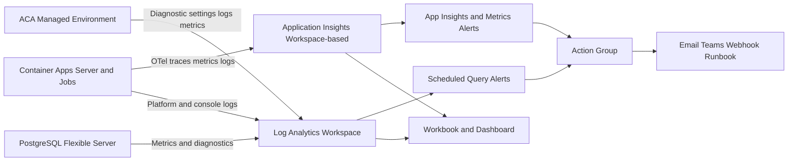

## Research Scope

### Requested Questions

1. What monitoring resources and configuration already exist in infra/bicep?
2. What production-grade observability wiring is missing?
3. What concrete Bicep changes are recommended and where?
4. What are current Microsoft-recommended patterns for Azure Monitor, Application Insights, and OpenTelemetry for app workloads?
5. What minimal reference architecture and rollout order fit this repository?

## Status

Complete.

## Method

1. Inspected infrastructure and deployment code paths with focus on infra/bicep and deployment automation.
2. Verified existing monitor-related resource declarations and wiring with line-level references.
3. Queried official Microsoft Learn guidance for current Azure observability patterns and fetched full source pages.
4. Mapped repo state to production-grade target wiring and produced concrete Bicep change recommendations.

## Verified Findings

### Current inventory in infra/bicep

| Area | Present | Evidence |
| --- | --- | --- |
| Log Analytics workspace | Yes | infra/bicep/modules/monitoring.bicep:8 creates Microsoft.OperationalInsights/workspaces with 30-day retention at line 15 |
| ACA environment app logs to Log Analytics | Yes | infra/bicep/modules/containerAppsEnvironment.bicep:24-29 configures appLogsConfiguration to destination log-analytics |
| Log Analytics workspace injected from root template | Yes | infra/bicep/main.bicep:39 declares monitoring module, lines 56-57 pass customerId/sharedKey to ACA env module |
| Application Insights resource | No | Resource search across infra/bicep returned only infra/bicep/modules/monitoring.bicep:8; no Microsoft.Insights/components declarations |
| Diagnostic settings resources | No | No Microsoft.Insights/diagnosticSettings declaration found under infra/bicep |
| Alerting resources | No | No Microsoft.Insights/actionGroups, Microsoft.Insights/metricAlerts, Microsoft.Insights/scheduledQueryRules, or Microsoft.Insights/activityLogAlerts in infra/bicep |
| Dashboards/workbooks | No | No Microsoft.Portal/dashboards or workbook resources found in infra/bicep |
| Data Collection Rules and Endpoints | No | No dataCollectionRules or dataCollectionEndpoints resources found in infra/bicep |

### Deployment and operational wiring

| Area | Present | Evidence |
| --- | --- | --- |
| Migration failure log query to LA | Partial | .github/workflows/cd.yml:475-487 queries ContainerAppConsoleLogs_CL via az monitor log-analytics query |
| App telemetry env var wiring for AI or OTel | No | .github/workflows/cd.yml:240-267 and 293-314 define required env vars, none for APPLICATIONINSIGHTS_CONNECTION_STRING or OTEL_* |
| CD bootstrap variables for observability | No | scripts/bootstrap-cd-environment.sh:25-51 required and optional variables omit App Insights and OTel configuration |

### Important nuance

The deployment workflow already uses Log Analytics for migration troubleshooting, which is useful for platform/application console logs. This is not a replacement for Application Insights plus OpenTelemetry app tracing and dependency correlation.

## Assumptions

1. This assessment is based on repository code and scripts only.
2. No direct inspection of live Azure resources or portal configuration was performed.
3. Runtime-only manual configuration in Azure Portal may exist and is not represented in this analysis.

## Missing Production-Grade Wiring

1. No workspace-based Application Insights resource is provisioned in Bicep.
2. No deployment path injects APPLICATIONINSIGHTS_CONNECTION_STRING into server app runtime.
3. No explicit diagnostic settings resources route ACA environment categories and metrics in IaC.
4. No alerting baseline exists in IaC (action groups, metric alerts, log alerts, activity/service health alerts).
5. No dashboard/workbook assets are codified for team operations.
6. No governance for alert processing rules, noise control, or severity routing is codified.
7. No DCR/DCE resources are defined. For this specific PaaS-centric stack (Container Apps + PostgreSQL Flexible Server), this can be acceptable initially, but DCR/DCE become relevant if VM/Arc/AMA data collection is added later.

## Bicep Change Recommendations

### Immediate changes

1. Add workspace-based Application Insights resource and output its connection string.
  - File to update: infra/bicep/modules/monitoring.bicep
  - Resource type: Microsoft.Insights/components
  - Wire to existing Log Analytics workspace by workspaceResourceId
  - Add outputs for applicationInsightsId and connectionString

2. Pass observability outputs from root module composition.
  - File to update: infra/bicep/main.bicep
  - Add output for Application Insights connection string reference target (or resource ID)
  - Keep secrets handling aligned with secure output practices

3. Add diagnostic settings module for ACA managed environment.
  - New file: infra/bicep/modules/diagnostics.bicep
  - Resource type: Microsoft.Insights/diagnosticSettings
  - Scope target: ACA managed environment ID
  - Categories: ContainerAppConsoleLogs, ContainerAppSystemLogs, and AllMetrics
  - Optional for ingress analysis: enable HTTP logs where supported via environment-level diagnostics

4. Add alerting baseline module.
  - New file: infra/bicep/modules/alerts.bicep
  - Resources:
    - Microsoft.Insights/actionGroups
    - Microsoft.Insights/metricAlerts
    - Microsoft.Insights/scheduledQueryRules
    - Microsoft.Insights/activityLogAlerts
  - Suggested initial rules:
    - Server container app high 5xx rate or failed requests (log alert)
    - Server/container restart or crash patterns (log alert)
    - ACA CPU/memory saturation (metric alert)
    - PostgreSQL CPU/storage/connection saturation (metric alert)
    - Deployment/job failures (log alert from ContainerAppConsoleLogs_CL)

5. Add optional workbook/dashboard module.
  - New file: infra/bicep/modules/visualization.bicep
  - Resource types: workbook and/or Microsoft.Portal/dashboards
  - Include links to key KQL views for server, migrations, auth failures, and DB health

### Recommended deployment-script follow-up aligned with Bicep

1. Add AI connection string secret/variable handling in scripts/bootstrap-cd-environment.sh and .github/workflows/cd.yml.
2. Inject APPLICATIONINSIGHTS_CONNECTION_STRING into server container app create and update commands.
3. Keep Log Analytics query path for migration troubleshooting as a complement.

## Microsoft-Recommended Patterns

### Source-backed guidance

1. Treat monitoring resources as codified infrastructure.
  - Microsoft states that alerts, diagnostic settings, and related monitor resources should be deployed and versioned via Bicep.
  - Source: [Create monitoring resources by using Bicep](https://learn.microsoft.com/azure/azure-resource-manager/bicep/scenarios-monitoring)

2. Use workspace-based Application Insights and co-locate with Log Analytics.
  - Microsoft Well-Architected guidance recommends one Application Insights resource per workload per environment and placing it in the same region as its Log Analytics workspace.
  - Source: [Architecture best practices for Application Insights](https://learn.microsoft.com/azure/well-architected/service-guides/application-insights)

3. Use OpenTelemetry with Azure Monitor and set connection string via environment variable in production.
  - Microsoft recommends Azure Monitor OpenTelemetry distro for .NET, Node.js, Python, Java, and recommends APPLICATIONINSIGHTS_CONNECTION_STRING as production configuration pattern.
  - Source: [Enable Azure Monitor OpenTelemetry for applications](https://learn.microsoft.com/azure/azure-monitor/app/opentelemetry-enable)

4. Configure ACA diagnostic settings explicitly for logs and metrics.
  - Microsoft documents that when Azure Monitor is used as log destination, diagnostic settings must be configured, including categories and AllMetrics.
  - Source: [Log storage and monitoring options in Azure Container Apps](https://learn.microsoft.com/azure/container-apps/log-options)

5. Enable HTTP log visibility through ACA diagnostics for request-level troubleshooting.
  - Microsoft documents ContainerAppHTTPLogs as diagnostics-driven and available after enabling HTTP logs.
  - Source: [Monitor logs in Azure Container Apps with Log Analytics](https://learn.microsoft.com/azure/container-apps/log-monitoring)

6. Standardize response routing through action groups.
  - Microsoft documents action groups as reusable alert response endpoints with notification and automation actions.
  - Source: [Action groups](https://learn.microsoft.com/azure/azure-monitor/alerts/action-groups)

## Minimal Reference Architecture

## Rollout Order

1. Extend monitoring module with workspace-based Application Insights and outputs.
2. Inject AI connection string into deployment path and server runtime env vars.
3. Add ACA and key resource diagnostic settings module.
4. Add minimal action group and first-wave alert rules with clear severities.
5. Add workbook/dashboard for incident triage and release validation.
6. Tune sampling, thresholds, and retention based on live signal quality and cost.

## Clarifying Questions

1. Should alert notifications route only to email initially, or include Teams/webhook automation from day one?
2. Is this stack expected to remain PaaS-only, or should we pre-design DCR/DCE for upcoming VM/Arc workloads?
3. Do you want strict environment isolation with separate Application Insights plus Log Analytics per environment, or shared-workspace patterns in non-prod?

## Recommended Next Research

- Validate which Container Apps diagnostic categories are available in your target region and API version before finalizing diagnostics.bicep.
- Define concrete KQL alert queries based on real log fields emitted by zzyix server and migration jobs.
- Benchmark expected ingestion volume and estimate daily costs after adding Application Insights and HTTP logs.
- Review existing runbook or incident response tooling for action group automation targets.
