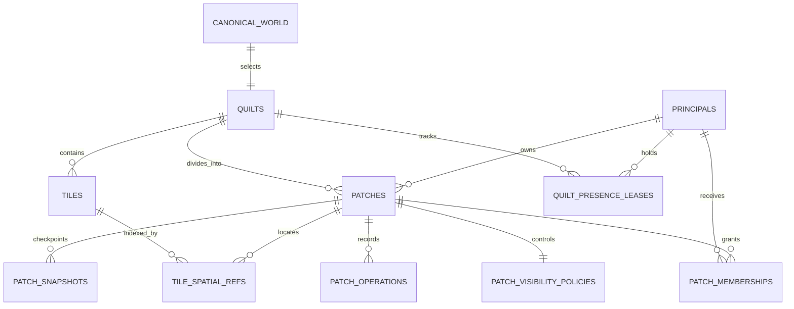
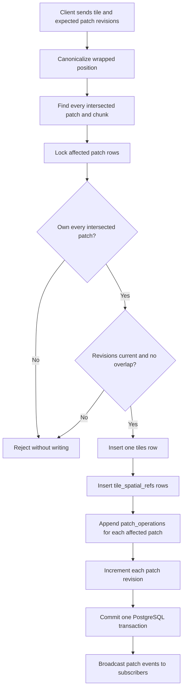
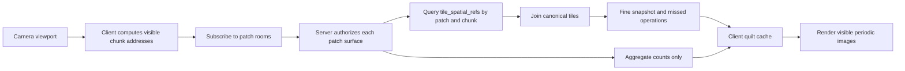

## The short version

The canonical quilt is one finite, wrapped world stored in PostgreSQL. It is not one
large image or one JSON document. The database separates the world definition, owned
regions, tile geometry, spatial lookup records, and change history.

The central idea is:

> Store each tile once, index it everywhere it must be found, and record each affected
> patch's history independently.

The browser only loads the nearby parts of that durable world. Wrapping the viewport
does not copy tiles in the database. The client renders translated images of the same
canonical tile when the camera crosses an edge.

## Physical model

### World selection

`canonical_world` is a single-row pointer, not the quilt's contents. Its canonical
record identifies the active `quilts` row and carries a generation number. Changing
this pointer can select a replacement world without embedding a quilt ID in the
client.

The selected `quilts` row defines the coordinate system:

* 32 patch rows and 32 patch columns
* Patch size of 31.2 by 20.4 world units
* Total canonical size of 998.4 by 652.8 world units
* Toroidal topology, so opposite edges meet
* Protocol version and coordinate origin

The database stores canonical coordinates inside this finite area. Continuous panning
is a display behavior layered over those coordinates.

### Ownership regions

Each `patches` row is one addressed region in the quilt. It stores its row, column,
owner, lifecycle state, and current revision. A patch is the unit of ownership,
authorization, history, and optimistic concurrency.

`patch_memberships` records the principals and roles associated with a patch.
`patch_visibility_policies` controls access to patch existence, detailed data,
aggregates, presence, search, durable events, and claiming.

When a new principal enters the canonical quilt, the server first returns an active
patch that principal already owns. Otherwise, it atomically assigns one eligible,
unclaimed patch and creates the owner membership. Competing assignments use database
locks so two users cannot receive the same patch.

### Tiles and spatial references

`tiles` stores each placed object once. A row contains its stable ID, shape, color,
material, canonical position, rotation, mirroring, attribution, and anchor patch.

`tile_spatial_refs` is the lookup index around that object. Each row says that a tile
intersects a particular patch and chunk address. A tile normally has one reference,
but a tile crossing a patch boundary or toroidal seam can have several.

This distinction prevents two common problems:

* The same logical tile is never duplicated merely because it crosses a boundary
* A patch or chunk query does not need to scan every tile in the quilt

A chunk is therefore an address used for indexing and delivery. There is no standalone
`chunks` table containing tile data. The current runtime chunk size is 8 by 8 world
units.

## What happens when a tile is placed

The placement is one transaction. Either every durable row commits, or none does.

Before writing, the server converts the requested position into canonical toroidal
coordinates. It identifies every patch touched by the tile's geometry, locks those
patches in a stable order, and verifies that the principal owns all of them. A tile may
be placed far from other tiles, but it cannot overlap existing geometry. A boundary
placement is rejected if it extends into a patch the principal does not own.

The client includes its expected revision for every affected patch. If another edit
changed one of those patches first, the server rejects the stale command instead of
silently overwriting newer state.

On success, the transaction:

1. Inserts one canonical `tiles` row.
2. Inserts the required `tile_spatial_refs` rows.
3. Appends a `tile_placed` entry to each affected patch's `patch_operations` stream.
4. Advances each affected `patches.revision` value.
5. Writes authorization audit records.

The operation ID makes retries idempotent. Retrying the same accepted command returns
the original result instead of placing a duplicate tile.

Removal follows the same shape: lock and authorize affected patches, delete the tile
and its cascading spatial references, append `tile_removed` operations, then advance
patch revisions.

## History and recovery

`patch_operations` is the durable ordered history for a patch. Its `op_seq` matches the
patch revision after that operation. Each entry records a unique event ID, the client
operation ID, actor, operation type, and payload.

`patch_snapshots` stores occasional materialized patch states. A snapshot gives
recovery a recent starting point; later operations can be replayed from its sequence
number. Snapshots are an optimization, while tile rows, spatial references, revisions,
and operations remain the authoritative durable model.

Because a boundary-spanning tile affects multiple patches, each affected patch receives
its own operation entry. Those entries refer to the same canonical tile ID.

## How a viewport reads data

The client converts its camera rectangle into nearby chunk addresses and groups those
addresses by patch. It subscribes to Socket.IO rooms for the requested patch surfaces.
The server checks the patch policy, uses `tile_spatial_refs` to find relevant tile IDs,
and joins the corresponding `tiles` rows.

Two payload levels reduce network cost:

* Fine snapshots contain tile geometry for normal editing and rendering
* Aggregate snapshots contain counts grouped by shape and material at distant zoom

Aggregate data does not replace cached fine geometry. Missed `patch_operations` after
the client's cursor are replayed in order so reconnects do not require a full quilt
download.

The browser's quilt cache and Socket.IO rooms are temporary delivery state. PostgreSQL
remains authoritative. Presence is represented by expiring `quilt_presence_leases`, so
abandoned connections disappear without becoming permanent collaboration records.

## A concrete boundary example

Suppose Alice places one rectangle across the line between patch `(4, 7)` and patch
`(4, 8)`:

* PostgreSQL inserts one `tiles` row for the rectangle
* `tile_spatial_refs` receives references for both patches and their affected chunks
* Both patch rows must be active and owned by Alice
* Both patch revisions advance
* Both patches receive a `tile_placed` operation containing the same tile ID
* Subscribers to either patch can discover the rectangle
* Rendering near a wrapped world edge may show multiple images, but storage still has
  only one tile

This is why patches are transaction and authorization boundaries while tiles remain
canonical world objects.

## Source map

* [Database schema](../apps/server/src/db/schema.ts)
* [Canonical discovery, assignment, persistence, and delivery](../apps/server/src/db/repository.ts)
* [HTTP and Socket.IO orchestration](../apps/server/src/index.ts)
* [Shared protocol contracts](../apps/server/src/contracts.ts)
* [Canonical topology decision](decisions/2026-07-27-finite-toroidal-quilt-v01.md)