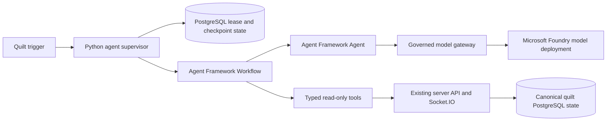

## Status

Accepted for the Mosaic Agents MVP architecture track. This document consolidates
the closed decisions under the Fantome agent epic
[#172](https://github.com/dkirby-ms/zzyix/issues/172) and records the final v1
architecture for implementation planning.

The runtime decision in this document supersedes the earlier TypeScript worker
baseline in [Resident Agent Architecture Decision](./decisions/2026-08-07-resident-agent-architecture.md).
The authority, identity, ownership, and model-safety boundaries from that
decision remain in force unless this document narrows them further.

## Decision sources

The final architecture is based on these closed issues in the Mosaic Agents MVP
milestone:

| Issue | Decision captured |
|-------|-------------------|
| [#173](https://github.com/dkirby-ms/zzyix/issues/173) | Agents are first-class principals that use the same server authority, ownership, validation, revision, collision, idempotency, and replica contracts as humans. |
| [#174](https://github.com/dkirby-ms/zzyix/issues/174) | Closed as a duplicate of the canonical resident domain model and event contract work item. |
| [#185](https://github.com/dkirby-ms/zzyix/issues/185) | Deterministic canvas authority is separate from conversational model behavior. Microsoft Foundry is approved for personality and historical context, not canvas mutation authority. |
| [#186](https://github.com/dkirby-ms/zzyix/issues/186) | Python Microsoft Agent Framework is the v1 runtime, with an Agent inside an explicit Workflow, read-only tools, structured proposals, durable PostgreSQL state, and read-only activation gates. |
| [#187](https://github.com/dkirby-ms/zzyix/issues/187) | The v1 model prompt boundary is prompt-minimized and memory-disabled, with explicit prompt-injection, output, retention, and validation rules. |
| [#188](https://github.com/dkirby-ms/zzyix/issues/188) | All model calls flow through a governed model gateway. Azure Container Apps managed identity uses an application identity path that is distinct from human delegated scopes. |

## Final architecture

Fantome uses one logical resident agent per quilt. The agent is a durable actor,
not a permanently dedicated container. A Python worker claims a PostgreSQL-backed
lease for a quilt, runs one serialized workflow for that quilt, checkpoints its
progress, and releases or renews the lease according to runtime state.

The v1 runtime uses Microsoft Agent Framework in Python. A framework Agent is
embedded inside an explicit Workflow. The Workflow and a small supervisor own
resident lifecycle, lease ownership, trigger deduplication, run serialization,
retry policy, pause policy, checkpoint commits, crash recovery, and deterministic
canvas behavior. The Agent owns only bounded model interaction, including
natural-language responses, historical context synthesis, structured proposals,
and allowlisted read-only tool calls.

The Agent Framework Harness is deferred. Its general-purpose planning, memory,
context compaction, and broad approval behavior are not required for the first
quilt-scoped resident agent.



## Authority boundary

The existing server remains the only authority for canonical quilt behavior. It
owns authentication, principal resolution, patch ownership, tile validation,
collision detection, revisions, idempotency, event ordering, authorization audit,
and replica-safe transactions.

The resident agent does not import server internals, write directly to canonical
quilt tables, bypass HTTP or Socket.IO authorization, forge actor identity, or
treat observation as authority. Any future canvas mutation must pass through the
same server contracts used by humans.

Model output is untrusted input. It cannot place, delete, move, recolor, or
otherwise mutate tiles. It cannot claim or transfer patches, moderate content,
make authorization decisions, alter retry behavior, bypass revisions, suppress
collision checks, or change audit attribution.

## Runtime and serialization

Each quilt has at most one active resident-agent Workflow run at a time. The
runtime acquires the quilt lease before starting work. Concurrent triggers do not
start competing runs. Duplicate wake-ups are coalesced, meaningful new triggers
are queued, and queued work is processed after the active run reaches a
checkpoint.

Trigger identity is persisted for idempotency. The trigger queue is bounded. When
it reaches capacity, the runtime applies backpressure or pauses rather than
accepting an unbounded backlog.

Lease renewal is mandatory during execution. If lease renewal fails, the active
workflow stops immediately. Another worker may resume after lease expiry by
loading the latest committed checkpoint.

## Durable state

The resident-agent runtime reuses the existing PostgreSQL database provisioned
for the server API. No separate agent database is introduced for the initial
implementation.

PostgreSQL owns the agent control plane:

* Agent identity and quilt assignment.
* Agent lifecycle status.
* Active lease owner and expiry.
* Workflow run ID and status.
* Last committed checkpoint.
* Checkpoint schema version.
* Pending and coalesced triggers.
* Tool-call outcomes.
* Model-call metadata.
* Failure, pause, and recovery state.

Checkpoints are versioned, resumable workflow boundaries. They are not raw Agent
Framework session dumps. A checkpoint records the agent ID, quilt ID, run ID,
workflow state, observed revision or cursor, pending trigger IDs, policy version,
framework version, checkpoint version, and update time.

Checkpoints are committed after authoritative state loading, after completed tool
calls, before waiting or sleeping, before lease release, and after any future
deterministic action. Tool calls use idempotency keys and explicit completion
state so a crash cannot unknowingly repeat work.

## Lifecycle states

Resident agents use these durable lifecycle states:

```text
provisioning -> active -> paused -> draining -> disabled
                         \-> faulted
```

The states mean:

* `provisioning` establishes identity, quilt assignment, configuration, and the
  initial checkpoint. No agent work runs.
* `active` allows the agent to acquire a lease, process bounded triggers, invoke
  approved tools, and renew its lease.
* `paused` intentionally stops work because of policy, capacity, provider, or
  administrator action. State is retained and no new work starts.
* `faulted` records an unrecoverable or repeatedly failing condition. Recovery
  requires explicit retry or administrator action.
* `draining` stops new trigger acceptance and finishes or checkpoints the
  current run before relinquishing the lease.
* `disabled` prevents the agent from running or authenticating until explicitly
  re-enabled. Durable history and checkpoints remain available.

Lifecycle transitions and their causes are recorded in the agent audit history.

## Tool boundary

The initial tool surface is limited to authorized reads and structured proposals.
The approved v1 capabilities are:

* Read agent status.
* Read assigned patch metadata.
* Read an authorized patch snapshot.
* Read recent authorized patch events.
* Read quilt metadata.
* Produce a structured tile-operation proposal without submitting it.
* Produce a structured agent response.

The model cannot directly invoke mutation or authority tools. Deferred tools
include direct tile placement or deletion, patch claiming or transfer,
moderation, arbitrary Socket.IO operations, database queries, deployment or
infrastructure operations, raw HTTP or filesystem access, dynamic tool creation,
and code execution.

Every tool must use a fixed typed request and response schema. Each tool defines
authorization, timeout, payload limits, audit behavior, and feature-flag
requirements. Tool inputs cannot contain arbitrary URLs, SQL, query fragments,
socket event names, or executable code.

## Model gateway

All model calls route through a governed model gateway inside the Python
resident-agent service. Users and client code cannot invoke providers directly,
and resident loops cannot bypass the gateway.

The gateway exposes typed operations for approved model capabilities and enforces:

* Configurable Foundry endpoint and deployment alias.
* Low-cost and low-latency default model routing.
* Explicit escalation policy for stronger models.
* Request timeout, retry budget, and backoff.
* Input and output token limits.
* Rate limits, concurrency limits, and cost budgets.
* Safety handling and deterministic fallback behavior.
* Redaction, retention, and telemetry controls.

The gateway is initially internal to the agent service. It can be extracted into
a separate server-side service later if multiple runtimes or agent classes need
a shared provider boundary.

## Identity and tenant boundary

The agent runtime uses Azure Container Apps managed identity as an application
identity, not as a browser user. Human tokens and agent tokens have distinct
validation paths.

The existing human authentication path validates delegated `scp` claims such as
`quilt.access`. A managed identity typically receives an app-only token with a
`roles` claim. The agent path therefore requires an explicit application role,
such as `agent.runtime`, assigned to the Container App managed identity.

The server must validate issuer, audience, algorithm, expiry, subject, and the
required app role for agent tokens. It must continue validating human delegated
scopes separately. `scp` and `roles` claims cannot substitute for one another.

Agent principals are pre-provisioned and mapped to `kind = 'agent'`. Unknown or
inactive agent identities are rejected. Managed identity role assignment and
agent principal provisioning must be auditable.

Multi-tenant API registration is not assumed. The implementation must first
evaluate same-tenant role assignment, a separate agent API registration or issuer,
and only then multi-tenant registration with explicit consent, issuer validation,
audience validation, and expanded trust-boundary review.

## Prompt and memory policy

The v1 resident model boundary is prompt-minimized and memory-disabled.

The model may receive only:

* Policy-controlled system and developer instructions.
* Agent persona and configuration required for the approved interaction.
* Public quilt metadata and the agent's own runtime status.
* Curated, versioned historical corpus snippets with source metadata and
  provenance.
* Tool outputs from approved read-only tools after schema validation and
  redaction.

User-authored content is excluded from v1 model prompts until a separate
data-flow, prompt-injection, sensitive-data, and output-policy review approves
it.

The model must not receive credentials, secrets, raw auth claims, tokens, hidden
or private patch data, internal authorization metadata, unredacted telemetry,
private content from other users, deployment or environment configuration,
arbitrary database rows, or unclassified retrieved text.

User text, retrieved corpus text, and tool outputs are treated as untrusted
content. They cannot override system policy, request new tools, alter tool
schemas, authorize actions, expand permissions, or change retention and
telemetry behavior.

No durable user memory is enabled in v1. Operational checkpoints, run metadata,
tool-call records, and model-call metadata are not user memory. Historical RAG
corpus content is curated reference material, not memory. Future user memory
requires a separate security and privacy review.

## Output policy

The model may produce user-facing conversational text, source-grounded historical
explanation, and structured proposal objects. It may not produce authority
decisions, claim a canvas mutation has occurred, expose secrets or internal
metadata, make unsupported historical claims, or emit tool parameters outside
approved schemas.

Unsafe, unsupported, or malformed output falls back to a deterministic response.

## Telemetry and retention

LLM and agent telemetry flows through the existing Application Insights and Log
Analytics path.

Telemetry records:

* Agent ID, quilt ID, run ID, checkpoint ID, tool-call ID, and model-call ID.
* Prompt template version and model deployment alias.
* Retrieved source IDs and response safety classification.
* Token counts, latency, retry count, fallback class, and failure class.
* Tool-call outcome and authorization result.
* Lease acquisition, renewal, loss, and recovery timing.
* Cost estimates where available.

Raw prompts and raw model responses are not retained by default. Raw content
capture requires an explicitly approved debug mode with short retention and
redaction controls.

## Versioning policy

The implementation pins:

* Python runtime version.
* Microsoft Agent Framework package versions.
* Foundry client package versions.
* Tool contract and schema version.
* Checkpoint schema version.

An upgrade requires compatibility tests for previous supported versions and a
recovery-path test that loads and resumes from the previous checkpoint schema.
Checkpoint migrations are explicit and versioned. Upgrades must not silently
reinterpret existing checkpoints.

## Activation gates

The initial implementation is a read-only proof of concept. It includes the
Python Agent Framework Agent inside an explicit Workflow, a fake model client
behind the governed gateway contract, PostgreSQL lease and checkpoint state,
trigger deduplication, authorized read-only tools, structured response
generation, and telemetry.

The read-only feature is enabled first. Structured proposal output is controlled
by a separate feature flag. Model-generated canvas mutation is not authorized.

Production activation requires evidence for:

* Lease-loss and crash-recovery behavior.
* Recovery from the previous checkpoint schema.
* Rejection of unauthorized and malformed tool calls.
* Complete tool-call auditing.
* Bounded and deduplicated triggers.
* Foundry timeout, quota, unsafe-response, and fallback behavior.
* Measured model latency and cost budgets.
* Multi-replica authentication and failover.
* Prompt injection in retrieved text, future user-text fixtures, and tool output.
* Forbidden-field exclusion and secret-like string redaction.
* Unsafe-output fallback and malformed structured-output rejection.
* Unsupported citation behavior and cross-user private-data exclusion.

## Follow-up work

Open implementation work remains in the Mosaic Agents MVP milestone. This
architecture does not close the domain model, creative memory, cadence,
operational governance, model-output evaluation, or multi-user behavior test
issues that are still open under the epic.

Any proposal to grant model output authority over canvas mutation, user memory,
private user-authored prompt content, provider access from the client, or a
changed hosting boundary requires a new architecture and security decision.